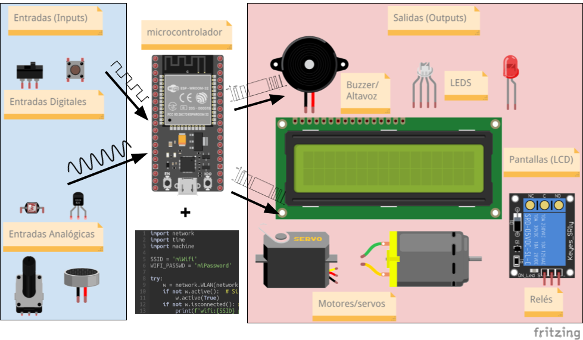

## Uso de entrada salida

En esta imagen hemos puesto algunos de los dispositivos más usuales con los que trabajaremos:

De unos leeremos datos, los llamaremos **sensores** y puede que leamos datos **digitales** (que sólo dan valores discretos) o datos **analógicos** (que se mueven en un rango discreto). Decimos que actúan como **entradas** o **input** para nuestro sistema. 

De los sensores digitales diremos que medimos su **estado**  que será activo (On) o apagado (Off). De los analógicos mediremos su **valor**.

Un buen ejemplo del primer tipo puede ser un pulsador o un interruptor (como los que tenemos en casa para encender/apagar la luz). Decimos que es digital porque o lo encendemos o apagamos. 

Un ejemplo del segundo tipo, analógico, puede ser el mando giratorio que controla el volumen en un aparato de audio o un sensor de temperatura que puede variar de manera continua.

Nuestra placa también controlará otros componentes, como luces (leds), motores, pantallas, altavoces.... decimos que estos actúan como **salidas** o **output**.

Cada placa tiene un "mapa" de las características que puede usar cada patilla o pin. Es lo que se suele llamar **pinout**. A veces una patilla puede leer datos digitales o sólo activarlos. También hay otras que pueden leer datos analógicos.

Para conectar los dispositivos tendremos que ver qué pines de la placa que usamos pueden trabajar y/o controlar las entradas y salidas que necesitamos.

Primero, aprenderemos a controlar 1 led, luego varios, en formato **digital** encendiéndolo y apagándolo. Finalmente, veremos cómo controlar de manera **continua** su brillo. Para ello introduciremos el concepto de **colección** en Python.

Al mismo tiempo aprenderemos también a trabajar con **ficheros de código** en micropython y a agrupar nuestro código en **funciones**, para facilitar su reutilización y hacer más clara y entendible su estructura.

Veremos también cómo detectar las **pulsaciones** de botones, de forma manual y de manera automática utilizando **interrupciones**.

Aplicaremos todo esto al manejo de motores, servos y leds RGB.

## Encendiendo y apagando LEDs

Nada hay más emocionante que el momento en el que encendemos un led por primera vez en una nueva placa o con un nuevo lenguaje. Es lo que solemos llamar un programa "Hello Led!" (por analogía con el típico programa "Hello world")

Vamos a ello... pero antes vamos a aprovechar para aprender un poco sobre los módulos de Python en general y de micropython en particular.
