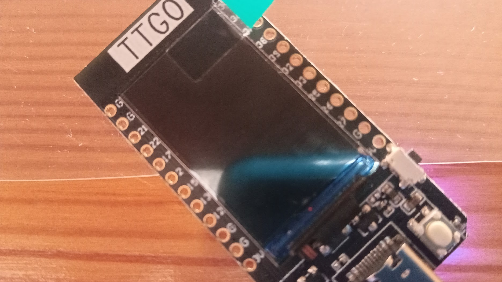
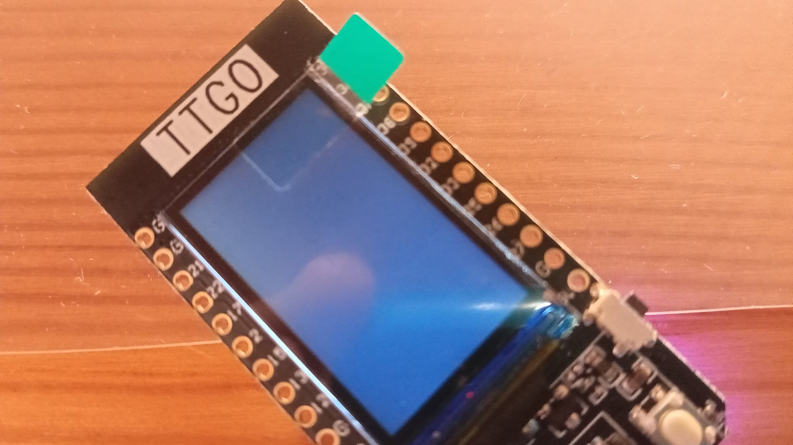

### Vamos con los LEDs 

Todo lo relacionado con la placa está en el módulo **machine** que cargamos con:

```python
import machine
```

Si ahora escribimos "machine." y pulsamos la tecla TAB (tabulador) aparecerá un listado con los posibles componentes (clases) que tiene este módulo.

Como lo que queremos hacer es activar/desactivar una salida para encender un led, tendremos que usar  la clase **Pin**, que es la indicada para acceder a una patilla, a la que tendremos que indicarle:

* El número de la patilla que queremos usar
* Si queremos usar la patilla como OUT (salida) para que genere un cierto voltaje o como IN (entrada) para que lea el voltaje que se aplica.

En nuestro caso vamos a usar el led incluído en nuestra placa (Bluitin Led), que según la documentación es el 2. Por ello haremos:

```python
>>> import machine
>>> machine.Pin(2, machine.Pin.OUT)
Pin(2)
```

Para saber ahora cómo activar o desactivar una patilla, podemos usar la ayuda con:

```python
import machine
>>> help(machine.Pin)
>>> help(machine.Pin)
object <class 'Pin'> is of type type
  init -- <function>
  value -- <function>
  off -- <function>
  on -- <function>
  irq -- <function>
  IN -- 1
  OUT -- 3
  OPEN_DRAIN -- 7
  PULL_UP -- 2
  PULL_DOWN -- 1
  PULL_HOLD -- 4
  IRQ_RISING -- 1
  IRQ_FALLING -- 2
  WAKE_LOW -- 4
  WAKE_HIGH -- 5
```

Donde vemos que existen funciones **on** y **off**

Ya hemos dicho que en Python se intenta ser muy ordenado, por ello, para actuar sobre este pin lo más sencillo es que declaremos una variable __led__, asignamos el pin 2, que es el pin de la placa Wemos D1 R32 (abajo están los pines para otras placas) y así trabajemos más fácil.

(Recuerda que puedes recuperar las sentencias anteriores, pulsando la tecla Flecha Arriba, si no quieres escribir otra vez)

```python
>>> import machine
>>> led = machine.Pin(2, machine.Pin.OUT) # Para Wemos D1 R32
>>> led.on() # Lo encendemos
>>> led.off()  # Lo apagamos
```

Donde ves que hemos incluído un **comentario** o explicación para que nuestro código quede más claro. Sólo tenemos que incluir el carácter **#** y a partir de él todo se ignorará hasta el final de la línea.

También se puede hacer **led.value(1)** ó **led.value(0)** o usar **led.value()** para conocer el valor actual.

Si usamos otra placa tendremos que cambiar el número del pin del led, que podemos obtener de la documentación de cada placa:

* Si usamos la TTGO, podemos usar el pin 4 que es la luz de la pantalla y aunque no brilla mucho, sí que se aprecia cuando está encendido o apagado

 

* Para la Adrafruit Feather, el led de la placa está conectado al pin 13.
* Para la pyBoard 1.1 los leds están conectados aP2, P3, P4 y P5
* Para la ESP-CAM es el pin 4
* Para la mayoría de las placas es 2 o 4.

[](https://drive.google.com/file/d/1ilOQgYBpthieuNtHMCdaJRuw3WpiQD0m/view?usp=sharing)

[Vídeo: Controlando un led con micropython](https://drive.google.com/file/d/1ilOQgYBpthieuNtHMCdaJRuw3WpiQD0m/view?usp=sharing)


