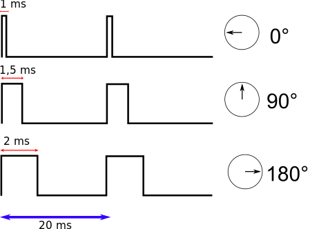
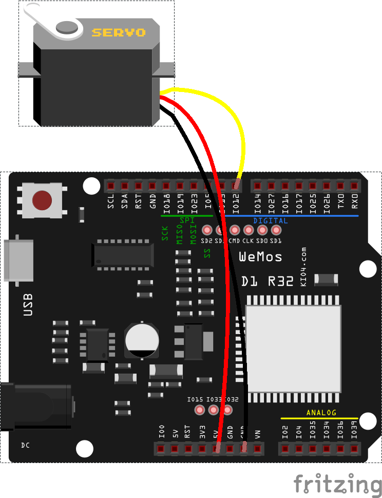

### Servos

Una aplicación del PWM es el control de los conocidos servos (o servomotores), unos motores que lleva incorporada una electrónica de control que nos permite hacer que apunten en una dirección, habitualmente entre 0 y 180

Se manejan con un pulso de 20 ms:



* Un pulso de 1ms pone el servo en su ángulo mínimo 0
* Un pulso de 2ms pone el servo en su ángulo máximo de 180

El resto de ángulos de manera proporcional.




```python

import machine

servo = machine.PWM(machine.Pin(25),freq = 50)
servo.duty(45) # Posicion minima
servo.duty(77) # Posicion central
servo.duty(115) # Posicion maxima

```

