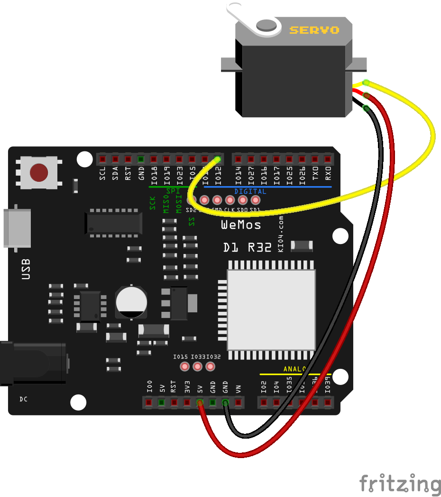

### Servos

Una aplicación del PWM es el control de los conocidos servos (o servomotores), unos motores que lleva incorporada una electrónica de control que nos permite hacer que apunten en una dirección, habitualmente entre 0 y 180

Se manejan con un pulso de 20 ms:


* Un pulso de 1ms pone el servo en su ángulo mínimo 0
* Un pulso de 2ms pone el servo en su ángulo máximo de 180

El resto de ángulos de manera proporcional.




```python

import machine

servo = machine.PWM(machine.Pin(25),freq = 50)
servo.duty(45) # Posicion minima
servo.duty(77) # Posicion central
servo.duty(115) # Posicion maxima

```

Podemos desconectar el canal PWM del servo haciendo __servo.deinit()__

En la versión 1.18 de micropython hay un error en ciertas condiciones (Estas cosas pasan en los proyectos que están en desarrollo).

Según dicen los desarrolladores ya está arreglado y debe funcionar en las [versiones de desarrollo](https://micropython.org/resources/firmware/esp32-ota-20220429-unstable-v1.18-401-g52add7b45.bin) (Nighty build) y vendrá  en la versión 1.19. También funciona en la versión 1.17

Podemos flashear esta versión de desarrollo con

```sh
esptool.py --chip esp32 --port /dev/ttyUSB0 erase_flash

esptool.py --chip esp32 --port /dev/ttyUSB0 --baud 460800 write_flash -z 0x1000 ~/Descargas/esp32-ota-20220429-unstable-v1.18-401-g52add7b45.bin
```


