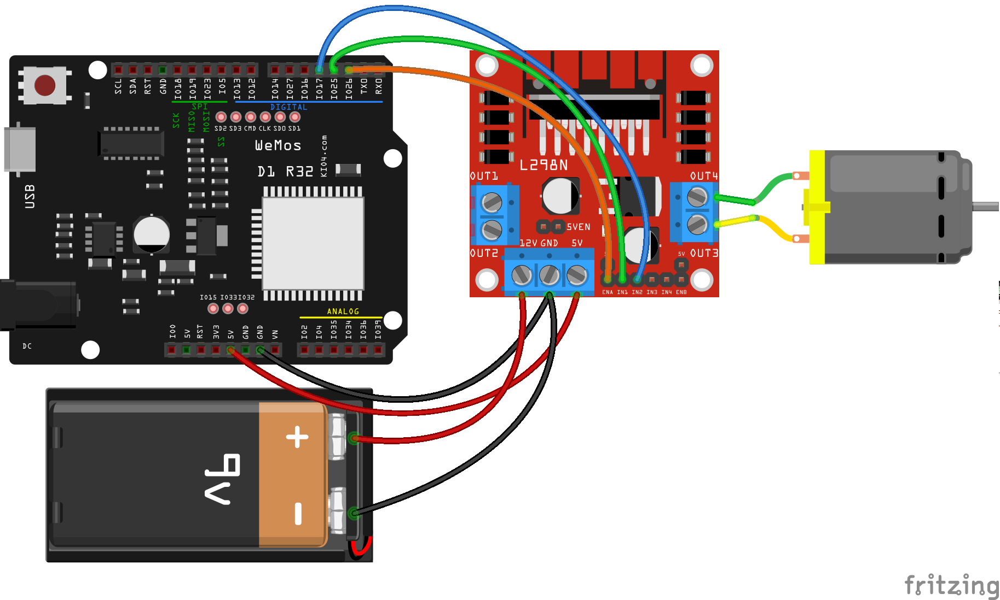

class motor(In1,In2,EN):
	def move(self,speed):
		if speed>0:
			In1.value(1)
			In2.value(0)
		elif speec < 0:
			In1.value(0)
			In2.value(1)
		else
			In1.value(0)
			In2.value(0)
		EN.duty(abs(speed))