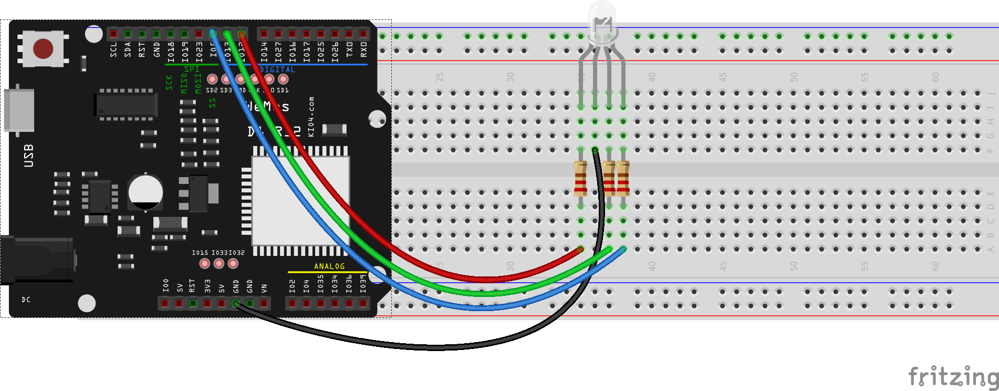
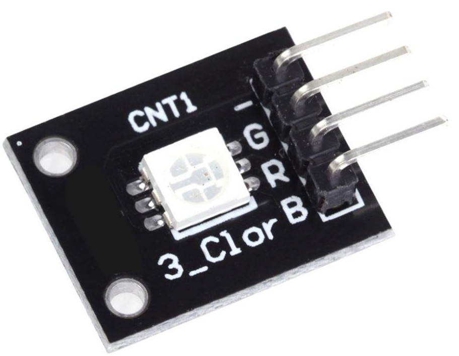
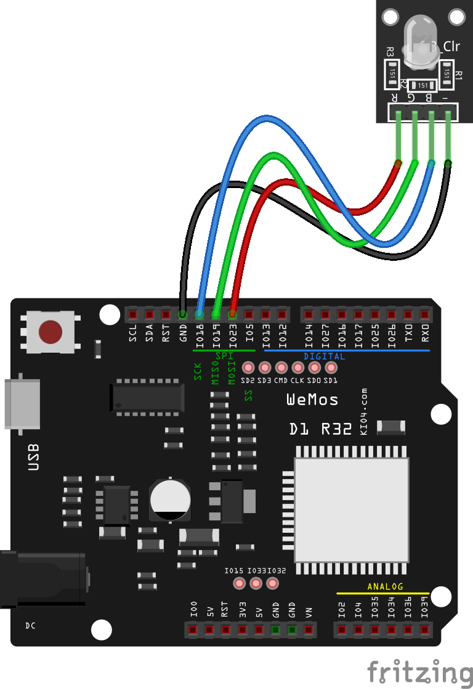

## Controlando led RGB

Un led RGB es un led que internamente tiene 3 leds: uno rojo, otro verde y otro azul, pudiendo controlar el brillo de cada uno de ellos independientemente. Los 3 leds tienen una patilla común (que puede ser el ánodo/positivo o el cátodo/negativo) y las otras 3 separadas, para que controlemos el brillo de cada uno de ellos independientemente.

Vamos a conectar cada uno a un canal PWM y vamos a poder jugar con ellos creando todo tipo de colores.


El montaje electrónico es muy sencillo, sólo hay que conectar en común al negativo, una resistencia a cada uno de los positivos y estos a los 3 pines.



En el [código](https://raw.githubusercontent.com/javacasm/CursoMicropython/master/codigo/ledRGB.py) declaramos los 3 canales PWM y creamos funciones para mostrar distintos colores


```python
import machine


led_red = machine.PWM(machine.Pin(12), freq = 500)
led_green = machine.PWM(machine.Pin(13), freq = 500)
led_blue = machine.PWM(machine.Pin(5), freq = 500)

def color(r,g,b):
    led_red.duty(r)
    led_green.duty(g)
    led_blue.duty(b)

def gray(bright):
    color(bright,bright,bright)

def black():
    gray(0)

def white():
    gray(1023)

```

[](https://drive.google.com/file/d/1BQy42owR09vGFqwpfse2RmkrMFTPZh4Y/view?usp=sharing)

[Vídeo: Controlando el color de un led RGB con 3 canales PWM desde Micropython](https://drive.google.com/file/d/1BQy42owR09vGFqwpfse2RmkrMFTPZh4Y/view?usp=sharing)


En el vídeo hemos usado un módulo led RGB (una placa con el led RGB y las 3 resistencias necesarias).




 En este otro esquema he usado la placa Wemos D1 R32, pero modificando los pines para que podamos conectar el módulo led RGB directamente a la placa conectando el pin - o **GND** del módulo con el **GND** de la placa y usando los 3 pines junto al pin GND (como en el vídeo): 18 para el azul, 19 para el verde y 23 para el rojo




Aunque se muestran los cables, podríamos conectar directamente en la protoboard como en el vídeo en la propia placa.
