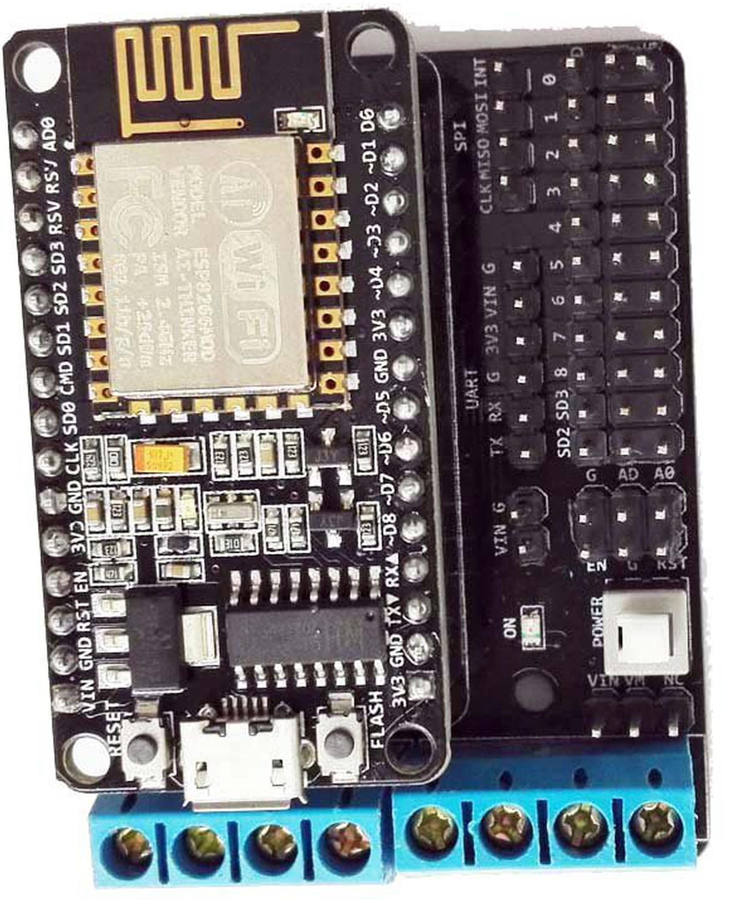
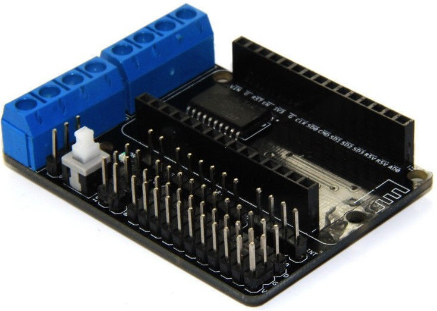
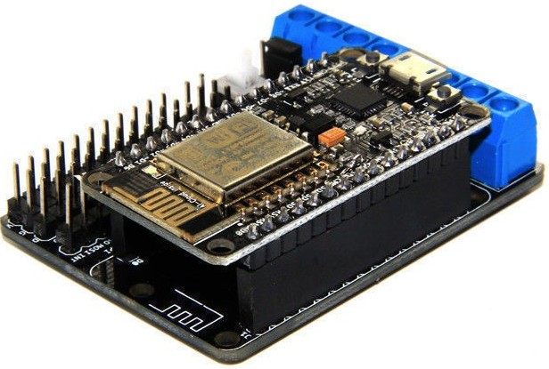
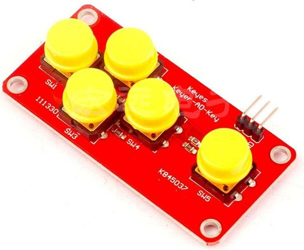

# Motor shield





Motor Shield	NodeMCU DevKit	GPIO	Purpose
D1 PWMA (Motor A)	D1	5	Speed
D3 DIRA (Motor A)	D3	0	Direction
D2 PWMA (Motor B)	D2	4	Speed
D4 DIRB (Motor B)	D4	2	Direction






```python
# Motor Shield
# from https://forum.micropython.org/viewtopic.php?t=3977
# Problemas de rendimiento https://www.instructables.com/id/Motorized-WiFi-IKEA-Roller-Blind/
# https://www.instructables.com/id/Motorize-IoT-With-ESP8266/

from machine import Pin, PWM

""" nodemcu pins from the motor shield """

# D1,GPIO 5 Enable A
# D2,GPIO 4 Enable B
# D3,GPIO 0 Direction A
# D4,GPIO 2 Direction B

v = '0.9'

pwm_frequency = 750

speed_STOP = 0
speed_min = 400 # Depends on batteries state
speed_med = 600
speed_max = 1023

current_speed = speed_med 

speedB = PWM(Pin(4,Pin.OUT), freq = pwm_frequency)
dirB = Pin(2,Pin.OUT)
dirA = Pin(0,Pin.OUT)
speedA = PWM(Pin(5,Pin.OUT), freq = 750)

def stop():
    speedA.duty(speed_STOP)
    speedB.duty(speed_STOP)

def setSpeed(speed = current_speed):
    speedA.duty(speed)
    speedB.duty(speed)
    
def backward(speed = current_speed):
    setSpeed(speed)
    dirA.off()
    dirB.off()

def forward(speed = current_speed):
    setSpeed(speed)
    dirA.on()
    dirB.on()

def right(speed = current_speed):
    setSpeed(speed)
    dirA.off()
    dirB.on()

def left(speed = current_speed):
    setSpeed(speed)
    dirA.on()
    dirB.off()

```

## Controlando con un keypad



```python
import machine
import time
import MotorShield

v = 0.5

KEY_LEFT  =  10  # SW1
KEY_UP    = 180  # SW2
KEY_DOWN  = 375  # SW3
KEY_RIGHT = 560  # SW4
KEY_ENTER = 807  # SW5

adc = machine.ADC(0)

encoder = machine.Pin(14)

print('Waiting por keypress...')

current_speed = 400

while True:
    value = adc.read()
    # print(f'\r {value} - {MotorShield.current_speed}' ,end=' ')
    print('\r ', value, ' - ', current_speed, end=' ')
    if value < KEY_LEFT:
        current_speed -= 10
        if current_speed < 0:
            current_speed = 0
        MotorShield.setSpeed(current_speed)
        # print('Left')
    elif value < KEY_UP:
        # print('Forward')
        MotorShield.forward(current_speed)
    elif value < KEY_DOWN:
        # print('Backward')
        MotorShield.backward(current_speed)
    elif value < KEY_RIGHT:
        # print('Right')
        current_speed += 10
        if current_speed > 1023:
            current_speed = 1023
        MotorShield.setSpeed(current_speed)
    elif value < KEY_ENTER:
        # print('Enter')
        MotorShield.stop()
    else:
        # No key
        pass
    time.sleep_ms(100)
```


