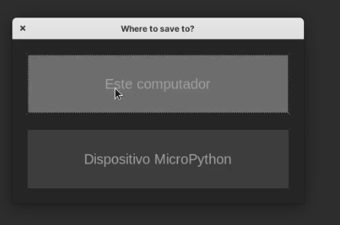

## Trabajando con ficheros de código

A medida que vamos generando más código, es conveniente que lo vayamos agrupando en ficheros, de esta manera lo tenemos más estructurado y siempre podremos acceder a él.

Para guardar el código que hemos escrito en la consola en un fichero:

* Creamos un nuevo fichero
* Copiamos y pegamos las líneas que hemos escrito en la consola
* Quitamos el símbolo de la consola, por ejemplo con "Buscar y reemplazar". 

Nos queda así para ESP32

```python
import machine
led = machine.Pin(2, machine.Pin.OUT) # Pin 2 para Wemos D1 R32
led.on() # Lo encendemos
led.off()  # lo apagamos

```

Para micro:bit

```python
from microbit import *
display.set_pixel(0,0,9) # enciende el led a máximo brillo
display.set_pixel(0,0,0)  # apaga el led
```

* Pulsamos "Guardar" 
* Ponemos nombre, por ejemplo blynk.py y nos pregunta si queremos guardar el fichero en el PC o en el **dispositivo Micropython**



* Lo guardamos en el dispositivo y veremos que nos aparece disponible en la pestaña ficheros, en la parte de "Dispositivo micropython"

Cuando editamos un fichero que está en la placa, el nombre de la pestaña aparece entre corchetes **[]**, cuando están en el PC el nombre aparece sin indicación.

Para ejecutar el fichero tendremos que importarlo (como un módulo más) con __import__, recordando que las mayúsculas/minúsculas son importantes:

```python

import blynk
```

y veremos cómo se ejecuta nuestro código. Bueno, en realidad casi no lo vemos porque se hace muy rápido...

Podemos transferir ficheros entre la placa y el PC (o viceversa) pulsando con el botón derecho sobre el fichero y seleccionando la opción "Descargar a ..."

