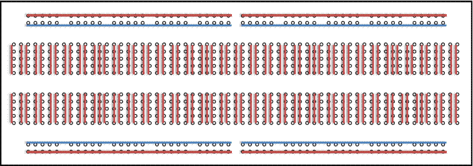

### Placa de prototipo

Para este montaje usaremos una placa de prototipo, o protoboard, que no es más que una regleta de conexiones para componentes electrónicos. Internamente las conexiones son así:

En esta imagen se han marcado con líneas rojas los agujeros que están unidos entre sí.

También vemos las líneas laterales, llamadas raíles, donde normalmente conectamos la alimentación el sistema, positivo marcado como rojo, y el negativo en el azul (en realidad el que sea una u otra es una convención).

Los restantes componentes los conectaremos en la parte central, con las líneas cortas que unen los 5 agujeros de cada fila entre sí.

Hay que insistir en que la línea roja de un lateral no está conectada con la roja del otro lado. Si queremos que las dos proporcionen alimentación tendremos que conectarlas. También algunas placas (como la de la imagen) no conectan todo los agujeros del lateral, sino la mitad. Esto lo indican cortando el dibujo de las líneas roja y azul

Tampoco están conectadas las líneas de 5 agujeros de un lateral y de otro.

Para hacer el montaje tendremos que ir usando estas filas para conectar los componentes entre sí. 

Como indicación suelen venir unas letras y unos números.

Veamos un circuito sencillo de una bombilla, la alimentación (que he representado con una pilas) y un interruptor:

Al cerrar el interruptor, este conecta las dos partes del cable rojo, y llega la alimentación a la bombilla.

Ahora vamos a ver cómo lo haríamos con una protoboard:

Hemos conectado el cable positivo a la línea lateral roja y el negativo a la línea negativa azul. 

Conectamos nuestro interruptor/conmutador a partir de la posición 10J hasta la 13J

Añadimos un cable rojo desde la línea lateral positiva hasta la fila donde está el conector izquierdo 10G, que conectará con el terminal del interruptor (toda la fila 10 F-J)

Llevamos otro cable desde el conector central 11G, que conecta con el pin central del interruptor en 11J, hasta la bombilla.

Solo nos queda llevar un cable negro desde el lateral negativo hasta el otro conector de la bombilla.

A lo largo del curso iremos haciendo montajes más complicados pero todos basados en las mismas técnicas.
