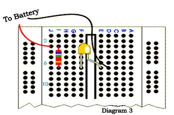

Breadboard Basics and Connections

What is Breadboard?
A breadboard is a circuit board that is used to make temporary circuits. It is a device having electronics and test circuit
designs. The electronic elements inside the electronic circuits can be interchanged by inserting the terminals and leads into
holes and later connecting it with the help of appropriate wires. The device has stripes of metal below the board that
connects the holes placed on the top of the board. The connections of the breadboard are mostly temporary and the
elements can further be reassembled and reused without any damage. Breadboards are generally used in electrical
engineering. Engineers make use of breadboards in order to test different products made by them. Using breadboard is the
most efficient way of testing and also they are cost effective. They can be reused again and again for the purpose of testing.
Today, starting from tiny analog, digital circuits to big complicated CPU’s everything can be tested with the help of this.
Breadboards earlier were made of copper wires or terminal strips. These days it is made up of white plastic and is a
breadboard that can be plugged. Breadboards are solderless and they are made of two kinds of strips i.e. terminal and bus
strips. Terminal strips help in holding the electronic elements while the bus strip is used to power electric power to all the
electronic components. You can find manufacturers selling solderless breadboards very easily, some manufactures sell the
bust and terminal strips separately and some sell it together.
Breadboard Basics:
A breadboard is a circuit which if of a temporary nature used for the purpose of testing and prototyping circuits. It is easy to
prototype circuits with the help of breadboards because it is fast and easy. Breadboards are generally used to test circuits.
As this device have holes in it. In order to form a circuit, wires are inserted simply inside the holes. An advantage of using a
breadboard is that the positions of the wires can be changed if they are placed in a wrong order. In the below diagram you
can see alphabets are used in order to identify vertical columns and numbers are used in order to identify vertical columns.In the below diagram you can see both the vertical columns and horizontal to be connected internally. As soon as the power
is turned on, the current flows through these internal connections.
In the below diagram you can see how a resistor of 380 ohm and a LED are set up on the breadboard. A 9 volt battery is
eventually attached to the LED light. Replace the current resistor with a resistor having 680 ohm you can see the resistance
to be greater and the LED light to be dimmer.
Breadboard Connections:
A breadboard as mentioned before is used to make temporary circuit for testing and other purposes. The advantage of using
a breadboard for testing is that connection can be changed if they are wrong. Also the parts of the circuit do not get
damaged and can easily be reused. A breadboard generally consists of lots of holes so that wires can easily be pushed in.
testing for almost every electronic projects starts from the breadboard. The breadboard has many tiny sockets likes holes
arranged in a 0.1 grid. The leads that most elements have can easily be pushed inside these holes. The ICs are pushed
inside across to the gap with their dot on the left. Standard wires cannot be used for breadboard as they get damaged easily
and hence they require single core plastic coated wires that have 0.6mm diameter. Standard wires if used can also lead to
damage of the board.The above diagram shows how the holes of a breadboard are connected. The bottom and the top rows are connected
horizontally across as the red and the black line denotes. The power supply is connected to both the black and red rows.
The other rows are connected in a vertical manner which consists of five rows each without any links to the across the
centre. In this way there are separate blocks of connections to each of the ICs pin. Now this was the connection in a small
breadboard.
In case of large breadboards, there are breaks half way in the top and the bottom rows of the power supply. It is always
better to link across the gap before you start building circuit. If you do not link it then that part of the circuit will not have any
power supply.
Virtual Breadboard:
The virtual breadboard is generally used to test and design embedded software that is in a high level interactive circuit. It is
used for prototyping the hardware from these designs. People find the virtual breadboard easier to utilize than the normal
ones because it has a high approach. Also it is faster in tis working and helps in testing new ideas and circuit variations.
Virtual breadboards are usually used in place of real breadboards because they are fast in working. Also it is fast in
performing experiments and testing electronic embedded applications. Many experimenters prefer using virtual boards for
experiments than real boards as its functioning is easy. The virtual board is popular in many universities around the world
since the 1999.
A virtual breadboard is also called as VBB and makes use of microcontrollers featuring Makeable bereadbaord designs. A
virtual breadboard helps in making your projects easier and helps you do your experiments I a simple way. There are
different versions of VBB that are available which users can use according to their need. It is always better to use a virtual
breadboard than a real one as the virtual ones are more reliable. So if you are in a hurry and want immediate results it is
advised that you make use of VBB.
On the whole, using a breadboard is very easy and as it gives immediate results everyone prefers using it for testing
different gadgets and electronic products.
Source: http://www.electronicshub.org/breadboard-basics-and-connections/Building Circuits on Breadboards
Uses of Breadboards
A breadboard is used to make up temporary circuits for
testing or to try out an idea. No soldering is required so
it is easy to change connections and replace
components. Parts will not be damaged so they will be
available to re-use afterwards.
The photograph shows a circuit on a typical small
breadboard which is suitable for beginners building
simple circuits with one or two ICs (chips).
Connections on Breadboards
Breadboards have many tiny sockets
(called 'holes') arranged on a 0.1" grid.
The leads of most components can be
pushed straight into the holes. ICs are
inserted across the central gap with
their notch or dot to the left. Wire links
can be made with single-core plastic-
coated wire of 0.6mm diameter (the
standard size). Stranded wire is not
suitable because it will crumple when
pushed into a hole and it may damage
the board if strands break off.
NE555
The diagram shows how the
breadboard holes are connected.
The top and bottom rows are linked horizontally all the way across. The power supply is
connected to these rows, + at the top and 0V (zero volts) at the bottom. I suggest using the
upper row of the bottom pair for 0V, then you can use the lower row for the negative supply with
circuits requiring a dual supply (e.g. +9V, 0V, -9V).
The other holes are linked vertically in blocks of 5 with no link across the centre. Notice how
there are separate blocks of connections to each pin of ICs.
Large Breaboards
On larger breadboards there may be a break halfway along the top and bottom power supply
rows. It is a good idea to link across the gap before you start to build a circuit, otherwise you
may forget and part of your circuit will have no power!
Electronics
Club
© John Hewes 2013
Downloaded from electronicsclub.info
Building Circuits on Breadboards
page 1Building a Circuit on Breadboard
Converting a circuit diagram to a breadboard layout is not straightforward because the
arrangement of components on breadboard will look quite different from the circuit diagram.
When putting parts on breadboard you must concentrate on their connections, not their
positions on the circuit diagram. The IC (chip) is a good starting point so place it in the centre of
the breadboard and work round it pin by pin, putting in all the connections and components for
each pin in turn.
+9V
47k
R1
10k
7
trigger
8
6555
timer
21
+
C1
4
3
5
470
0.01µ
100µ
0V
Monostable Circuit Diagram
The best way to explain this is by example, so the process of building this 555 timer circuit on
breadboard is listed step-by-step on the next page.
The circuit is a monostable which means it will turn on the LED for about 5 seconds when the
'trigger' button is pressed. The time period is determined by R1 and C1 and you may wish to try
changing their values. R1 should be in the range 1kΩ to 1MΩ.
Time Period, T = 1.1 × R1 × C1
IC pin numbers
IC pins are numbered anti-clockwise around the IC starting
in the bottom left-hand corner, near the notch or dot. The
diagram shows the numbering for 8-pin and 14-pin ICs,
but the principle is the same for all sizes.
8 7 6 514 13 12 11 10 9 8
NE5554001B
1 2 3 41 2 3 4 5 6 7
Components without suitable leads
Some components such as switches and variable
resistors do not have suitable leads of their own so you
must solder some on yourself. Use single-core plastic-
coated wire of 0.6mm diameter (the standard size).
Stranded wire is not suitable because it will crumple
when pushed into a hole and it may damage the board if strands break off.
Electronics
Club
© John Hewes 2013
Downloaded from electronicsclub.info
Building Circuits on Breadboards
page 2Building the example circuit
Begin by carefully insert the 555 IC in the centre of the breadboard with its notch or dot to the
left. Then deal with each pin of the 555:
Pin 1: Connect a wire (black) to 0V.
Pin 2: Connect the 10k resistor to +9V.
Connect a push switch to 0V (you will need to solder leads onto the switch)
Pin 3: Connect the 470 resistor to an used block of 5 holes, then...
Connect an LED (any colour) from that block to 0V (short lead to 0V).
Pin 4: Connect a wire (red) to +9V.
Pin 5: Connect the 0.01µF capacitor to 0V.
You will probably find that its leads are too short to connect directly, so put in a
wire link to an unused block of holes and connect to that.
Pin 6: Connect the 100µF capacitor to 0V (+ lead to pin 6).
Connect a wire (blue) to pin 7.
Pin 7: Connect the 47k resistor to +9V.
Check: there should be a wire already connected to pin 6.
Pin 8: Connect a wire (red) to +9V.
Finally...
+
+
+
• Check all the connections carefully.
• Check that parts are the correct way round (LED and 100µF capacitor).
• Check that no leads are touching (unless they connect to the same block).
• Connect the breadboard to a 9V supply and press the push switch to test the circuit.
If your circuit does not work disconnect (or switch off) the power supply and very carefully re-
check every connection against the circuit diagram on the previous page.
100µF
25V
9V
Power
Supply
0.01
NE555
Monostable Circuit on Breadboard
Electronics
Club
© John Hewes 2013
Downloaded from electronicsclub.info
Building Circuits on Breadboards
page 3