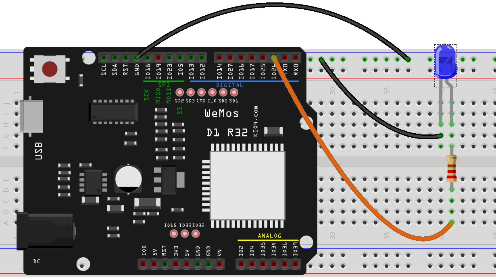
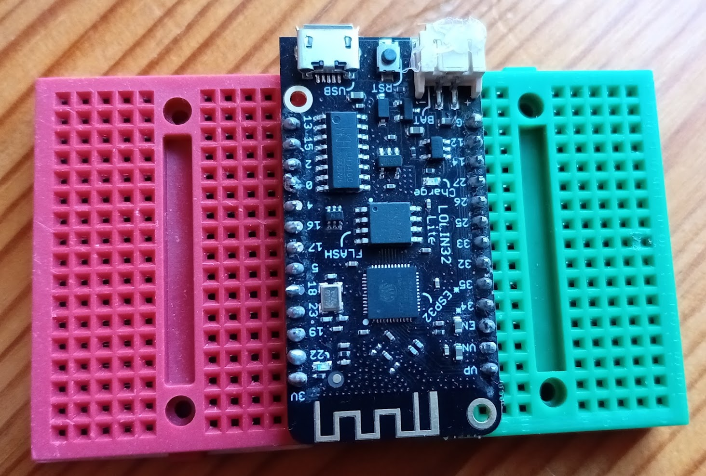
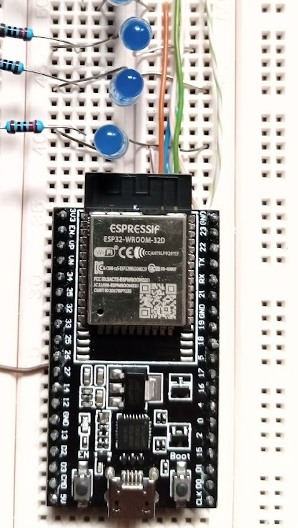

## Usando un led externo

Vamos a modificar el fichero blink.py para utilizar un led externo que conectaremos al pin 26 (puede ser cualquier otro). 

El montaje es como siempre: un led en serie con una resistencia para evitar que se sobrecargue el led y lo dañemos. La resistencia suele ser de 220 Ohmios. Si no tienes de ese valor y pones una mayor el led brillará menos.

Los leds tienen polaridad, es decir hay que conectar cada led al lado positivo o negativo. El terminal negativo del led  suele ser más corto y  se representa en el esquema como recto lo conectamos hasta el lateral negativo.

Conectamos la resistencia a la misma fila del pin positivo del led (el más largo y por eso se muestra doblado) y en la parte central de la protoboard.

En el otro lateral conectamos un cable que llevamos hasta el pin 26 de la placa.




En el ejemplo hemos usado la placa Wemos D1 R32 que tiene conectores de tipo hembra y por tanto se conecta con cables a la protoboard.

El cambio en el código es también muy sencillo y le vamos a añadir un par de líneas para que se imprima 'On' y 'Off' por pantalla a la vez que se cambia el estado de led:

```python
import machine # Todo lo relacionado con el acceso al hardware
import utime   # utilidades relacionadas con el tiempo

# Creamos un objeto led conectado al pin 26 y como salida
led = machine.Pin(26, machine.Pin.OUT)

while True: # se repite para siempre
    led.on()          # encendemos
    print('On')
    utime.sleep(0.5)  # esperamos medio segundo
    led.off()         # apagamos  
    print('Off')
    utime.sleep(0.5)  # esperamos medio segundo
print('fuera del bucle')
```


En el caso de que tengamos una placa tan ancha como la protoboard, podemos usar 2 protoboard, una para cada hilera de la placa:




Otra opción es usar cables para conectar las líneas de debajo de la placa. Los cables internos de los cables red/ethernet son ideales para esto:




[](https://drive.google.com/file/d/10ZJyflnQROowDhB3bbCjvBDCdjPPDw_v/view?usp=sharing)

[Vídeo: Haciendo que parpadee un led externo](https://drive.google.com/file/d/10ZJyflnQROowDhB3bbCjvBDCdjPPDw_v/view?usp=sharing)


