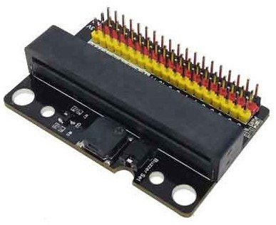

### Conexión de componentes a micro:bit

La placa micro:bit no está pensada para conectar directamente circuitos y componentes, salvo que usemos cables de tipo cocodrilo. Para hacer montajes más complejos lo normal es usar unas placas que se suelen llamar **extensores** y que nos facilitan la conexión, proporcionándonos patillas para los pines y otras de alimentación y tierra (positivo y negativo)



Estas son las conexiones de la micro:bit


Como vemos, algunos de los pines tienen varios usos. Con los adaptadores podemos utilizarlos fácilmente.

También hay otras placas que nos permiten conectar la placa a una protoboard


Con este extensor podemos conectar un led de forma sencilla:


```python
from microbit import * # Todo lo relacionado con el acceso al hardware de micro:bit
import utime   # utilidades relacionadas con el tiempo


while True: # se repite para siempre
    pin2.write_digital(1)
>>>          # encendemos
    print('On')
    utime.sleep(0.5)  # esperamos medio segundo
    pin2.write_digital(0)         # apagamos  
    print('Off')
    utime.sleep(0.5)  # esperamos medio segundo
print('fuera del bucle')
```

