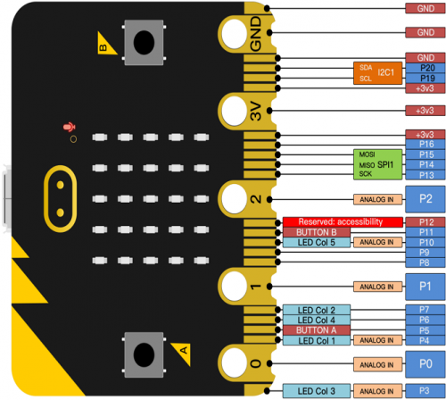
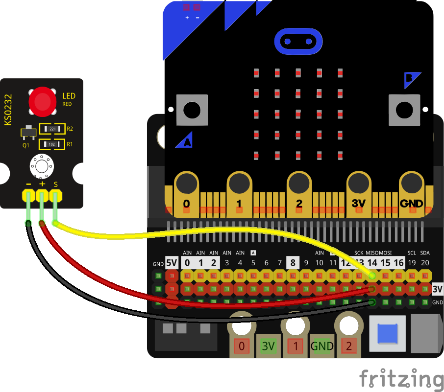

## GPIO/pines de micro:bit



Para facilitar el uso ya están definidos los pines dentro del módulo **microbit** como 
**pin0** - **pin20**

En la micro:bit v2 tenemos además **pin_logo** para detectar la pulsación sobre el logo y **pin_speaker** para el buzzer.

Cuando usamos la pantalla/display algunos de los pines se utilizan pin3, pin4, pin6, pin7 y pin10, por lo que no los podemos usar a la vez que la pantalla.

El botón A está conectado al pin5 y el botón B al pin11. 

También está reservado el uso del pin12.

### Escritura digital

Podemos activar/desactivar el estado de cualquier pin con **write_digital(valor)** pudiendo ser valor True o False.

A estos pines podemos conectar un led o cualquier otro dispositivo digital, como un relé.

```python
from microbit import *
from utime import sleep_ms

while True:
    pin14.write_digital(True)  # activamos el pin 14 encendiendo el led si está conectado
    sleep_ms(500)  # esperamos medio segundo
    pin14.write_digital(False)  # desactivamos el pin 14 apagando el led si está conectado
    sleep_ms(500)  # esperamos medio segundo
```


