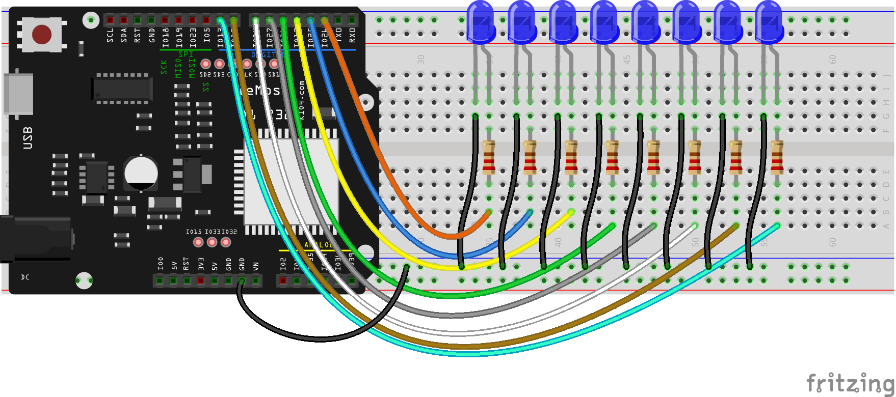

## Trabjando con varios leds: Colecciones

Vamos a trabajar ahora con varios LED al mismo tiempo. Conectaremos 8 de ellos a distintas patillas y vamos a controlarlos encendiéndolo y apagándolo de forma sucesiva.

Para ello vamos a aprender a utilizar lo que se llaman **colecciones** que es una forma de almacenar varios valores dentro de una misma variable, pudiendo acceder a ellos individualmente.

En Python existen diferentes tipos de colecciones que utilizaremos según  el uso que vayamos a hacer de ellas, si están definidas desde el principio o si tenemos que añadir o retirar elementos.

* Están las **tuplas** pensadas para trabajar con una colección a la que ni añadimos ni quitamos elementos, es decir, son inmutables. Para declararla utilizamos el nombre de la tupla seguida del caracter "="  una colección de elementos entre paréntesis y separados por comas.

```python
tupla = (26, 25, 17, 16, 27, 14, 12, 13)
```
* También están las **listas**, pensadas para ir añadiendo dinámicamente elementos o también retirarlos de ella. Utilizaremos los corchetes para definir los elementos que incluyen y también podemos añadir elementos con la función **append**.

```python

lista = [10, 20, 22]
lista.append(15) # añade un elemento más
```




El montaje es muy sencillo, similar al anterior, solo que hay que hacerlo 8 veces, uno para una por cada uno de los LED, es decir, usaremos 8 leds, sus 8 resistencias y todos los cables de conexión necesarios para la conexión a GND y para cada uno de los pines

Si utilizas otro tipo de placa, podrás hacer un montaje similar, solo que seleccionando los correspondientes pines a los que conectes los distintos LEDs.

Las placas esp32 son muy versátiles y nos van a permitir que utilicemos cualquiera de los pines para encender o activar LED en formato digital como hacemos ahora, o como haremos más adelante, en un formato en el que podemos decidir la intensidad del brillo de cada uno de los LED independientemente, lo que conocemos como PWM y que veremos más adelante.


Veamos el programa:

* Vamos a empezar creando una tupla con todo los pines a los que hemos conectado nuestros LED

```python
pin_leds = (26, 25, 17, 16, 27, 14, 12, 13)
```

Podemos recuperar cualquier valor una colección usando un índice que indica su posición. Hay que tener en cuenta que el primer elemento tiene el índice 0 (cosas de informáticos....) y si tenemos N elementos, el último ocupará la posición N-1. Para recuperar un valor usamos el nombre de la colección poniendo entre corchetes "[...]" el índice.

```python
>>> pin_leds[0] # el 1er elemento
26
>>> pin_leds[3] # el 4º elemento
16
>>> pin_leds[7] # el último elemento
13
```

Podemos saber la longitud de una coleccíón usando la función **len(coleccion)**

```python
>>> len(pin_led)
8
```

Si intentamos acceder más allá del final obtendremos un error:

```python
>>> pin_leds[9]
Traceback (most recent call last):
  File "<stdin>", line 1, in <module>
IndexError: tuple index out of range
```

Pero sí que podemos acceder con un índice negativo, siendo el elemento de la posición -1 el último y el elemento -N el primero

```python
>>> pin_leds[-1] # el último
13
>>> pin_leds[-2]
12
>>> pin_leds[-7]
25
>>> pin_leds[-8] # el primero
26
```

Otra ventaja de las colecciones es que podemos recorrerlas de forma muy sencilla en un bucle. En python existe una tipo de bucle específico para recorrer las colecciones: es el bucle **for**. La sintaxis es bastante clara: **for elemento in coleccion:** va recuperando en cada repetición del bucle un elemento de la colección de manera ordenada y termina cuando ya no hay más elementos.

Para nuestros leds quedaría así:

```python
>>> for pin in pin_leds:
...     print(pin)
... 
26
25
17
16
27
14
12
13
>>> 
```

Como hemos visto para usar fácilmente los leds lo mejor es crear una variable para llamar a los métodos para encenderlo/apagarlo. Como ahora tenemos varios vamos a crear una lista con un objeto led asociado a cada pin. Usaremos una lista porque podemos ir creándolos y añadiéndolos dinámicamente.

Vamos a crear una lista vacía

```python
>>> leds = [] # Una lista vacía
>>> len(leds)
0
```

Y ahora usando un bucle for que recorra la colección **pin_leds** vamos a ir creando un objeto led que añadiremos a nuestra lista:

```python
>>> import machine
>>> for pin in pin_leds:  # recorremos todos los pines
...     print(pin)
...     led = machine.Pin(pin, machine.Pin.OUT)  # creamos un objeto pin 
...     leds.append(led)    # lo añadimos a la lista
... 
26
25
17
16
27
14
12
13
```
Si ahora preguntamos la longitud de la lista __leds__ veremos que está rellena

```python
>>> len(leds)
 8
```

Ahora vamos a poder encender o apagar cualquier led sin mas que usar el elemento correspondiente de la lista __leds__

```python
leds[3].on()  # 4º leds encendido
leds[6].off() # 7º apagado
leds[7].on()  # 8º encendido 
```

Vamos a hacer ahora un bucle para encenderlos y apagarlos todos. Para ello necesitamos recorre la lista completa. Podemos hacerlo de una forma similar a como recorríamos __pin_leds__

```python
>>> for led in leds:
...     led.on()
```


Como ese es algo muy frecuente, existe una manera específica de hacerlo, usando lo que se llama un **rango**, es una colección especial de los N números empezando en 0 y terminando en N-1, que podemos crear usando **range(N)**. 

En nuestro caso podemos iterar por toda la lista de esta manera:

```python
>>> for i in range(8):
...     leds[i].off()
```

Con todo esto vamos a hacer unas funciones **apagarTodos**, otra que sea **encenderTodos** y otra **inicializar** que prepare nuestra lista para poder usarla:

```python
# trabajando con varios leds
import machine

v = 0.2

pin_leds = (26, 25, 17, 16, 27, 14, 12, 13) # Wemos D1 R32
# pin_leds = (0, 16, 12, 13, 15, 14, 2, 4) # ESPCAM CUIDADO CON EL GPIO 0

leds = []

def inicializar():
    for pin in pin_leds:
       print(pin,end=' ') # tras imprimir cada pin añade 1 espacio sin saltar de línea
       led = machine.Pin(pin, machine.Pin.OUT)
       leds.append(led)
    print(' inicializados')

def encenderTodos():
    for led in leds:  # Iteramos en todos los leds
        led.on() 

def apagarTodos():
    for led in range(len(leds)): # iteramos usando el índice del rango
        leds[led].off()  
          
```

Vemos que las colecciones las hemos definido fuera de la funciones, de esta manera son accesibles a todas las funciones. Decimos que son **variables globales**. Por contra la variable pin o led de las otras funciones son **locales**

Hemos usado distintas formas de iterar, y ademas a la hora de crear el range en __apagarTodos__ hemos usando **len(leds)** que funcionará perfectamente aunque usáramos más o menos leds en la colección pin_leds.

Guardamos todo en un fichero leds.py y lo usamos con:

```python

import leds
leds.inicializar()
leds.encenderTodos()
leds.apagarTodos()

```

¿Y si se nos olvida llamar inicialmente al método inicializar? Pruébalo antes de contestar
Pues no ocurre nada, puesto que la colección leds, que es la iteramos, está vacía y el bucle no haría ninguna repetición. Cuando aprendamos un poco más haremos que nos dé un aviso en este caso o incluso que llame al método "inicializar" directamente.

Con todo esto no podía faltar el ejemplo que se conoce como Scanner Larsson o Cylon o Knight Rider * Kit


Un posible código sería éste:

```python
def kit(tiempo_espera = 200):
    print('subiendo ...')
    for i in range(len(leds)):
        leds[i].on() # encendemos
        utime.sleep_ms(tiempo_espera) # esperamos ..
        leds[i].off() # lo apagamos
    print('bajando ...')        
    for i in range(-len(leds),0): # -N es el último
        leds[i].on() # encendemos
        utime.sleep_ms(tiempo_espera) # esperamos ..
        leds[i].off() # lo apagamos
```        

Para hacerlo de otra forma vendrá bien saber que también podemos hacer rangos que cuentan hacia atrás, como este __range(7,0,-1)__ que cuenta desde 7 hacia atrás...

[](https://drive.google.com/file/d/1iE-8xN3bXm7k7JrYEHPMoP-7VKyWkRne/view?usp=sharing)

[Vídeo: Trabajando con varios leds: colecciones en micropython](https://drive.google.com/file/d/1iE-8xN3bXm7k7JrYEHPMoP-7VKyWkRne/view?usp=sharing)

