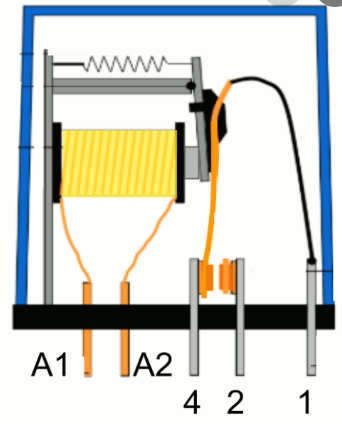

## Aplicación de colecciones: manejando varios relés


1. ¿Qué es un **relé**? un relé es un interruptor eléctrico que podemos accionar electrónicamente con una pequeña corriente y que funciona casi siempre electromecánicamente (un electroimán que atrae un contacto eléctrico) de ahí el 'clic-clic' que hacen al funcionar. 

1. Uso: los usaremos para controlar dispositivos que necesitan más potencia  que nuesta placa y/o que funcionan a mayores voltajes.
1. Control: para activar/desactivar los relés sólo tenemos que activar/desactivar el pin de nuestra placa al que está conectado
1. Alimentación y Consumo: el control de varios relés requiere de una mayor potencia de la que puede suministrar el puerto USB, por lo que usaremos un alimentación más potente si es posible.
1. Puesto que las señales de control de las placas son de 3.3V pudiera ser que algunos relés no se activen correctamente, aunque la mayoría sí.

## Controlando relés

Una aplicación directa de lo que hemos visto activando leds, puede ser controlar un módulo con varios relés al mismo tiempo.


Como hemos dicho, un relé es un dispositivo que nos permite controlar un dispositivo conectado a la corriente con una salida de nuestro dispositivo y sus modestos 5 voltios. Es decir, el relé actúa como un interruptor electrónico y al activar la patilla que lo controla se cierra el contacto que deja pasar la corriente al dispositivo


En el montaje del ejemplo vemos como el relé 1 actúa como interruptor del circuito de alimentación de la bombilla. Al activar la salida 18, que controla el relé 1 (por estar conectada a IN1) cerrará la salida del relé y la alimentación llegará a la bombilla. Podemos poner la alimentación desde un enchufe o desde cualquier otra fuente de alimentación. Los relés funcionan como un interruptor eléctrico.

Los dos círculos eléctricos, de alta potencia (la bombilla) y el de baja potencia (la placa) están aislados entre sí. No obstante **hay que tener cuidado al manejar la parte de alto voltaje/potencia**


```python
import machine

pin_reles = (18,19,23,5)
reles = []
for pin in pin_reles:
    rele = machine.Pin(pin,machine.Pin.OUT)
    reles.append(rele)

reles[2].on() # Encendemos el relé 2

reles[0].off() # Apagamos la bombilla
```
Y con esto ya estamos abriendo la puerta a la domótica...
