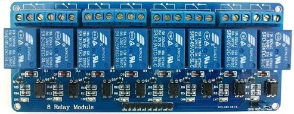
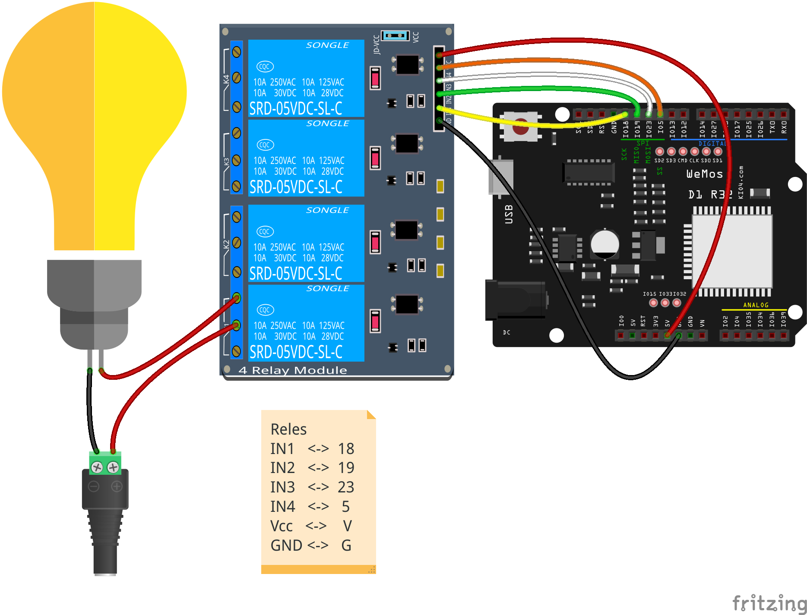

## Aplicación de colecciones: manejando varios relés

Una aplicación directa de lo que hemos visto puede ser controlar un módulo con varios relés al mismo tiempo.



Un relé es un dispositivo que nos permite controlar un dispositivo conectado a la corriente con una salida de nuestro dispositivo y sus modestos 5 voltios. Es decir, el relé actúa como un interruptor electrónico y al activar la salida que lo controla se cierra el contacto que deja pasar la corriente al dispositivo



En el montaje del ejemplo vemos como el relé 1 actúa como interruptor del circuito de alimentación de la bombilla. Al activar la salida 18, que controla el relé 1 (por estar conectada a IN1) cerrará la salida del relé y la alimentación llegará a la bombilla.


```python
import machine

pin_reles = (18,19,23,5)
reles = []
for pin in pin_reles:
    rele = machine.Pin(pin,machine.Pin.OUT)
    reles.append(rele)

reles[2].on() # Encendemos el relé 2

reles[0].off() # Apagamos la bombilla
```
Y con esto ya estamos abriendo la puerta a la domótica...
