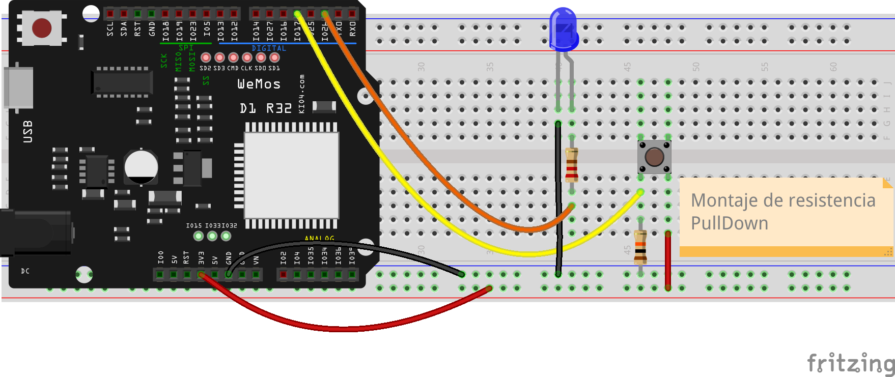

## Leyendo entradas digitales: botones

Vamos a empezar ahora a leer la entrada digital es decir vamos a ver el estado de una patilla la aplicación más típica es el trabajar con botones.

Vamos a conectar un botón a una pastilla y vamos a comprobar su estado. 



Hemos conectado uno de los contactos de nuestro pulsador a la alimentación de 3.3 voltios y el otro contacto del pulsador a la patilla 17 de nuestra placa, será la actúe como entrada y  leeremos el estado del  pulsador.

A primera vista, uno pensaría que ese montaje así de simple funciona, pero es más estable si al mismo tiempo conectamos el contacto que vamos a leer con una resistencia de 10K Ohmios a GND. De esta forma aseguramos que cuando el botón no esté pulsado tendremos una lectura de 0 v. Es un montaje que se conoce como **Pull-down** o resistencia Pull-down.

Las entradas hay que definirlas con **Pin.IN**

```python
import machine

pulsador = machine.Pin(17, machine.Pin.IN)

led = machine.Pin(26, machine.Pin.OUT)
```

Para leer el estado usamos **pulsador.value()**

Vamos a hacer un sencillo programa que activa nuestro led cuando pulsamos el pulsador para lo que usaremos la otra forma de activar las patillas que vimos: usando la función **value(estado)**. Es así de sencillo:

```python
import machine
import time

v = 0.2

pulsador = machine.Pin(17, machine.Pin.IN)

led = machine.Pin(26, machine.Pin.OUT)

while True:
    estado_pulsador = pulsador.value()

    print('pulsador: ',estado_pulsador, end='\r') # '\r' hace que imprimamos siempre en la misma línea
    led.value( estado_pulsador) # estado del led igual al del pulsador
    time.sleep_ms(200) # ponemos un pequeño retardo para no saturar la pantalla
```

