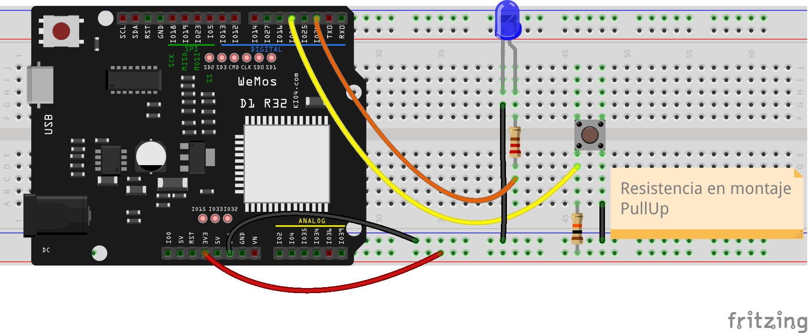
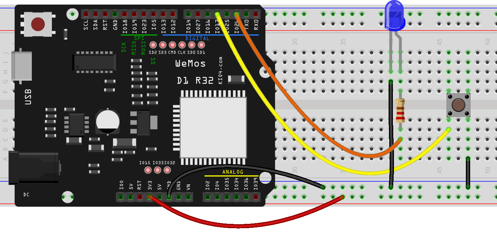

## Montaje con lógica invertida

De la misma manera que hemos usado una resistencia Pull-Down, que hacía que el valor por defecto del pulsador sea 0v, podemos usar un montaje donde la resistencia hace que el valor por defecto sea 5V y al pulsar el pulsador veremos 0v. 



Aunque puede sonar raro que el pulsador esté activo sin pulsarlo y se ponga inactivo al pulsarlo, en ciertas ocasiones puede resultar conveniente. Decimos que en este caso estamos usando **lógica invertida**.

Internamente la mayoría de las patillas tienen una resistencia Pull-Up que podemos activar con **machine.Pin.PULL_UP**:

```python

pulsador = machine.Pin(17,machine.Pin.IN, machine.Pin.PULL_UP)
```


Con esto nuestro montaje se simplifica:



A cambio de un pequeño cambio en el programa que ahora tiene que poner en el led, el valor invertido del pulsador. Podemos invertir un valor en python usando la palabra reservada **not**, con lo que nuestro programa quedará así:


```python
import machine
import time

v = 0.3

pulsador = machine.Pin(17, machine.Pin.IN)

led = machine.Pin(26, machine.Pin.OUT, machine.Pin.PULL_UP)

while True:
    estado_pulsador = pulsador.value()

    print('pulsador: ',estado_pulsador, end='\r') # '\r' hace que imprimamos siempre en la misma línea
    led.value( not estado_pulsador) # estado del led es invertido el del pulsador
    time.sleep_ms(200) # ponemos un pequeño retardo para no saturar la pantalla
```
