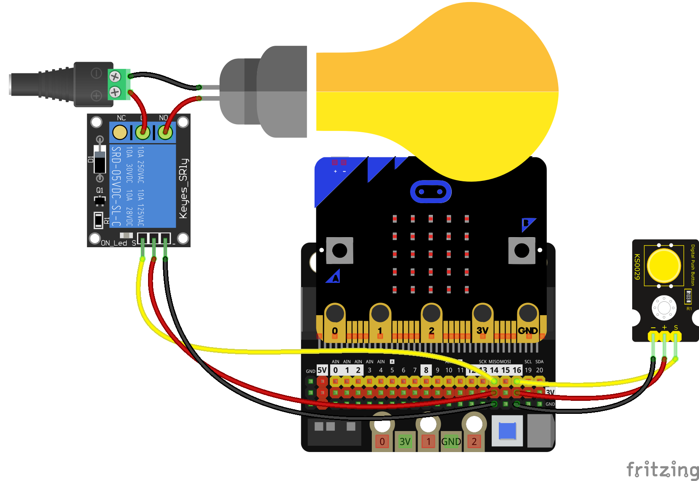

### Bonotes en micro:bit

La placa micro:bit tiene 2 botones conectados, podemos hacer que cuando se detecte una pulsación se ejecuten unas órdenes.

Podemos detectar si uno de los botones incorporados en la micro:bit está pulsado en este mismo instante con **is_pressed()**. También podemos saber si se ha pulsado con **was_pressed()** desde que se inició la placa o desde que se llamó anteriormente a este método o las veces que se ha pulsado con **get_pressed()**

```python
from microbit import *

while True:
    if button_a.is_pressed():
        display.show('A')
    if button_b.is_pressed():
        display.show('B')
```

Ahora vamos a encender el relé con los botones A y B. Usaremos el montaje que hicimos antes, conectándolo al pin 14:

```python
from microbit import *

rele = pin14

while True:
    if button_a.is_pressed():
        print('Relé on')
        display.show(Image.YES)
        rele.write_digital(True)
    if button_b.is_pressed():
        print('Relé off')
        display.show(Image.NO)
        rele.write_digital(False)
```

Podemos leer el estado de un pin cualquiera usando **read_digital()** que nos devolverá True o False según su estado.

Vamos a hacer el mismo ejemplo anterior usando un pulsador externo que hemos conectado al pin 16:



```python
from microbit import *

rele = pin14
pulsador = pin16

while True:
    if pulsador.read_digital():
        print('Relé on')
        display.show(Image.YES)
        rele.write_digital(True)
    if pulsador.read_digital():
        print('Relé off')
        display.show(Image.NO)
        rele.write_digital(False)
```

### Resistencias Pull-UP o Pull-DOWN

micro:bit incluye resistencias pull-up o pull-down conectadas a sus pines, que podemos activar/desactivar con **set_pull(valor)** con valor pudiendo ser PULL_UP, PULL_DOWN o NO_PULL

