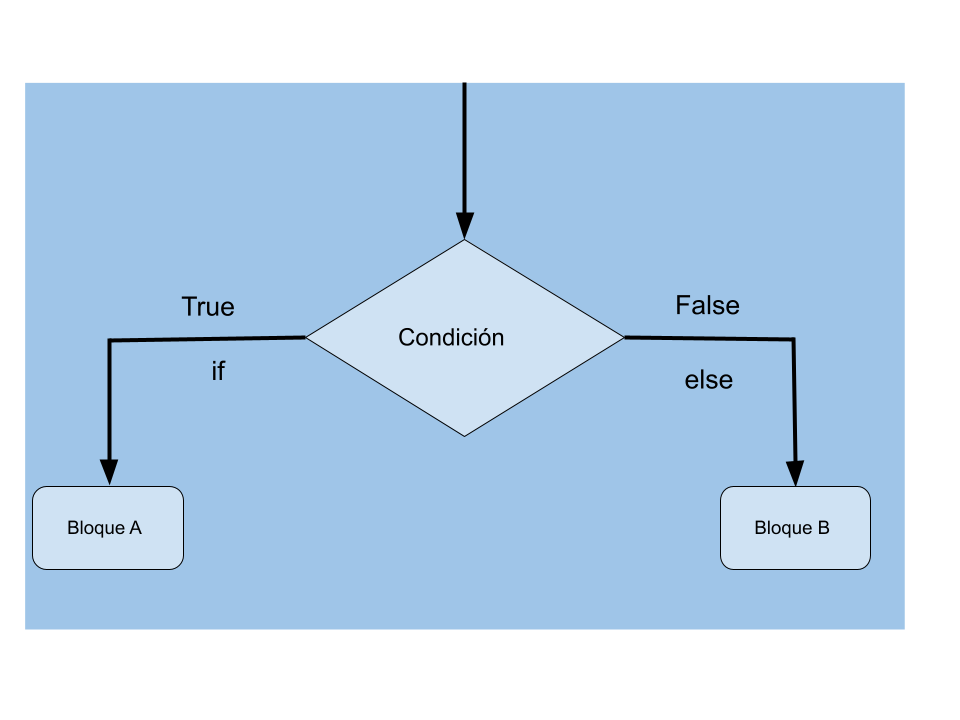

## Sentencias condicionales

A veces queremos que una parte de nuestro código se ejecute o no dependiendo de que se cumpla determinada condición:

* Qué una variable tenga determinado valor o
* O que el valor de la variable esté en determinado rango, por ejemplo mayor que un valor
* O que estemos pulsando o no un botón
* ...



En estos casos usamos sentencias condicionales. La más simple es la sentencia **if** (si) que irá seguida de una **condición** que sólo puede ser verdadero (True) o falso (False) por lo que decimos que es un valor booleano, y después pondremos "**:**". En caso de que este valor sea **True** se ejecutará el bloque de líneas que sigue a la sentencia. Si es **False** no se ejecutará.

En muchas ocasiones tenemos un bloque de instrucciones para el caso que se cumpla y otro para cuando no se cumpla. En ese caso incluiremos la sentencia **else :** para delimitar el bloque que se ha de ejecutar en caso de que no se cumpla la condición.

Recordemos que para definir un bloque haremos que las líneas de código empiecen con 4 espacios (no es obligatorio que sean 4, pero es lo recomendado) más a la derecha. **Es fundamental que respetemos el formato de las líneas.**

Vamos a rehacer el ejemplo del pulsador usando sentencias condicionales:

```python
import machine
import time

v = 0.3

pulsador = machine.Pin(17, machine.Pin.IN)

led = machine.Pin(26, machine.Pin.OUT)

while True:
    if  pulsador.value() == 1: # está activo
      led.on()
      print('On')
    else:  # no está activo
      led.off()
      print('off')
    time.sleep_ms(200) # ponemos un pequeño retardo para no saturar la pantalla
```

Las sentencias condicionales nos permiten hacer más sofisticado nuestro código ayudando a hacerlo más manejable.

Vamos a usar una sentencia condicional para comprobar si ya se han inicializado los leds en el ejemplo anterior de las colecciones y si no se ha hecho lo haremos.

Para ello vamos a comprobar en cada método si la lista __leds__ tiene los mismos elementos que la tupla __pin_led__ y si no es así llamamos al método inicializar:

```python
...
def encenderTodos():
    if len(leds) != len(pin_leds):
        inicializar()
    for led in leds:  # Iteramos en todos los leds
        led.on() 

...

```


## Ejemplo: luz de escalera

Vamos a usar ahora lo que hemos aprendido para hacer un sencillo ejemplo de código para una luz de escalera, con un pulsador y un led simulando la iluminación (recuerda que puedes sustituir el led por un __relé__ y ya puedes conectar una instalación eléctrica real)

Crearemos la función de interrupción asociada al pulsador y usaremos una variable __pulsado__ para avisar al programa principal que se ha pulsado. Desde el programa principal comprobaremos el valor de la variable y encenderemos el led que mantendremos encendido unos segundos cuando el valor de la variable sea True.

Hemos añadido una línea en la función de la interrupción donde indicamos que la variable es global: al usar interrupciones es importante que lo hagamos para avisar al intérprete de que la variable no es local.

En este ejemplo he usado la placa TTGO que tiene un pulsador conectado al pin 35, sólo habría que añadir el led/relé al pin 12. Si usas otra placa puedes modificar el pin del pulsador y el del led usando los montajes que hemos hecho antes.

```python

import machine 
import time

v = 0.3

pulsado = False

def interupcion_pulsador(pin):
    global pulsado
    print('detectado')
    pulsado = True


pin_Luz = 12
pin_pulsador = 35

led = machine.Pin(pin_Luz, machine.Pin.OUT)
led.off()
pulsador = machine.Pin(pin_pulsador, machine.Pin.IN,machine.Pin.PULL_DOWN)

pulsador.irq(trigger=machine.Pin.IRQ_RISING, handler = interupcion_pulsador)

while True:
  if pulsado:
    print('Pulsado. ¡encendiendo la luz!')
    led.on()
    time.sleep(20) # 20 segundos encendido
    print('Apagado!')
    led.off()
    pulsado = False
```

Al ejecutarlo verás que cuando pulsamos el pulsador aparecen varios mensajes de 'detectado' aunque intentes que la pulsación sea muy corta. Eso te da una idea de la velocidad a la que funcionan estos sistemas.

