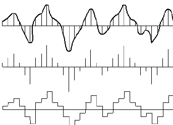
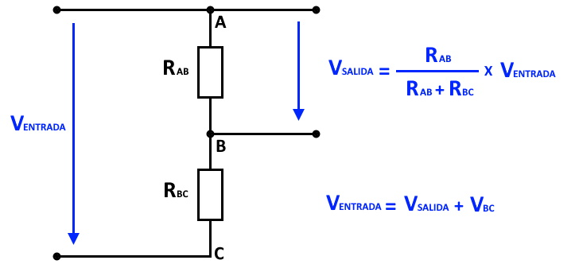

### Lectura de valores analógicos con ADC

El sistema que se encarga de hacer la medida de señales analógicas se denomina ADC: Analog to Digital Converter. Es un sistema capaz de convertir el voltaje que detecta en la entrada que estamos midiendo y nos da un número entero, traducido a una escala digital proporcional al valor máximo que puede medir.

Como vemos en la imagen, a partir de la medida la reconstrucción de la señal no siempre es aproximada.

Veamos algunas de las características de los ADC:

* Tienen un **rango de medida**, un voltaje máximo que pueden medir. No conviene sobrepasarlo, pues podríamos dañar la placa. La mayoría de las placas hoy en día funcionan a 3,3 voltios lo que quiere decir que ese es el valor máximo que podemos medir.
* Alguna, como el esp32, permiten adaptar los niveles máximos según lo que se conoce como **atenuación** pudiendo restringir los valores de voltaje para así conseguir una mayor precisión en la medida.
* También tiene lo que se llama **resolución** que es el rango de valores al que podemos convertir: a mayor rango, mayor resolución pues esta sería el valor del cociente entre el rango de medida y el rango de valores. Se suele expresar en número de bits, siendo el número de valores posibles 2^(número bits). Por ejemplo para un sistema que tenga un rango de medida de 3.3V y 10 bits, el valor de la resolución sería de 3.3V/1024 = 3 mV (milivoltios).
* La **precisión** es la calidad y repetibilidad en la medida. Es decir, que dos señales iguales dan igual medida. Aquí la calidad de los ADCs de los equipos habituales quedan un poco en evidencia, como era de esperar pues no son equipos profesionales.

A medida que vamos trabajando con los ADCs de estos sistemas nos damos cuenta que tiene una calidad aceptable pero no profesional. Si queremos trabajar con buena medida de calidad necesitaremos comprar un hardware externo. 

Como veremos en el tema siguiente, estas placas admiten que le conectemos complementos o periféricos, con los que se comunican y a los que pueden delegar tareas.  Unos de ellos pueden ser los ADCs de más precisión,o más rápidos o simplemente más canales para poder tomar más muestras a la vez. Por ejemplo [este conversor de 24 bits](https://www.amazon.es/ILS-ADS1220-Converter-m%C3%B3dulo-Sensor/dp/B07ZP152XF) tiene una sensibilidad y precisión de millonésimas de voltio y lo podríamos usar con nuestros ESP32.

Otra opción que siempre tenemos es hacer muchas medidas y realizar un tratamiento estadístico con los valores que vamos leyendo. De esta forma conseguiremos promediando tener una medida de mayor calidad y una estimación del error de este valor.

Si necesitáramos medir más allá del límite, tendríamos que usar un divisor de tensión:

