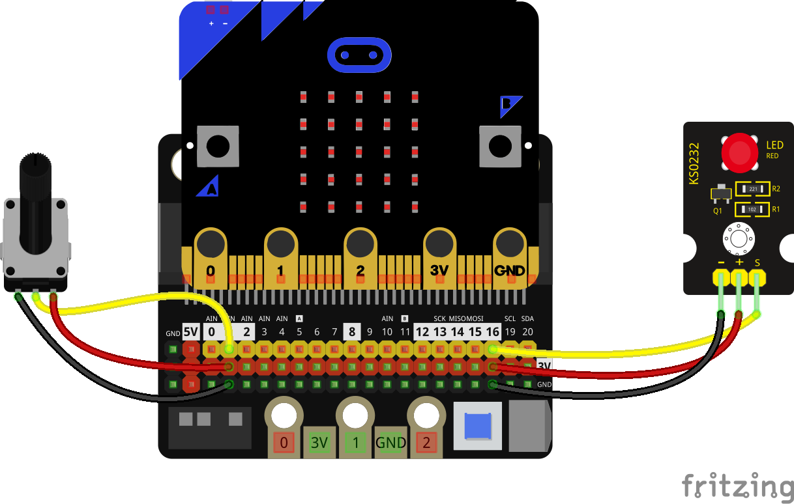

### Pines analógicos

Tenemos los pines analógicos: pin0, pin1, pin2, pin3, pin4 y pin10 capaces de medir el voltaje que llega al pin, entre 0 y 3.3V. Lo haremos usando **read_analog()** que nos devuelve un valor entre 0 y 1023

Vamos a hacer un sencillo montaje para controlar el brillo de un led conectado al pin 16 usando un potenciómetro conectado al pin 1



```python
from microbit import *

led = pin16
pot = pin1


while True:
    led.write_analog(pot.read_analog())
```
