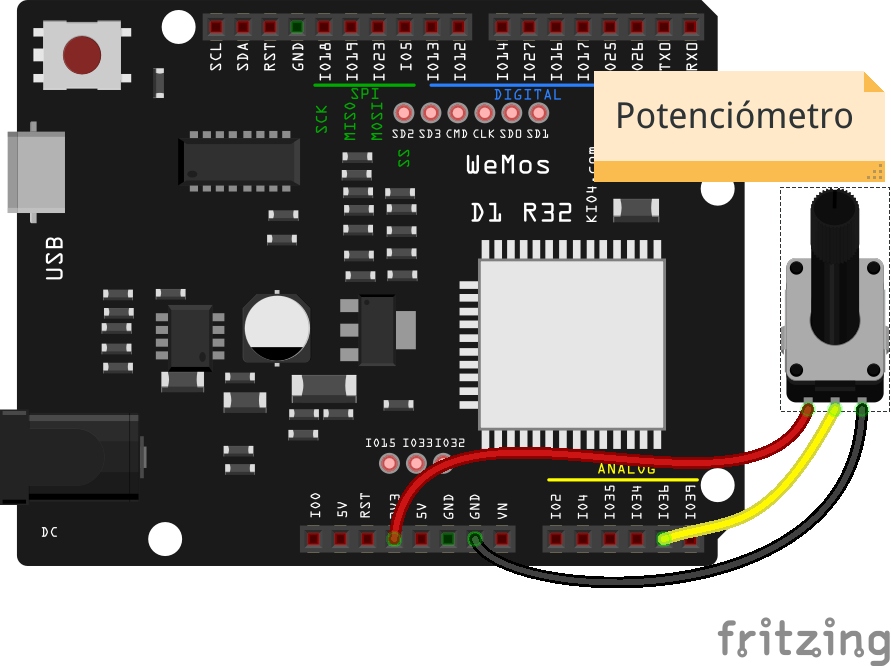
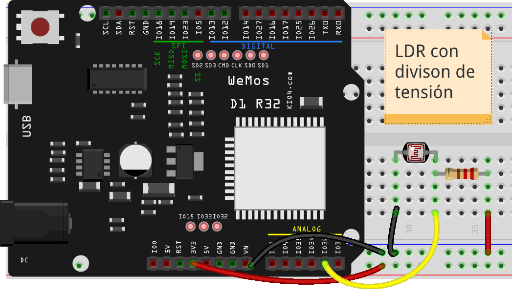
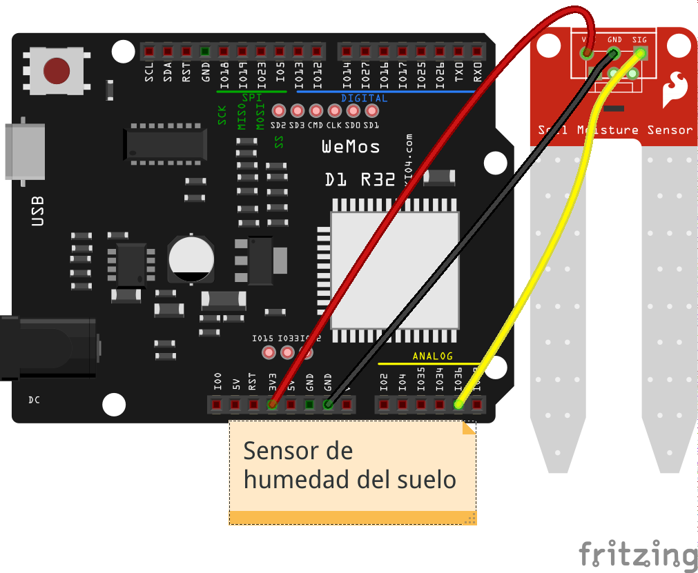
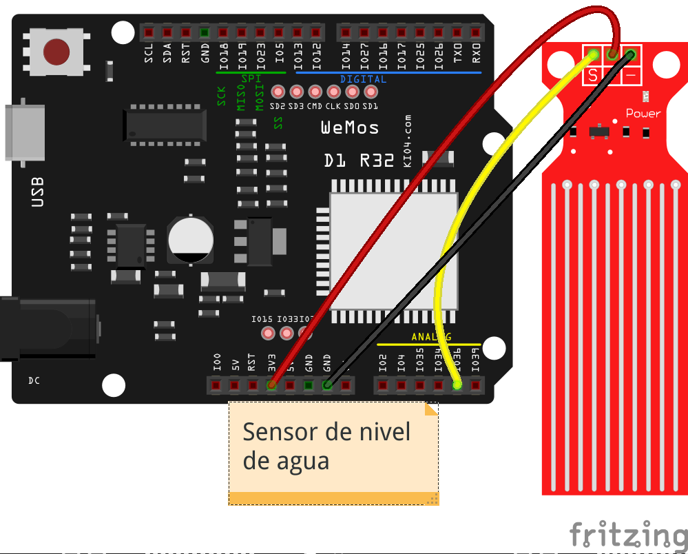
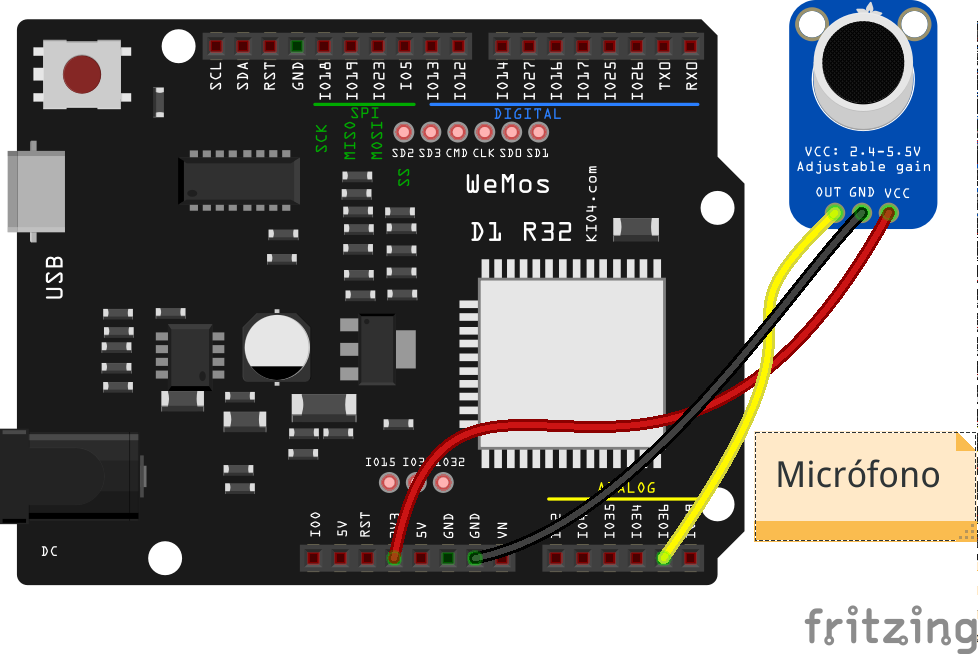
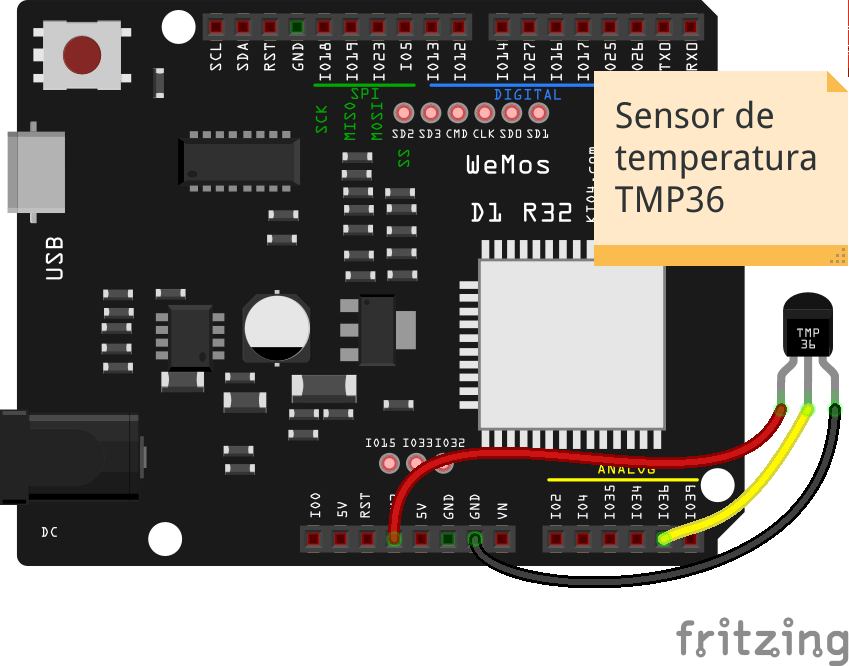

## Sensores Analogicos

Existen multitud de sensores con los que podemos medir diferentes medidas físicas. Por ejemplo:temperatura, luz, humedad,... Leeremos el voltaje del sensor con el ADC y posteriormente debemos convertir estos valores a los valores de la magnitud física.

Este proceso se conoce como **calibración** consiste en establecer qué valores numéricos qué obtenemos de nuestro ADC se corresponden con los valores reales de la magnitud física medida.

Los sensores analógicos calibrados que podemos encontrar en el mercado son mucho más caros que los que solemos utilizar con estos dispositivos. El proceso de calibración es un proceso costoso y muy dependiente del dispositivo y sobre todo prácticamente manual.

A veces no necesitamos un proceso de calibración complejo sino simplemente establecer unos ciertos niveles o umbrales que serán aquellos en los que nuestros programas tengan que actuar. Por ejemplo, en un sistema de riego no necesitamos conocer con exactitud la cantidad de agua del suelo si el valor a partir del cual nosotros queremos consideramos que en el suelo está seco y tenemos que regarlo

Tenemos que distinguir entre magnitudes analógicas (casi todas) y que el sensor proporcione una señal analógica. También existen sensores que miden magnitudes analógicas pero que nos proporcionan la medida en un formato digital, por medio de un protocolo. En el próximo tema hablaremos de los segundos, ahora nos vamos a centrar en los primeros.

En estos primeros ejemplos no podemos calcular un valor absoluto de la magnitud que miden, nos conformamos con establecer unos umbrales para decidir si hay que actuar.

### Potenciómetro

Un **potenciómetro** es una resistencia variable cuyo valor podemos controlar con un cursor que gira. Se suele utilizar para poder controlar valores o ajustes.



### Resistencia sensible a la luz o LDR

Se trata una resistencia cuyo valor cambia dependiendo de la cantidad de luz que reciba o **LDR**, se la suele llamar también célula fotoeléctrica y se usa en multitud de lugares, como sensores de paso, activación de luces automática,...



El montaje requiere de un divisor de tensión, que es una resistencia que equilibra el valor de la LDR para facilitar la medida en el punto medio. La resistencia debe tener un valor similar al del LDR.

Para determinar su rango o el umbral deberemos medir los valores que obtenemos en las condiciones reales.

### Sensor de humedad de suelo



Este sensor mide la conductividad del suelo, lo que suele ser proporcional a la humedad de este.

Mediremos los valores del suelo seco y con el nivel de humedad que deseamos para determinar el umbral.

### Sensor de nivel de agua



Es un típico sensor que nos permite medir el nivel de agua de un depósito.

### Micrófono



Este sensor nos permite medir el volumen del sonido en un momento dado.

### Sensores de temperatura analógicos: TMP36



El sensor TMP36, es un sensor de temperatura analógico, que sí viene calibrado por el fabricante, que nos proporciona una fórmula para convertir la lectura del sensor en un valor concreto de temperatura. 


```python
import machine

adc36 = machine.ADC(machine.Pin(36), attn = machine.ADC.ATTN_11DB)
adc36.witdh(machine.ADC.WIDTH_9BIT)
valor = adc36.read() # entre 0 y 512

volts = 3.3 * valor / 512 # normalizamos a voltios
temperatura = (volts - 0.5) * 100  # calculamos la temperatura

print('Temperatura: ',temperatura)
```

 