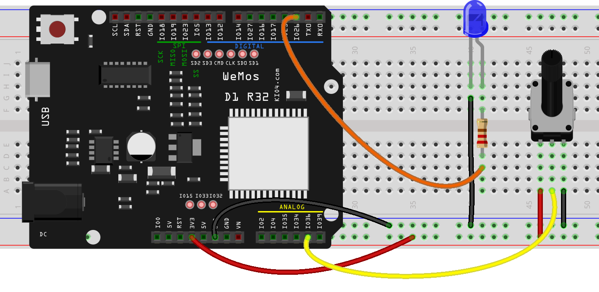

## Controlando el brillo de un led con un potenciómetro

Vamos a hacer un sencillo ejemplo en el que controlaremos el brillo de un led con un potenciómetro.



El código es muy sencillo, y solo tenemos que leer el potenciómetro y escalar el valor al rango 0 - 1023 del canal PWM del led.

```
import machine
import time

v = 0.2

adc36 = machine.ADC(machine.Pin(36))

adc36.atten(machine.ADC.ATTN_11DB) # 0 - 3v

pwm_rojo=machine.PWM(machine.Pin(26))

while True:
    valor_pot = adc36.read()
    brillo = valor_pot//4 # o int(valor_pot/4)
    print(valor_pot,' > ',brillo, end='  \r')
    pwm_rojo.duty(brillo)
    time.sleep_ms(100)
```

[](https://drive.google.com/file/d/1FThVBYL8lbukJY-_nbOo2f16-vFW-zEL/view?usp=sharing)

[Vídeo: Controlando el brillo de un led con un potenciómetro desde micropython](https://drive.google.com/file/d/1FThVBYL8lbukJY-_nbOo2f16-vFW-zEL/view?usp=sharing)

Si te animas haz un montaje con 3 potenciómetros y controla el color de un led RGB.
