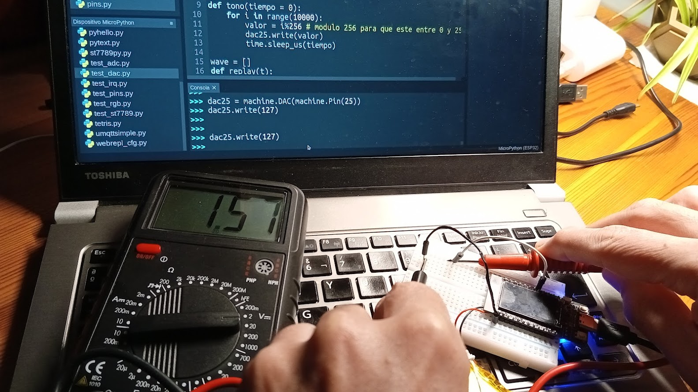

### Conversor Digital a Analógico: DAC 

Hemos visto cómo podemos modular la señal de una patilla digital para conseguir un cierto control sobre el nivel de brillo, es lo que hemos llamado PWM.

Algunos dispositivos, como por ejemplo el esp32, disponen de lo que se conoce como un Conversor Digital a Analógico, un DAC (digital-to-analog Converter) qué es un dispositivo capaz de establecer un valor analógico,es decir, un voltaje, en determinada patilla.

En el esp32 tenemos dos DAC: en los pines 25 y 26, con una resolución de 8 bits, es decir, podemos establecer valores entre 0 y 255,  obteniendo un voltaje entre cero y 3,3V.

Para usar un DAC, lo haremos a través del módulo machine, como siempre, vinculando el DAC con el objeto Pin de cada una de las patillas y por medio del método **write**  estableceremos el valor que queremos de voltaje. 

Podemos comprobar el valor de salida de un DAC sin más que conectar un voltímetro:

```python
>>> import machine
>>> dac25 = machine.DAC(machine.Pin(25))
>>> dac25.write(127) # esperamos medir 3.3/2
>>>
```




### Sonido con DAC

Un DAC no es adecuado para controlar el brillo de un LED puesto que estos necesitan un voltaje mínimo para activarse. 

Vamos a hacer unos ejemplos sencillos en los que crearemos una forma de onda que podemos utilizar para generar  sonidos.

Haremos una sencilla onda de diente de sierra con el método __tono__ y un sinusoidal con el método __seno__


```python
import machine
import math
import time

v = 0.5

dac25 = machine.DAC(machine.Pin(25))

def tono(tiempo = 0): # Onda de sierra
    for i in range(10000):
        valor = i%256 # módulo 256 para que esté entre 0 y 255
        dac25.write(valor) 
        time.sleep_us(tiempo)
       
wave = []
def replay(t): 
    if len(wave) == 0:
        for grado in range(360): # 360 grados son un ciclo entero
            valor = int(128 + 127 * (math.sin(20 * grado * math.pi / 180)))
            wave.append(valor)
    
    for i in range(10):
        for w in wave:
            dac25.write(w)
            time.sleep_us(t)

def seno( m = 1): # Onda sinusoidal
    for grado in range(360): # 360 grados son un ciclo entero
        valor = int(128 + 127 * (math.sin(m * grado * math.pi / 180)))
        dac25.write(valor)
        
def efecto_subida():
    for t in range(0,100,5):
        seno(t)
```

[](
https://drive.google.com/file/d/1Ll_HCY23Mz9kjA7v62dFwHFGNgsLG5m7/view?usp=sharing)

[Vídeo: 4.5 Generando sonidos con el DAC desde micropython](
https://drive.google.com/file/d/1Ll_HCY23Mz9kjA7v62dFwHFGNgsLG5m7/view?usp=sharing)
