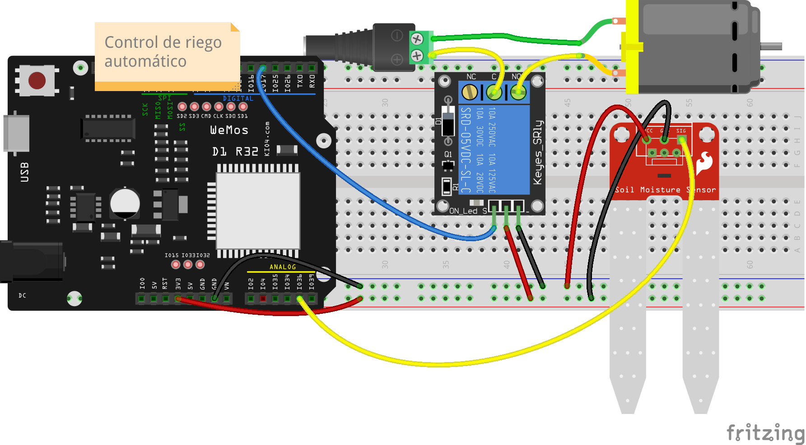
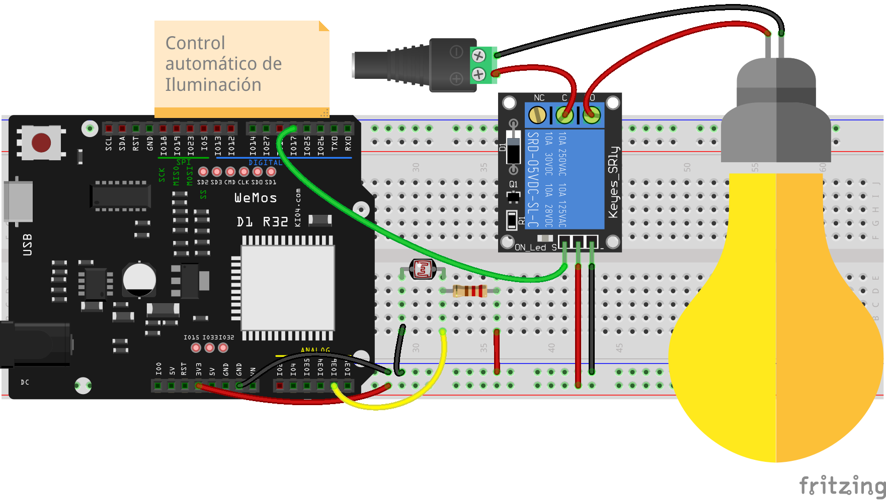
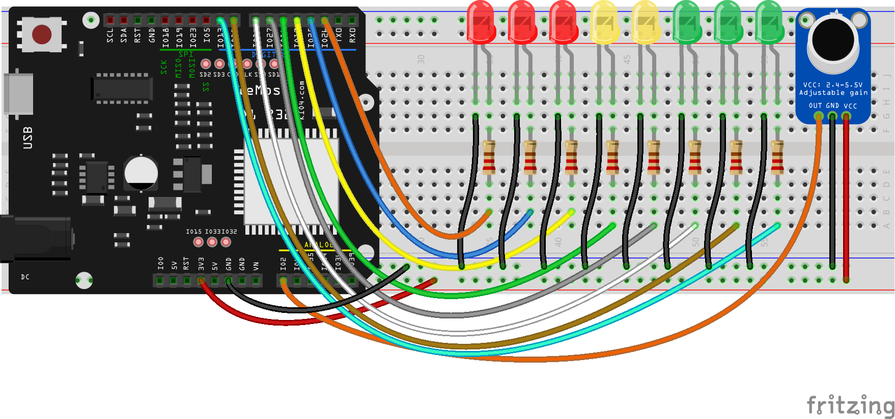

### Proyectos con sensores analógicos

Vamos a utilizar lo que hemos aprendido en este tema en unos sencillos proyectos

* **Sistema de riego** sería un simple sensor de humedad que conectamos a nuestra entrada analógica. Leeremos los valores y a partir de ellos decidiremos en qué momento activamos un relé que conecta una bomba de riego. Llegado el momento en el que el valor de la humedad suficiente pararíamos la bomba simplemente desactivando el relé.

El montaje es sencillo



Previamente a poner en funcionamiento el sistema tenemos que determinar para qué valor del sensor consideramos que ya está húmedo el suelo y para cual está seco. Usaremos unos valores genéricos en el programa.

Este sería el [código](https://raw.githubusercontent.com/javacasm/CursoMicropython/master/codigo/4.7.1.Sistema_riego.py)

```python
import machine
import time

rele = machine.Pin(17, machine.Pin.OUT)

adc36 = machine.ADC(machine.Pin(36), atten = machine.ADC.ATTN_11DB) # Hasta 3.3v
adc36.width(machine.ADC.WIDTH_10BIT) # no necesitamos más precisión

medidaSueloHumedo = 600 # Los determinamos empíricamente
medidaSueloSeco = 400

while True:
    valor_humedad = adc36.read()
    if valor_humedad < medidaSueloSeco:
        rele.on()
        print('Encendemos el riego')

    if valor_humedad > medidaSueloHumedo:
        rele.off()  
        print('Apagamos el riego')     

```


* Un **sistema de iluminación automática** solo tiene que utilizar el valor de la medida de una resistencia luminosa LDR para establecer en qué momento activamos o desactivamos la iluminación que controlaremos posiblemente con un relé:



El [programa](https://raw.githubusercontent.com/javacasm/CursoMicropython/master/codigo/4.7.2.Luz_automatica.py) es prácticamente idéntico al anterior...

```python
import machine
import time

rele = machine.Pin(17, machine.Pin.OUT)

adc36 = machine.ADC(machine.Pin(36), atten = machine.ADC.ATTN_11DB) # Hasta 3.3v
adc36.width(machine.ADC.WIDTH_10BIT) # no necesitamos más precisión

medidaLuz = 600 # Los determinamos empíricamente
medidaOScuridad = 400

while True:
    valor_luz = adc36.read()
    if valor_luz < medidaOScuridad:
        rele.on()
        print('Encendemos la luz')

    if valor_luz > medidaLuz:
        rele.off()  
        print('Apagamos la luz')     

```


* **Semáforo sonoro** 

Se trata de un sistema que mide el ruido ambiental e indica el nivel en un indicado formado por varios leds

El montaje es largo pero sencillo



El [código](https://raw.githubusercontent.com/javacasm/CursoMicropython/master/codigo/4.7.3.Semaforo_sonoro.py) se basa en el que hicimos para hacer efectos con 8 leds.

```python
import machine

v = 0.2

pin_leds = (26, 25, 17, 16, 27, 14, 12, 13) # Wemos D1 R32

leds = []

adc36 = machine.ADC(machine.Pin(36), atten = machine.ADC.ATTN_11DB) # Hasta 3.3v
adc36.width(machine.ADC.WIDTH_10BIT) # no necesitamos más precisión

def inicializar():
    for pin in pin_leds:
       print(pin,end=' ') # tras imprimir cada pin añade 1 espacio sin saltar de línea
       led = machine.Pin(pin, machine.Pin.OUT)
       leds.append(led)
    print(' inicializados')


def apagarTodos():
    for led in range(len(leds)): # iteramos usando el índice del rango
        leds[led].off()  

inicializar()
while True:
    volumen = adc36.read()
    apagarTodos()
    # encadenamos condiciones if
    if volumen < 100:
        leds[0].on()
    if volumen < 160:
        leds[1].on()
    if volumen < 360:
        leds[2].on()        
    if volumen < 560:
        leds[3].on()
    if volumen < 660:
        leds[4].on()
    if volumen < 760:
        leds[5].on()
    if volumen < 860:
        leds[6].on()
    if volumen < 950:
        leds[7].on()
                                                
```


