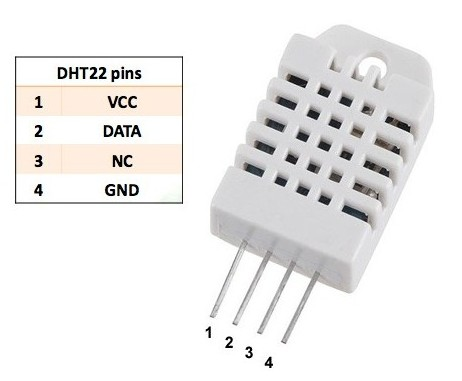
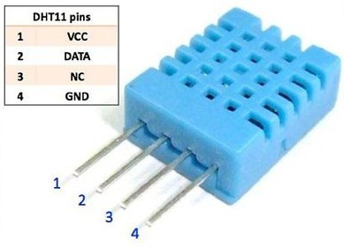
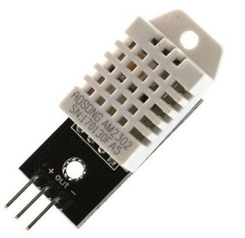
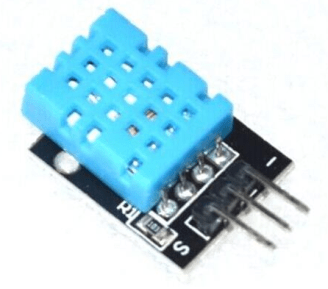
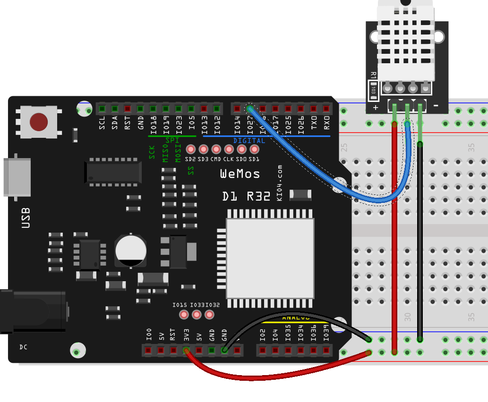

## Sensores DHT

La familia de sensores DHT está formada por sensores de **temperatura** y **humedad** de bajo coste y que se usan en multitud de dispositivos. Tienen un característico encapsulado de plástico, de diferente color según los modelos. Los diferentes sensores de la familia tienen diferente  precisión a la hora de medir.

Todos tienen en común que para comunicarse utilizan un protocolo digital (un lenguaje digital de 1 y 0, organizados de una manera concreta en el tiempo.), y requieren de un único pin digital. 

Para comunicarnos con ellos necesitaremos un módulo que implemente este protocolo de comunicaciones.

También es algo característico que tiene 4 patillas pero que sólo usaremos 3 de ellas: Vcc, GND y Data.

Podemos alimentarlos entre 3 y 5V.

No podemos medir demasiado rápido con ellos, recomendándose que se deje al menos 1 segundo entre medidas.



El DHT22 (también llamado AM2302) tiene una resolución aproximada de 0.5º al medir temperatura y del 2% en la humedad, como podemos ver en su [hoja de datos](https://www.sparkfun.com/datasheets/Sensors/Temperature/DHT22.pdf) (datasheet)



El DHT11 tiene una resolución aproximada de 2º para la temperatura y 5% en la humedad, como podemos ver en su [hoja de datos](https://www.mouser.com/datasheet/2/758/DHT11-Technical-Data-Sheet-Translated-Version-1143054.pdf)

Los podemos encontrar en formato módulo donde el fabricante suele incorporar una resistencia que mejora la calidad de la comunicación, sólo añade 3 terminales externos y añade los nombre de las patillas:






Cuando los compremos debemos asegurarnos de conocer cual es cada patilla, puesto que distintos fabricantes no respetan la misma disposición de los terminales. 

Si no respetamos la polaridad en la alimentación no sólo no funcionan, sino que se queman y quedan inservibles.

Vamos a hacer un sencillo montaje



Y ahora importamos el módulo DHT y declaramos un objeto dht del tipo correspondiente (DHT22 en mi caso) y le pasamos un objeto pin al que está conectado. Para leer llamamos a los método **measure()** y recuperamos el valor de la temperatura y la humedad con los métodos **temperature()** y **humidity()**

```python

>>> import dht
>>> import machine
>>> dht22 = dht.DHT22(machine.Pin(27))
>>> dht22.measure()
>>> dht22.temperature()
22.4
>>> dht22.humidity()
44.2
```

Vamos a empaquetarlo ahora en un fichero donde usaremos un bucle para tomar una medida cada segundo


```python
import dht
import machine
import time

v = 0.1

dht22 = dht.DHT22(machine.Pin(27))

while True:
    dht22.measure()
    print('Temperatura: ',dht22.temperature(),'º C Humedad:',dht22.humidity(),'%')
    time.sleep(1)

```

[](https://drive.google.com/file/d/1vD_YS2aPuW1wdRUmI0XrEllX7eWjO0uw/view?usp=sharing)

[Vídeo: Midiendo humedad y temperatura con un sensor DHT22 en micropython](https://drive.google.com/file/d/1vD_YS2aPuW1wdRUmI0XrEllX7eWjO0uw/view?usp=sharing)


Vamos a darle un poco más de formato:


```python
# Test dht
import dht
import machine
import time

v = 0.2

PIN_DHT = 27


dht22 = dht.DHT22(machine.Pin(PIN_DHT))

while True:
    dht22.measure()
    # Con más formato ...
    print(f'Temp: {dht22.temperature():2.1f} C ')
    print(f'Hum: {dht22.humidity():2.2f} % ')
    time.sleep(1)

```    
Donde hemo usado lo que se conoce como f-string: una mezcla de cadena y formato, donde se pueden evaluar expresiones poniéndolas dentro de unas llaves **{}**.

A medida que vayamos usando montajes más complejos y nuestro código vaya creciendo, nos vamos a encontrar con que se producen errores de ejecución que detienen nuestro código. Son lo que se llaman excepciones y vamos a hablar de ellas.

Si se produce un error de comunicación con el sensor, nuestro código producirá una excepción. Por eso es conveniente que estemos prevenidos.

