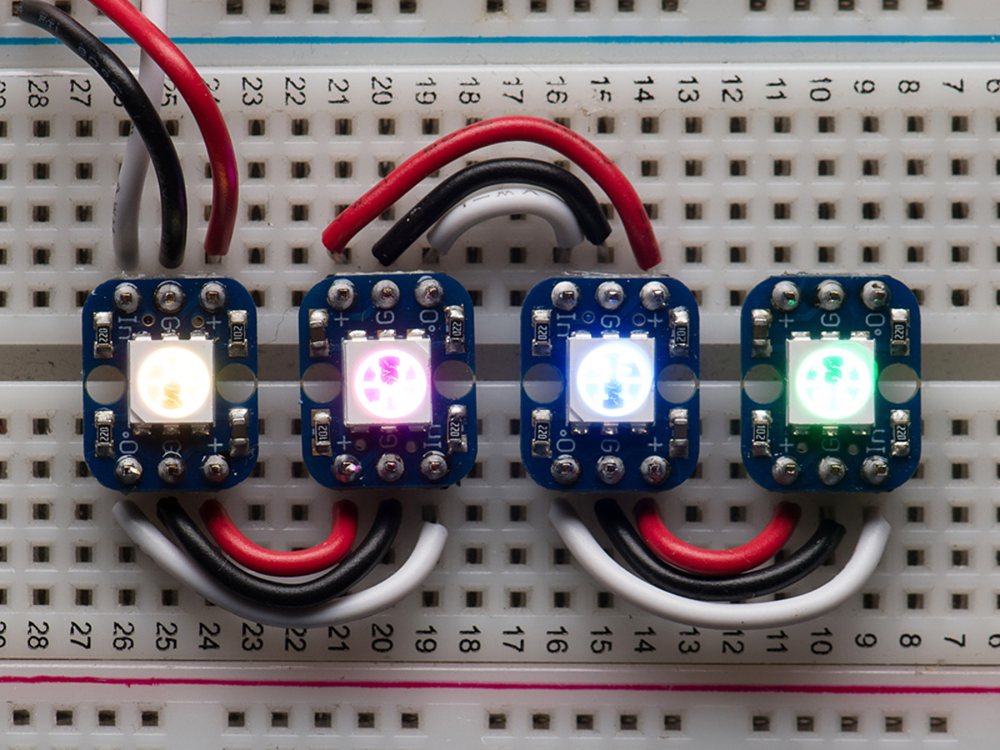
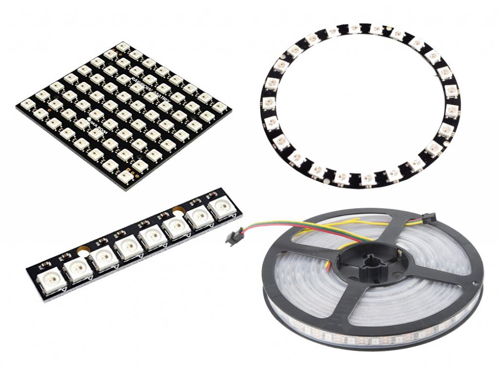

## Neopixels

Los neopixels son unos leds RGB, pensados para trabajar en tiras de leds o incluso en pantallas, que soportan un modo de comunicaciones avanzado que nos permite con un solo pin, manejar todos los leds que estén conectados, pudiendo establecer en cada uno de ellos un color diferente y cambiarlos con gran velocidad.

Los neopixels se encadenan, conectando la salida de uno con la entrada del siguiente y las alimentaciones.



Podemos encontrarlos en muchos formatos: tiras, anillos, individuales, matrices, ....



La conexión es muy sencilla:

* Vcc: si se trata de unos pocos leds podemos alimentarlos de la placa, pero si es posible mejor utilizar una alimentación directa e independiente para los leds.
* GND: conectamos el GND de los leds y de la placa. Si hay 2 alimentaciones, esta es la forma correcta.
* Conectamos el pin DIn del primer neopixel con el pin que lo va a controlar.

El programa también es muy sencillo, puesto que el módulo está incluído en micropython por defecto:

* Lo importamos
* Declaramos un objeto ledRGB que será una lista generada por el objeto neopixel.NeoPixel, al que le pasaremos el Pin al que está conectado y el número de neopixels que hemos conectado
* Establecemos el color de cada led accediendo al elemento correspondiente de la lista y dándole una tupla de 3 números que representa el brillo de cada tono (r,g,b) que estará entre 0 (apagado) y 255 (máximo brillo). 
* Ejecutamos el método __write()__ que activa esa configuración de color.


```python
import neopixel, machine


N = 256 # Número de neopixels

ledRGB = neopixel.NeoPixel(machine.Pin(2),N) 

for led in range(0,N-1,5): # Vamos a poner cada 5 leds iguales
    # Rojo
    ledRGB[led] = (50,0,0)
    # Verde
    ledRGB[led + 1 ] = (0,50,0)
    # Azul
    ledRGB[led + 2 ] = (0,0,50)
    # Blanco
    ledRGB[led + 3 ] = (255,255,255)
    # Negro
    ledRGB[led + 4 ] = (0,0,0)
    
ledRGB.write()  # activamos la nueva visualización

```

