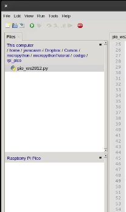
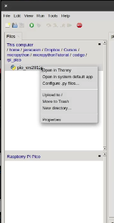
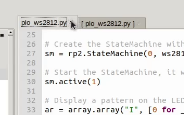
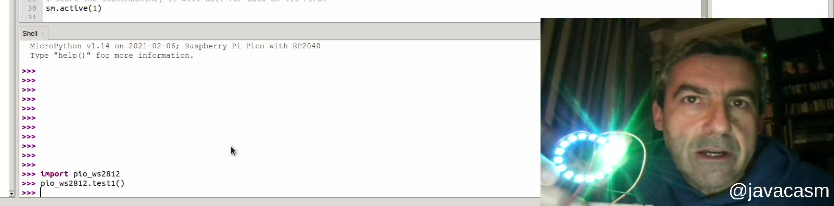
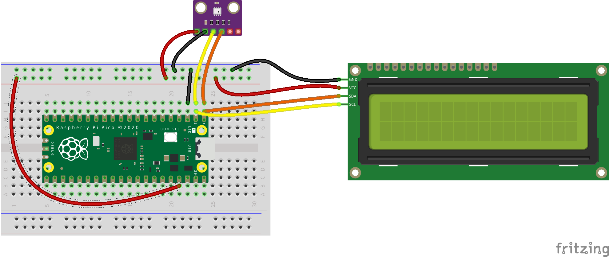

### Ejemplo 2: Conectando neopixels

Aprovechando los ejemplos de la guía "SDK para Python en Raspberry Pi Pico" vamos a ver cómo usar neopixels con la Raspberry Pi Pico en micropython. Podemos descargar [el ejmplo del github de ejemplos de micropython para Raspberry Pi Pico](https://github.com/raspberrypi/pico-micropython-examples/blob/master/pio/pio_ws2812.py)

Vemos que en el código aparece una pequeña parte en ensamblador, es un ejemplo de cómo se pueden usar los PIO (Programable I/O) para hacer que un pin determinado (el 22 en este caso) para crear una máquina de estados que se comunique con un dispsitivo usando un protocolo, el de los neopixels. 

He modificado levemente el fichero original añadiendo un par de funciones para agrupar el código.


```python
# Example using PIO to drive a set of WS2812 LEDs.

import array, time
from machine import Pin
import rp2

# Configure the number of WS2812 LEDs.
NUM_LEDS = 16


@rp2.asm_pio(sideset_init=rp2.PIO.OUT_LOW, out_shiftdir=rp2.PIO.SHIFT_LEFT, autopull=True, pull_thresh=24)
def ws2812():
    T1 = 2
    T2 = 5
    T3 = 3
    wrap_target()
    label("bitloop")
    out(x, 1)               .side(0)    [T3 - 1]
    jmp(not_x, "do_zero")   .side(1)    [T1 - 1]
    jmp("bitloop")          .side(1)    [T2 - 1]
    label("do_zero")
    nop()                   .side(0)    [T2 - 1]
    wrap()


# Create the StateMachine with the ws2812 program, outputting on Pin(22).
sm = rp2.StateMachine(0, ws2812, freq=8_000_000, sideset_base=Pin(22))

# Start the StateMachine, it will wait for data on its FIFO.
sm.active(1)

# Display a pattern on the LEDs via an array of LED RGB values.
ar = array.array("I", [0 for _ in range(NUM_LEDS)])

def test1():
    # Cycle colours.
    for i in range(4 * NUM_LEDS):
        for j in range(NUM_LEDS):
            r = j * 100 // (NUM_LEDS - 1)
            b = 100 - j * 100 // (NUM_LEDS - 1)
            if j != i % NUM_LEDS:
                r >>= 3
                b >>= 3
            ar[j] = r << 16 | b
        sm.put(ar, 8)
        time.sleep_ms(50)

def test2():
    # Fade out.
    for i in range(24):
        for j in range(NUM_LEDS):
            ar[j] >>= 1
        sm.put(ar, 8)
        time.sleep_ms(50)

```

Podemos encontrar [más ejemplos de uso de PIO del mismo repositorio](https://github.com/raspberrypi/pico-micropython-examples/tree/master/pio).

Desde Thonny podemos abrir el fichero original que hemos descargado, lo modificamos y adaptamos.

Al conectar desde Thonny con la Raspberry Pi Pico con el firmware de micropython, no sólo obtenemos una consola donde ejecutar codigo python en modo interactivo, conocida como REPL, sino que ademas podemos tenemos un explorador de archivos de la placa Raspberry, donde podremos subir y editar archivos. 



Arriba vemos los ficheros locales y abajo los de la Raspi Pico. Podemos enviar cualquier fichero a la Raspberry Pi Pico pulsando sobre el fichero local y haciendo clic con el botón derecho del ratón seleccionamos "Upload to"  




Podemos editar los ficheros tanto locales como los de la Raspi Pico que aparecen con el nombre entre corchetes



El montaje es muy sencillo, sólo hay que conectar el anillo led a GND y Vcc y el pin de control al pin 22


Ahora podemos ejecutar los test y veremos cómo se iluminan los leds




[](https://youtu.be/kFOTH7aQqh8)

[Vídeo: Usando neopixels con Raspberry Pi Pico en micropython](https://youtu.be/kFOTH7aQqh8)

[Raspberry Pi Pico Python SDK](https://datasheets.raspberrypi.org/pico/raspberry-pi-pico-python-sdk.pdf)


### Ejemplo 3: BME280 + LCD I2C



[Guía para usarla con micropython](https://www.raspberrypi.org/documentation/pico/getting-started/)

### Ejemplos

[Ejemplos: PWM, ADC, i2c, temperatura, etc...](https://github.com/raspberrypi/pico-micropython-examples)

#### Uso C/C++

[Programación en C](rptl.io/rp2040)

[Ejemplos en C](https://github.com/raspberrypi/pico-examples)

[Guía para uasrla con C++](https://datasheets.raspberrypi.org/pico/getting_started_with_pico.pdf)

### Recursos

Diagrama de bloques


#### Pronto nuevas placas con RP2040 

[Adafruit To Add 'Pi Silicon' To Their Boards](https://www.tomshardware.com/news/adafruit-rp2040)

[Arduino To Release Board Based on Raspberry Pi Silicon](https://www.tomshardware.com/news/arduino-rp2040)

[Arduino Announces Raspberry Pi RP2040 Core Port, Arduino Nano RP2040 Connect Board](https://www.hackster.io/news/arduino-announces-raspberry-pi-rp2040-core-port-arduino-nano-rp2040-connect-board-615085ce4791)


#### Tutoriales

[Macrotutorial de Adafruit](https://learn.adafruit.com/getting-started-with-raspberry-pi-pico-circuitpython?view=all)

[Raspberry Pi Pico: Tutorials, Pinout, Everything You Need to Know](https://www.tomshardware.com/news/raspberry-pi-pico-tutorials-pinout-everything-you-need-to-know)

[How to Set Up and Program Raspberry Pi Pico](https://www.tomshardware.com/how-to/raspberry-pi-pico-setup)

[What is Programmable I/O on Raspberry Pi Pico?](https://hackspace.raspberrypi.org/articles/what-is-programmable-i-o-on-raspberry-pi-pico)

[Flashing lights with MicroPython and Programmable I/O part 1](https://hackspace.raspberrypi.org/articles/pio1)

[Flashing lights with MicroPython and Programmable I/O part 2](https://hackspace.raspberrypi.org/articles/flashing-lights-with-micropython-and-programmable-i-o-part-2)

[Ideas y proyectos](https://www.raspberrypi.org/documentation/pico/getting-started/)


### Reviews 

[Comparativa RPi Pico/ESP32](https://www.youtube.com/watch?v=cVHCllbN3bQ)

[Raspberry Pi Pico microcontroller: specifications, features and RP2040](https://magpi.raspberrypi.org/articles/raspberry-pi-pico-microcontroller-specifications-features-and-rp2040)

[bricogeek](https://blog.bricogeek.com/noticias/raspberry-pi/raspberry-pi-pico-con-microcontrolador-propio-arm-cortex-m0/)

[xataka](https://www.xataka.com/accesorios/raspberry-pi-pico-microcontrolador-4-dolares-sorpresa-soc-propio-disenado-raspberry-pi-foundation)

### Varios

[Emulador de Raspberry Pi Pico](https://hackaday.io/project/177082-raspberry-pi-pico-emulator)

[Hilo con imágenes de Rayos X del chip RP2040](https://twitter.com/johndmcmaster/status/1355092011829719046)


