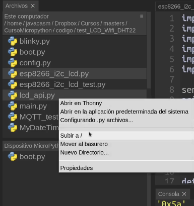
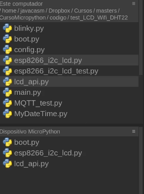

## Pantalla LCD con conexión I2C

Vamos a comenzar a conectar componentes I2C y empezaremos por una pantalla LCD (obviamente con conexión I2C) que nos permite mostrar texto fácilmente.


Conectamos nuestra placa a la alimentación y se encenderá. Si no se enciende o no vemos nada puede ser que tengamos que ajustar el potenciómetro que tiene en la parte de atrás.

Conectaremos también lo pines SDA y SCL de la placa y de la pantalla LCD e incorporamos el módulo python

Vamos a cargar ahora en la placa los módulos python que nos permite usar la pantalla LCD. Son 2 ficheros [LCD API](https://raw.githubusercontent.com/javacasm/CursoMicropython/master/codigo/P.MedidorCO2/lcd_api.py) y [ESP I2C LCD](https://raw.githubusercontent.com/javacasm/CursoMicropython/master/codigo/P.MedidorCO2/esp8266_i2c_lcd.py), que obtenemos de la [página de su creador](https://github.com/dhylands/python_lcd). Descárgalos a tu PC y envíalos tu placa



De manera que los tengamos accesibles desde nuestro código en la placa



Ahora vamos a ver en la consola cómo sería el código:

* Importamos el módulo correspondiente
```python
    import esp8266_i2c_lcd 
```

* Creamos un objeto __i2c__ para acceder al driver I2C (si no lo hemos hecho antes...)

```python
    i2c = machine.SoftI2C(scl=machine.Pin(22), sda=machine.Pin(21))
```
* Creamos un objeto __lcd__ pasándole la dirección de nuestra pantalla, el número de filas y de columnas (o de caracteres por fila):

```python
    lcd = esp8266_i2c_lcd.I2cLcd(i2c, 0x27,2,16)
```

* Vamos a mostrar un texto usando el método __putstr('texto')__ que lo mostrará tras el último carácter mostrado, decimos que el **cursor** está en esa posición. Podemos cambiar la posición donde se imprimirá con el método __move_to(columna,fila)__

```python
    lcd.move_to(0,1) # columna 0, fila 1
    lcd.putstr('Hola Mundo')
```
Vamos a mostrar los datos de nuestro sensor DHT22 en el LCD y a través de la consola. El programa quedará así:

```python
import dht
import machine
import time
import esp8266_i2c_lcd

v = 0.3

dht22 = dht.DHT22(machine.Pin(27)) # inicializamos el sensor dHT22

i2c = machine.SoftI2C(scl=machine.Pin(22), sda=machine.Pin(21)) # creamos el acceso al i2c
lcd = esp8266_i2c_lcd.I2cLcd(i2c, 0x27,2,16)  # creamos el lcd

lcd.putstr('Medida con DHT22')

while True:
    try:    
        dht22.measure()  # Leemos el sensor
        tempDHT22 = dht22.temperature()
        humDHT22 = dht22.humidity()
        sMsg = f'T:{tempDHT22} H:{humDHT22}'  # creamos una cadena con el contenido a mostrar
        print(sMsg)  # enviamos el mensaje a la consola
        lcd.move_to(0,1) # columna 0, fila 1
        lcd.putstr(sMsg) # enviamos el mensaje al LCD
    except:
        print('Error leyendo el sensor')
    time.sleep(1)

```

Lo guardamos en la placa como 'meteo.py' y lo ejecutamos importándolo


```python
>>> import meteo
  T:17.6 H:53.8
```

Si obtenemos algún error del estilo "OSError: [Errno 116] ETIMEDOUT" puede deberse a una mala conexión del sensor o del LCD.

[](https://drive.google.com/file/d/14tIdReEZ-covfRcG3ewyVr0DP7M9M26q/view?usp=sharing)

[Vídeo: Medida de temperatura, humedad con DHT22 y eCO2 con lcd I2C usando micropython](https://drive.google.com/file/d/14tIdReEZ-covfRcG3ewyVr0DP7M9M26q/view?usp=sharing)


