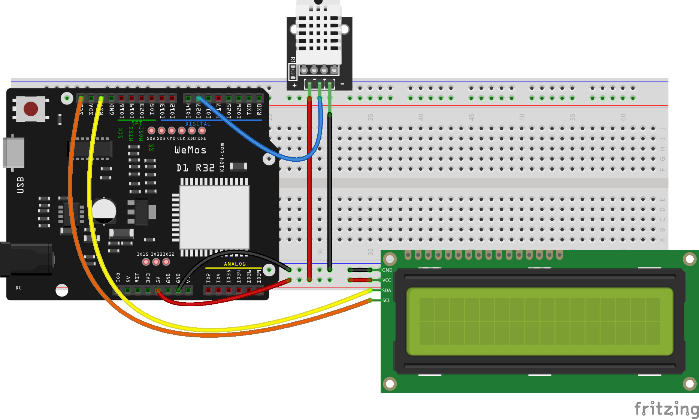

## LCD_I2C

Vamos a comenzar a conectar componentes I2C y empezaremos por una pantalla LCD (obviamente con conexión I2C) que nos permite mostrar texto fácilmente.

Conectamos nuestra placa a la alimentación y se encenderá. Si no se enciende o no vemos nada puede ser que tengamos que ajustar el potenciómetro que tiene en la parte de atrás.

Conectaremos también lo pines SDA y SCL de la placa y de la pantalla LCD e incorporamos el módulo python