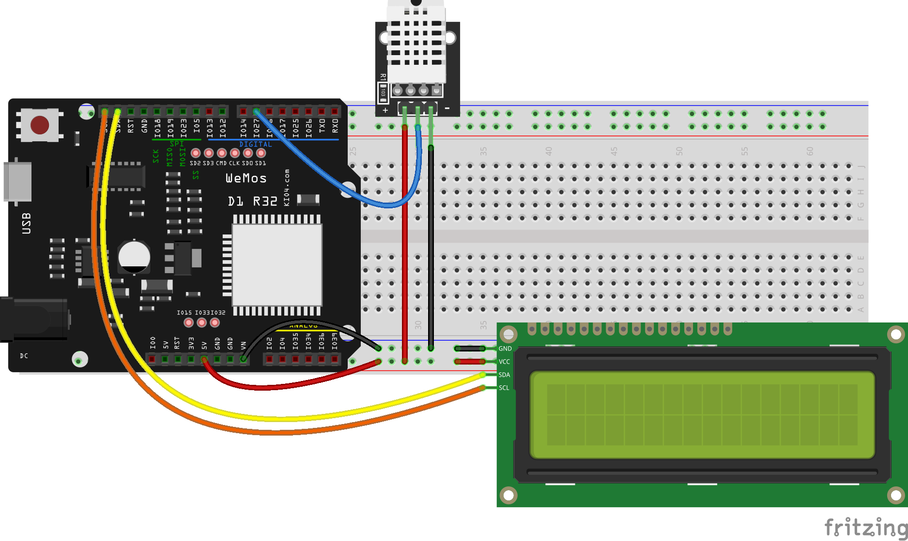

## Pantalla LCD con conexión I2C

Vamos a comenzar a conectar componentes I2C y empezaremos por una pantalla LCD (obviamente con conexión I2C) que nos permite mostrar texto fácilmente.



Conectamos nuestra placa a la alimentación y se encenderá. Si no se enciende o no vemos nada puede ser que tengamos que ajustar el potenciómetro que tiene en la parte de atrás.

Conectaremos también lo pines SDA y SCL de la placa y de la pantalla LCD e incorporamos el módulo python

Vamos a cargar ahora en la placa los módulos python que nos permite usar la pantalla LCD. Son 2 ficheros [LCD API](https://raw.githubusercontent.com/javacasm/CursoMicropython/master/codigo/P.MedidorCO2/lcd_api.py) y [ESP I2C LCD](https://raw.githubusercontent.com/javacasm/CursoMicropython/master/codigo/P.MedidorCO2/esp8266_i2c_lcd.py), que obtenemos de la [página de su creador](https://github.com/dhylands/python_lcd). Descárgalos a tu PC y envíalos tu placa


De manera que los tengamos accesibles desde nuestro código en la placa


Ahora vamos a ver en la consola cómo sería el código:

* Importamos el módulo correspondiente
```python
    import esp8266_i2c_lcd 
```

* Creamos un objeto __i2c__ para acceder al driver I2C (si no lo hemos hecho antes...)

```python
    i2c = machine.SoftI2C(scl=machine.Pin(22), sda=machine.Pin(21))
```
* Creamos un objeto __lcd__ pasándole la dirección de nuestra pantalla, el número de filas y de columnas (o de caracteres por fila):

```python
    lcd = esp8266_i2c_lcd.I2cLcd(i2c, 0x27,2,16)
```

* Vamos a mostrar un texto usando el método __putstr('texto')__ que lo mostrará tras el último caracter mostrado, decimos que el **cursor** está en esa posición. Podemos cambiar la posición donde se imprimirá con el método __move_to(columna,fila)__

```python
    lcd.move_to(0,1) # columna 0, fila 1
    lcd.putstr('Hola Mundo')
```
Vamos a mostrar los datos de nuestro sensor DHT22

```python
import dht
import machine
import time
import esp8266_i2c_lcd

v = 0.2

dht22 = dht.DHT22(machine.Pin(27)) # inicializamos el sensor dHT22

i2c = machine.SoftI2C(scl=machine.Pin(22), sda=machine.Pin(21)) # creamos el acceso al i2c
lcd = esp8266_i2c_lcd.I2cLcd(i2c, 0x27,2,16)  # creamos el lcd

while True:
    dht11.measure()
    tempDHT22 = dht22.temperature()
    humDHT22 = dht22.humidity()
    texto = f'T:{tempDHT22} H:{humDHT22}'
    print(texto)
    lcd.move_to(0,1) # columna 0, fila 1
    lcd.putstr(texto)
    time.sleep(1)

```


```python

```


