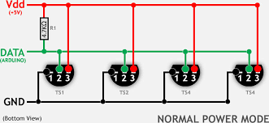
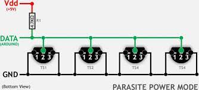

## Sensores atmosféricos

## Sensor atmosférico BMP180

Sensor I2C atmosférico BMP180

Subimos el fichero bmp180.py de https://github.com/micropython-IMU/micropython-bmp180


```python
import machine
import bmp180
import Wemos

i2c = machine.I2C(sda = machine.Pin(Wemos.D2),scl = machine.Pin(Wemos.D1))
i2c.scan() # [119] o 0x77

bmp = bmp180.BMP180(i2c)

bmp.temperature
bmp.pressure

bmp.baseline = 101234## Presion a nivel del mar
bmp.altitude

```

## Sensor de temperatura ds18x20 (onewire)

Una de las ventajas de usar OneWire es que puesto que cada sensor tiene una dirección propia podemos conectar varios sensores a un mismo pin y podremos leer su valor usando su dirección rom. 

Por esto lo primero que hacemos es escanear la red oneWire para saber los sensores conectados. Para ello usamaremos el método **scan** que nos devolverá las direcciones de cada sensor, a lo que suele llamar "rom"

Veamos la conexión de varios sensores de temperatura ds18x20 con conexión onewire conectado al mismo pin



Conectamos los pines iguales de todos los sensores (GND,Vdd y Data). El fabricante recomienda que  pongamos una resistencia de 4.7KOhmios entre Vcc y Data.

Para leer sensores de temperatura haremos:

* Primero definimos la red onewire asociada al pin al que hemos conectado los sensores.

```python
ds = ds18x20.DS18X20(onewire.OneWire(machine.Pin(pinOneWire)))
```
* Escanemos la red para obtener las direcciones rom de los sensores llamando al método **scan** que nos devuelve una colección con las direcciones encontradas:

```python
roms = ds.scan()
```
* Llamamos al método **convert_temp** para hacer que los sensores midan la temperatura
* Iteramos por las rom

El código completo puede ser este

```python
import onewire, ds18x20 
ds = ds18x20.DS18X20(onewire.OneWire(machine.Pin(Wemos.D2)))
roms = ds.scan() # escaneamos las direcciones de los sensores
ds.convert_temp() # iniciamos la medida
for rom in roms:
    print(f'{rom} {ds.read_temp(rom)}') # leemos el valor del sensor de id 'rom'

```

Algunos sensores también permiten conexión en alimentación parásita, es decir, toman la alimentación del pin de datos.




# from https://docs.micropython.org/en/latest/esp8266/tutorial/onewire.html
# https://docs.micropython.org/en/latest/esp32/quickref.html?highlight=onewire
# https://github.com/micropython/micropython/blob/master/drivers/onewire/ds18x20.py


## Sensor de temperatura y humedad DHT12 (I2C)

Sensor de temperatura y humedad DHT12 vía I2C con los pines D1 y D2


[Módulo y ejemplo](https://github.com/mcauser/micropython-dht12)


```python
import dht12
from machine import I2C, Pin
i2c = I2C(scl=Pin(5), sda=Pin(4))
sensor = dht12.DHT12(i2c)
sensor.measure()
print(sensor.temperature())
print(sensor.humidity())
```

From [Temperature Sensor](https://docs.micropython.org/en/latest/esp8266/tutorial/dht.html#temperature-and-humidity) in esp8266 micropython tutorial
```
Sensor without I2C in 1-wire mode (eg. DHT11, DHT22, AM2301, AM2302):

1=VDD, 2=Data, 3=NC, 4=GND
Sensor with I2C in 1-wire mode (eg. DHT12, AM2320, AM2321, AM2322):

1=VDD, 2=Data, 3=GND, 4=GND
Sensor with I2C in I2C mode (eg. DHT12, AM2320, AM2321, AM2322):

1=VDD, 2=SDA, 3=GND, 4=SCL
You should use pull-up resistors for the Data, SDA and SCL pins.

To make newer I2C sensors work in backwards compatible 1-wire mode, you must connect both pins 3 and 4 to GND. This disables the I2C interface.
```

## SHT30

[Instalacion via PyPi](
https://pypi.org/project/micropython-sht30/)

[Módulo](
https://github.com/rsc1975/micropython-sht30)

https://github.com/rsc1975/micropython-sht30/blob/master/sht30.py


```python
from sht30 import SHT30

sensor = SHT30()

try:
    t, h = sensor.measure()
except SHT30Error as ex:
    print('Error:', ex)
```


