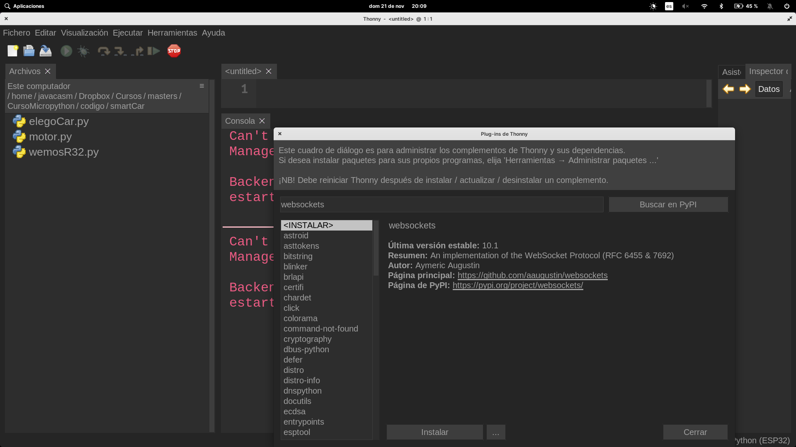

## webRepl

¿Qué es?

[Código](https://github.com/micropython/webrepl)


## Accediendo por Wifi a la consola: WebREPL

Para poder acceder remotamente vía wifi activamos y configuramos **WebREPL** escribiendo en modo interactivo

```python
>>> import webrepl_setup
```

Contestamos a lo que nos pregunta, establecemos una contraseña de acceso y finalmente se resetea




