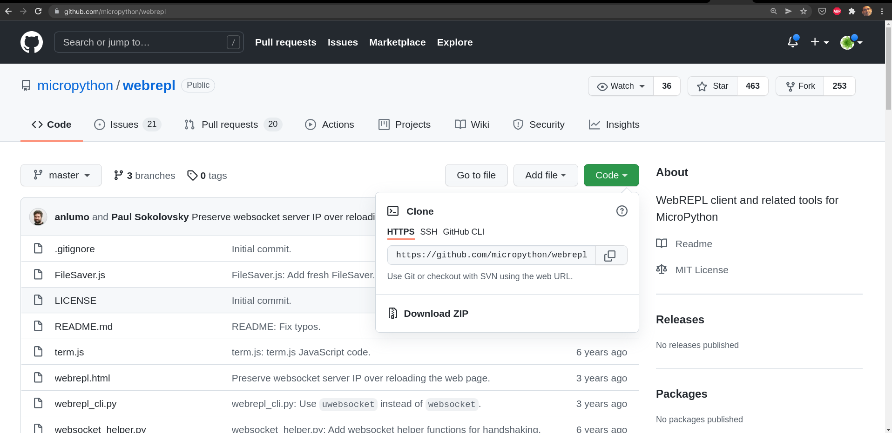

## Accediendo por Wifi a la consola: WebREPL

Una de las ventajas de la conexión wifi es que nos permite acceder remotamente a nuestras placas. Existe una versión que nos permite acceder a la consola vía web. Se llama **WebREPL**.

Hay que decir que estas últimas versiones de Thonny y de micropython, no funciona demasiado bien...

Para usarla tenemos que tener activo nuestro wifi y activar y configurar **WebREPL** escribiendo en modo interactivo

```python
>>> import webrepl_setup
```

Contestamos a lo que nos pregunta, establecemos una contraseña de acceso y finalmente se resetea.

```python
>>> import webrepl_setup
WebREPL daemon auto-start status: disabled

Would you like to (E)nable or (D)isable it running on boot?
(Empty line to quit)
> e
To enable WebREPL, you must set password for it
New password (4-9 chars): Passwd1234
Invalid password length
New password (4-9 chars): Passwd123
Confirm password: Passwd123
Changes will be activated after reboot
Would you like to reboot now? (y/n) 
```

Una vez configurada, se añade una línea al fichero boot.py para arrancar el webREPL y se crea un fichero webrepl_cfg.py que contiene la contraseña de acceso.


Nos descargamos el [Código](https://github.com/micropython/webrepl)



Abrimos el fichero __webrepl.html__ que hemos descargado en el navegador


Ponemos la dirección ip de nuestra placa y ya podemos trabajar desde el navegador. Pudiendo trabajar como en una consola local, enviar y leer ficheros.

También podemos trabajar desde Thonny con webREPL, seleccionándolo como puerto de conexión y rellenando la ip y la contraseña de acceso


Si nos da un error de que falta un módulo lo instalaremos desde Thonny


Una vez configurada, se incluirá en el fichero boot.py para que se arranque automáticamente.


```python
import webrepl
import network
iw = network.WLAN(network.STA_IF)
iw.active(True)
iw.connect('OpenWrt','qazxcvbgtrewsdf')
webrepl.start()
iw.ifconfig()
print('esp32 Lolin32.34')
```

También podemos usar webrepl desde un navegador. Para ello lo descargamos desde [su repositorio](https://github.com/micropython/webrepl) y abrimos el fichero __webrepl.html__ en un navegador veremos una consola donde pondremos la url de nuestro placa, introducimos la clave y accedemos, pudiendo trabajar interactivamente y enviar o recibir ficheros de manera sencilla.


El rendimiento a día de hoy de esta forma de usar webrepl es mucho mejor que el de Thonny.

[](https://drive.google.com/file/d/14PRBpt1AS_YXc0UHx2tcG2b4n0RDEHor/view?usp=sharing)

[Vídeo: 6.1 Configuración y funcionamiento del acceso remoto con webREPL en micropython](https://drive.google.com/file/d/14PRBpt1AS_YXc0UHx2tcG2b4n0RDEHor/view?usp=sharing)
