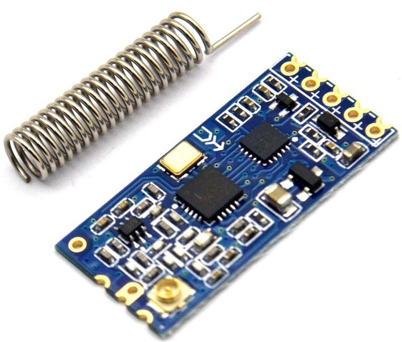
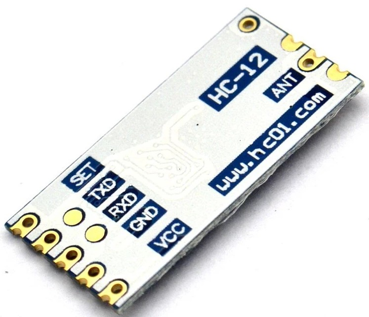

## Radio HC-12

Un sistema de radio sencillo que emula comunicación serie

[Tutorial sencillo de Simon Monk](http://www.doctormonk.com/2022/09/simple-long-range-radio-from-raspberry.html)

[Producto HC-12](https://es.aliexpress.com/item/1005003828295712.html?spm=a2g0o.order_detail.0.0.f91139d3QSlaw6&gatewayAdapt=glo2esp)

