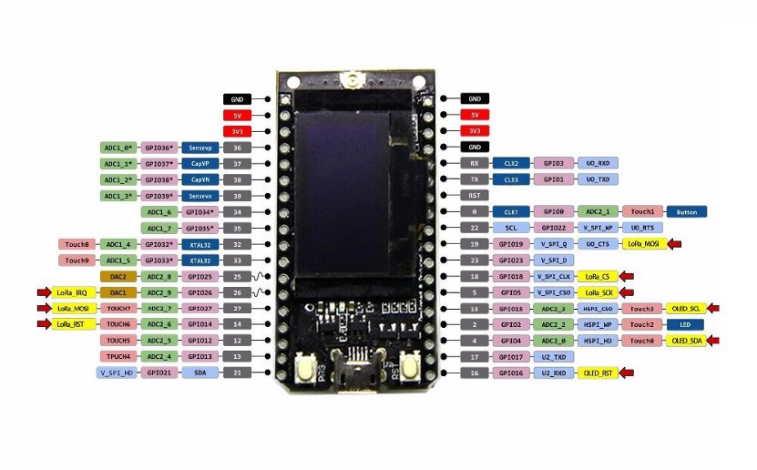

## ESP32 TTGO Lora Oled




```python
from machine import Pin,SoftI2C
from time import sleep
from ssd1306 import SSD1306_I2C

v = 0.6

OLED_RESET = 16

OLED_SCL = 15
OLED_SDA = 4

OLED_ADDRESS = 0x3c

OLED_WITDH = 128
OLED_HEIGHT = 64

LED_BUILTIN = 2 

def test_led():
    led = Pin(LED_BUILTIN,Pin.OUT)
    espera = 0.5
    for i in range(10):
        led.on()
        sleep(espera)
        led.off()
        sleep(espera)
        espera /= 1.5

def test_oled():

    oled_rst = Pin(OLED_RESET,Pin.OUT)

    i2c = SoftI2C(scl=Pin(OLED_SCL),sda=Pin(OLED_SDA))

    oled_rst.off()
    print(f'oled reset off: {i2c.scan()}')

    oled_rst.on()
    print(f'oled reset on: {i2c.scan()}')

    oled = SSD1306_I2C(OLED_WITDH,OLED_HEIGHT,i2c,addr=OLED_ADDRESS)
    
    oled.text('hola',0,0)
    oled.show()
    
    sleep(1)
    
    oled.text('lora',0,9)
    oled.show()
    
    for i in range(0,OLED_WITDH,4):
        oled.rect(1,1,i, int(i*OLED_HEIGHT/OLED_WITDH),1)
        oled.show()

    
    for i in range(OLED_WITDH):
        oled.scroll(1,0)
        oled.show()


    oled.text('hola',0,OLED_HEIGHT-18)
    oled.text('lora',0,OLED_HEIGHT-9)
    oled.show()

    '''sleep(1)
    print('reset off')
    oled_rst.off()

    sleep(1)
    print('reset on')
    oled_rst.on()'''


```