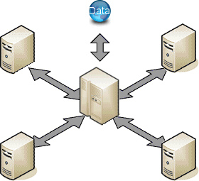
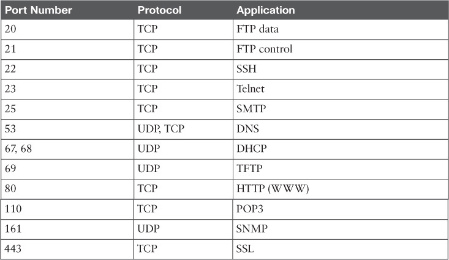

## Teoría de comunicaciones

Cuando comunicamos dos sistema por medio de red necesitamos un canal que se encargue de que los datos llegue de un extremo al otro, de dar confirmación a quien lo envía de que ha llegado, de dar integridad y detectar errores... Al concepto de canal de comunicaciones se le suele llamar **socket**

Existen muchos protocolos de comunicaciones, y dentro una comunicación existen muchas capas, algunas físicas (como el Wifi o el ethernet) y otras lógicas.

Normalmente por socket nos referimos al nivel más bajo de las comunicaciones accesible desde nuestro código (de los niveles más bajos se encarga el sistema operativo).

Vamos a ver los dos tipos de sockets más frecuentes:

* **TCP**: utilizado cuando las aplicaciones necesitan comunicarse de manera fiable. Cada vez que un paquete llega a su destino se notifica al que lo ha enviado y se utiliza en la mayoría de los casos.
* **UDP**: Se utiliza cuando no se necesita garatía en la comunicación. Por ejemplo en las retrasmisiones vía de vídeo Broadcast, al servidor no le importa si los datos llegan o no los clientes. Además si algunos datos se pierden la comunicaciónes continua
    
Cada uno de estos tipos tiene diferentes características y decimos que la cantidad más pequeña de datos que intercambian es un **paquete**, que tendrán los datos que los equipos se envían más una cabecera que identifica al emisor, al destinatario,...

Los equipos se identifican dentro las redes por su **dirección IP**, que normalmente representamos por 4 números separados por putos, cada uno de los cuales puede esta entre 0 y 255, es lo que se conoce como IP4, aunque ya está en servicio IP6 con mayor capacidad.

Con mucha precuencia dos equipos tienen que establecer simultáneamente varias conexiónes, por eso creamos el concepto de **puerto**, que es un número que nos permite identificar cada una de estas comunicaciones. Por convención se asignan puertos concretos a aplicaciones concretas.    
    
### Modelo cliente/servidor

El modelo cliente-servidor es un modelo computacional que actúa como una aplicación distribuida particionando las tareas y la carga de trabajo de los proveedores de recursos, llamados servidores, y los solicitantes de servicios llamados clientes

* Servidor de correo
* Servidor de impresión
* Servidor de proxy
* Servidor de fax
* Servidor web
* Servidor de base de datos

Un mismo equipo puede actuar como servidor de diferentes **servicios**

### Ejemplos de servicios

[Servicios/Puertos](https://en.wikipedia.org/wiki/List_of_TCP_and_UDP_port_numbers)

* Telnet (23) Es la conexión más sencilla, para acceder a equipos remotos. Podemos utlizar con el programa [PuTTY](https://www.chiark.greenend.org.uk/~sgtatham/putty/latest.html)
* FTP (21) Pensado para enviar ficheros pesados. [Filezilla](https://filezilla-project.org/)
* SSH (22) conexión segura remota de servidores. [PuTTY](https://www.chiark.greenend.org.uk/~sgtatham/putty/latest.html)
* HTTP (80) el protocolo que usamos cuando navegamos por internet con navegadores WWW
* NTP protocolo de sincronizción horaria

