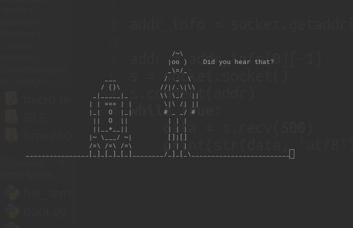

## Sockets en micropython

En todos estos ejemplos de comunicaciones se supone que ya tenemos conectado nuestra placa a Internet vía wifi. Si no es así añade el código necesario al fichero boot.py, como ya vimos anteriormente. Quedaría algo así:


```python
# Fichero boot.py 
v = 0.2

# Conectamos al wifi
import time
import network
wl = network.WLAN(network.STA_IF)
wl.active(True)
if not wl.isconnected():
    wl.connect('OpenWrt','qazxcvbgtrewsdf')
    while not wl.isconnected():
        print('.',end='')
        time.sleep(1)
    
print(f'IP: {wl.ifconfig()[0]}')

# Actualizamos la fecha

import ntptime
import utime
ntptime.settime()
sFecha='{3:02}:{4:02}:{5:02} {2:02}/{1:02}/{0}'.format(*utime.localtime())
print(sFecha)

# Arrancamos webrepl
import webrepl
webrepl.start()


```

Vamos a ver un sencillo ejemplo de comunicación usando un socket de tipo TCP en micropython.  Nos conectaremos al puerto 23 del servidor towel.blinkenlights.nl y mostraremos todo lo que nos envíe por pantalla

```python
import socket

addr_info = socket.getaddrinfo("towel.blinkenlights.nl", 23) # Obtenemos la dirección del servidor

addr = addr_info[0][-1]
s = socket.socket() # conectamos
s.connect(addr)
while True:
    data = s.recv(500)
    print(str(data, 'utf8'), end='')
```

Ejecútalo y disfruta de tu ESP32.



En este caso vamos a crear una conexión con un servidor web, mostrando el resultado en la consola. Por eso nos conectamos al puerto 80, que es el que se usa por defecto para las páginas web.

```python
import socket
full_addr = socket.getaddrinfo('micropython.org', 80)
addr = full_addr[0][-1] # obtenemos la dirección del servidor a través del DNS
print(addr) # dirección IP y puerto del servidor
s = socket.socket()
s.connect(addr) # Conectamos por protocolo tcp
datos_enviados = s.send(b'GET / HTTP/1.1\r\nHost: micropython.org\r\n\r\n') #Solicitamos la página web
data = s.recv(1000) # traemos lo primeros 1000 caracteres
print(data)
s.close() # Cerramos la conexión
```

