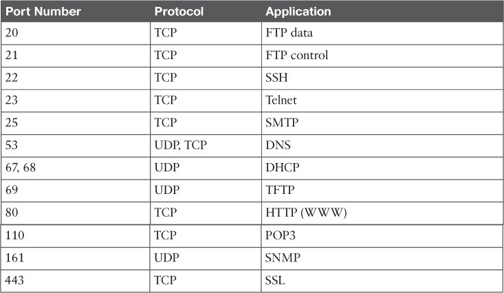

## Teoría de comunicaciones

# Protocolos

Un protocolo de comunicación  es un sistema de mensajes digitales  y unas normas para el intercambio de  los mensajes entre las computadoras a través de las telecomunicaciones.

* El nivel físico se encarga de administrar el hardware de red.
* El nivel enlace de datos de la topología de la red, detección de errores y direccionamiento físico.
* El nivel de red identifica qué ruta existen en las redes.
* El nivel de transporte  realiza el transporte de datos de una computada a otra.
* El nivel de sesión es el encargado de administrar el enlace que hay entre dos máquinas.
* El nivel de presentación  realiza  la representación de información de tal forma que si dos computadoras  tienen diferentes representaciones internas de la información, los datos de la comunicación se les presentan de manera  que puedan reconocerlos.
* El nivel de aplicación  establece los protocolos que a van utilizar las aplicaciones  para el intercambio de información.

IP es un protocolo de comunicación perteneciente  al  nivel de red que es el encargado de llevar la información entre una máquina origen a una máquina destino

Los datos de las aplicaciones son encapsulados en lo que se conoce como paquetes o datagramas. 

## Tipos de comunicaciones

### TCP - sockets
    Cuando las aplicaciones necesitan comunicarse de manera fiable. Cada vez que un paquete llega a su destino se notifica al que lo ha enviado. 
    
    Se utiliza en la mayoría de los casos
    
### UDP 
    Se utiliza cuando no se necesita garatía en la comunicación
    
    Por ejemplo en las retrasmisiones vía Broadcast
    
    
### Puertos

    Normalmente querremos establecer varias comunicaciones entre 2 equipos por eso se crea el concepto de Puerto

    Las aplicaciones suelen usar un puerto concreto para comunicarse
    
    
### Modelo cliente/servidor

El modelo cliente-servidor es un modelo computacional que actúa como una aplicación distribuida particionando las tareas y la carga de trabajo de los proveedores de recursos, llamados servidores, y los solicitantes de servicios llamados clientes

* Servidor de correo
* Servidor de impresión
* Servidor de proxy
* Servidor de fax
* Servidor web
* Servidor de base de datos

### Ejemplos de servicios

[Servicios/Puertos](https://en.wikipedia.org/wiki/List_of_TCP_and_UDP_port_numbers)

#### Telnet (23)

Es la conexión más sencilla

Putty

#### FTP (21)

[Filezilla](https://filezilla-project.org/)

#### SSH (22)

[PuTTY](https://www.chiark.greenend.org.uk/~sgtatham/putty/latest.html)

#### HTTP (80)

Navegadores

Podemos "simularlo" con telnet servidor 80

GET /index.html HTTP/1.1\r\n
\r\n

#### NTP ()

* Seguridad  SSL
  * Herramienta [PuTTY](https://www.chiark.greenend.org.uk/~sgtatham/putty/latest.html)
  * Herramienta [Wireshark](https://www.wireshark.org/)
* HTTP
  * Get
  * Post
  * HTML
  * API REST

import socket
addr = socket.getaddrinfo('micropython.org', 80)[0][-1]
s = socket.socket()
s.connect(addr)
s.send(b'GET / HTTP/1.1\r\nHost: micropython.org\r\n\r\n')
data = s.recv(1000)
s.close()