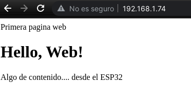

## Ejemplo sencillo de servidor web

Veamos un ejemplo muy básico en el que nos vamos a olvidar del aspecto centrándolos en el contenido y estructura.

```python
import socket

v = 0.2

html = """<html>
          <head>Primera página web</head>
          <body>
          <h1>Hello, Web!</h1>
          <p>Algo de contenido.... desde el ESP32</p>
          </body>
          </html>"""

# No importa los espacios ni el formato del html

s = socket.socket(socket.AF_INET, socket.SOCK_STREAM) # Creamos un socket para escuchar
s.bind(('', 80)) # conectado al puerto 80
s.listen(5) # nos podemos a escuchar

while True:
  conn, addr = s.accept() # Se bloque hasta que llega una conexión
  print(f'Cliente con IP {addr}')
  request = conn.recv(1024)
  print(f'Petición: {request}')
  conn.send(html)
  conn.close()
```
  
Lo ejecutamos y si ahora ponemos la dirección ip del ESP32 en un navegador, veremos el resultado



Si al ejecutarlo obtenemos el error "OSError: [Errno 112] EADDRINUSE" significa que no se cerró bien socket del servidor y debemos hacerle un reset completo (no soft reset) pulsando el botón de la placa.

Decimos que este contenido es **estático** puesto que no cambia. Por oposición llamaremos **dinámico** a aquel que cambia en función del estado de nuestro sistema, por ejemplo mostrando datos de los sensores. Tampoco hemos tenido en cuenta la petición que nos hace el cliente, siempre enviamos la misma respuesta.

