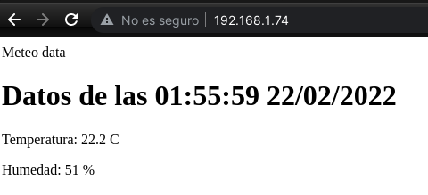

## Interface web para nuestra meteo

Vamos a publicar en una sencilla página web que muestra los valores que leemos de un sensor DHT22 y la fecha.

```python
import dht
import machine
import utime
import socket
import network

v = 0.5

dht22 = dht.DHT22(machine.Pin(27)) # inicializamos el sensor dHT22

def getData():
    dht22.measure()  # Leemos el sensor
    tempDHT22 = dht22.temperature()
    humDHT22 = dht22.humidity()
    sFecha='{3:02}:{4:02}:{5:02} {2:02}/{1:02}/{0}'.format(*utime.localtime())
    return sFecha,tempDHT22,humDHT22

w = network.WLAN(network.STA_IF)
if w.isconnected():
    print(f'Connect to http://{w.ifconfig()[0]}:80')


s = socket.socket(socket.AF_INET, socket.SOCK_STREAM) # Creamos un socket para escuchar
s.bind(('', 80)) # conectado al puerto 80
s.listen(5) # nos podemos a escuchar

while True:
    conn, addr = s.accept() # Se bloque hasta que llega una conexión
    print(f'Cliente con IP {addr}')
    request = conn.recv(1024)
    # print(f'Petición: {request}')    
    sFecha,tempDHT22,humDHT22 = getData() 
    html = f'''<html>
                <head>
                <Title>Meteo data at {sFecha}</Title>
                <meta http-equiv="refresh" content="5" >
                </head>
                <body>
                <h4>Datos de las {sFecha}</h4>
                <p>Temperatura: {tempDHT22} C</p>
                <p>Humedad: {humDHT22} %</p>
                </body>
                </html>'''
    print(f'Temperatura:{tempDHT22} C Humedad:{humDHT22} {sFecha}')
    conn.send(html)
    conn.close()
```

Donde vemos que la clave está en que generamos el html dinámicamente usando una f-string y los datos del sensor.

Hemos añadido al HTML la opción del refresco automático cada 5 segundos con la etiqueta "<meta http-equiv="refresh" content="5" >"



Ya que tenemos un servidor, podemos hacer que esté disponible todo el tiempo. Para eso podemos llamarlo desde el fichero main.py

```python
# fichero main.py

import machine
import web_meteo

v = 0.3

try:
    web_meteo.start_webServer()
except Exception as e:
    print(e)
    machine.reset()
```

Lo reorganizamos un poco y añadimos un led que se activará mientras un cliente esté conectado

```python
import dht
import machine
import utime
import socket
import network

v = 0.8

dht22 = dht.DHT22(machine.Pin(27)) # inicializamos el sensor dHT22

led = machine.Pin(19,machine.Pin.OUT)

def getData():
    dht22.measure()  # Leemos el sensor
    tempDHT22 = dht22.temperature()
    humDHT22 = dht22.humidity()
    sFecha='{3:02}:{4:02}:{5:02} {2:02}/{1:02}/{0}'.format(*utime.localtime())
    return sFecha,tempDHT22,humDHT22

def start_webServer(puerto = 80):
    w = network.WLAN(network.STA_IF)
    if w.isconnected():
        print(f'Connect to http://{w.ifconfig()[0]}:{puerto}')


    s = socket.socket(socket.AF_INET, socket.SOCK_STREAM) # Creamos un socket para escuchar
    s.bind(('', puerto)) # enganchado al puerto 
    s.listen(5) # nos podemos a escuchar

    while True:
        conn, addr = s.accept() # Se bloque hasta que llega una conexión
        led.on()
        print(f'Cliente con IP {addr}')
        request = conn.recv(1024)
        # print(f'Petición: {request}')
        try:
            sFecha,tempDHT22,humDHT22 = getData() 
            html = f'''<html>
                        <head>
                        <Title>Meteo data at {sFecha}</Title>
                        <meta http-equiv="refresh" content="5" >
                        </head>
                        <body>
                        <h4>Datos de las {sFecha}</h4>
                        <p>Temperatura: {tempDHT22} C</p>
                        <p>Humedad: {humDHT22} %</p>
                        </body>
                        </html>'''
            print(f'Temperatura: {tempDHT22} C Humedad: {humDHT22}% {sFecha}')
        except Exception as e:
            print(e)
            html = f'''<html>
                        <head>
                        <Title>Error</Title>
                        <meta http-equiv="refresh" content="1" >
                        </head>
                        <body>
                        <h4>Error</h4>
                        <p>Error: {e} C</p>
                        </body>
                        </html>'''
        conn.send(html)
        conn.close()
        led.off()
```


