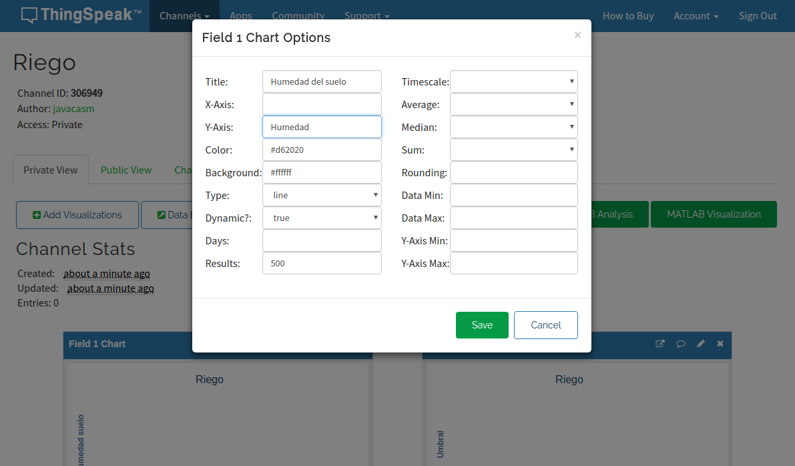

## Publicación en ThingSpeak

ThingSpeak es una servicio web que nos permite publicar datos de las medidas de nuestros dispositivos IOT (o de cualquier otro).


Es gratuito para cierto número de datos y nos permite de manera muy sencilla subir datos.

### Creación del canal (Channel)

* Nos hacemos una cuenta en ThingSpeak, recibiremos un email y lo verificamos.

* Entramos en Channels->My Channels y pulsamos en "New Channel".


* Configuraremos el canal, indicando los datos que se van a enviar. Podemos añadir una descripción y datos como la web, canal de youtube, etc...


* Para poder enviar datos al canal necesitamos el API KEY que lo identifica que incluiremos en nuestro código.


* Para que cualquiera pueda ver los datos, podemos hacer que el canal sea público, desde la pestaña Sharing.


* Una vez creado el canal podemos configurar los detalles de cada gráfico, para lo que pulsaremos sobre el icono "lápiz" de cada uno.

* En cualquier momento podemos importar/exportar los datos de un gráfico dado.




### Código micropython 

Vamos a utiliza el módulo **urequests** para acceder a la web de ThingSpeak y publicar los datos, utilizando las URLs que nos indican en la página del API.


Este es el [código completo](https://raw.githubusercontent.com/javacasm/CursoMicropython/master/codigo/test_thingspeak/test_thingspeak.py)

```python
import machine
import dht
import utime
import urequests

api_key = 'THINGSPEAK_KEY
v = 0.6

dht22 = dht.DHT22(machine.Pin(27)) # inicializamos el sensor dHT22

def getData():
    dht22.measure()  # Leemos el sensor
    tempDHT22 = dht22.temperature()
    humDHT22 = dht22.humidity()
    sFecha='{3:02}:{4:02}:{5:02} {2:02}/{1:02}/{0}'.format(*utime.localtime())
    return sFecha,tempDHT22,humDHT22

def pubData(field1,field2):
        dict_datos = {'field1':field1, 'field2':field2}
        
        request_headers = {'Content-Type': 'application/json'}

        request = urequests.post(
            'http://api.thingspeak.com/update?api_key=' + api_key,
            json = dict_datos,
            headers = request_headers)
        if request.text == '0':
            print('Error sendinng: ',reques.text)
        else:
            print('Published: '+request.text)
        request.close()

def pub_forever():
    while True:
        try:
            sFecha, tempDHT22, humDHT22 = getData() 
            print(f'Temperatura:{tempDHT22} C Humedad:{humDHT22} {sFecha}')
            
            pubData(tempDHT22,humDHT22)
            
            utime.sleep(30)
        except Exception as e:
            print(f'Error: {e}')

```

Comprobamos el valor que nos devuelve la llamada:

* Un valor de 0 indica que no se ha publicado (seguramente porque hemos intentado publicar demasiados datos/minuto)
* Un valor distinto de 0, nos dice que se ha publicado y la posición que ocupa el elemento.

Como se suelen producir errores, el código de publicación se rodea de bloques try/except.

