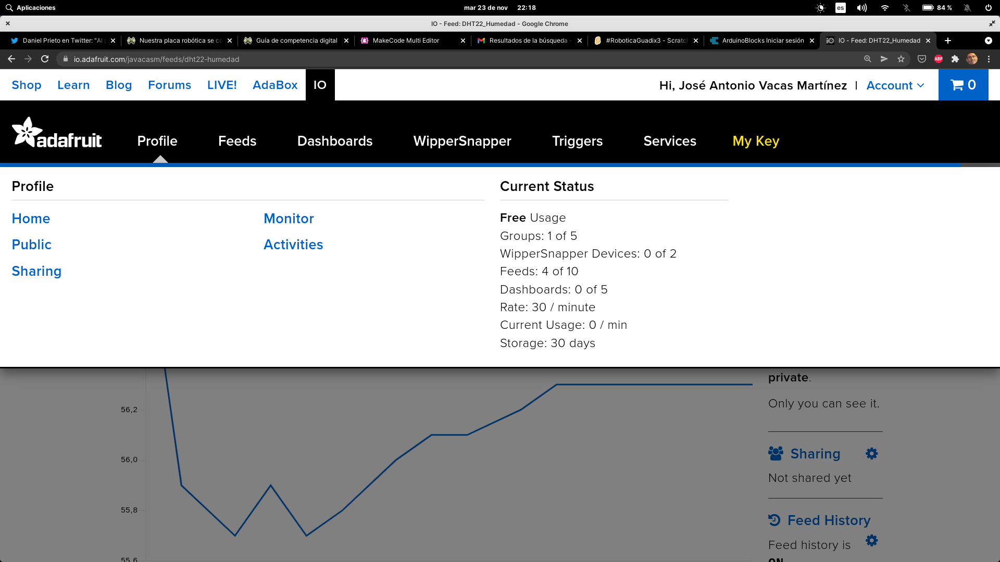
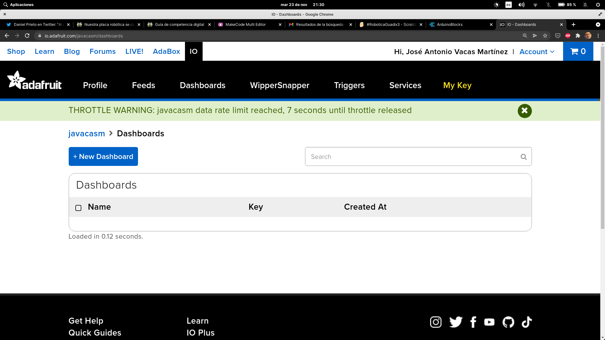
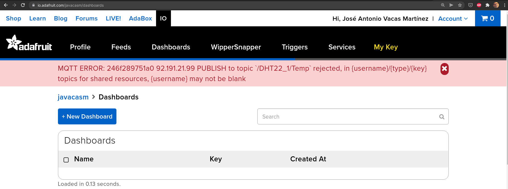

## Publicación de contenidos en Adafruit IO

Vamos a adaptar ahora el ejemplo anterior para conectarnos a Adafruit IO, publicando valores con MQTT. 

Para ello lo primero será darnos de alta en la plataforma. Con la versión gratuita podremos trabajar bastante bien, pero con límites en cuanto a la velocidad de envío de datos y al histórico de estos que se guarda.



Pasados estos límites, o si no usamos adecuadamente la autorización veremos errores en la página de nuestro feed




Vamos a ver algunos cambios que tenemos que hacer a nuestro código:

* Los topics (adafruit los llama feeds) tienen el formato **usuario/feeds/topic**
* Adafruit usa autentificación, por lo que en método **connect** tendremos que darle valores a los parámetros **user** que será nuestro nombre de usuario en adafruit.io y como password, el 

Esta es la configuración de la conexión:

```
Host	io.adafruit.com
Secure (SSL) Port	8883
Insecure Port	1883
MQTT over Websocket	443
Username	Your Adafruit IO Username
Password	Your Adafruit IO Key
```

### Ejemplo micropython

Vamos a adaptar el ejemplo anterior para Adafruit IO. Como cada vez necesitamos más datos de configuración vamos a crear un fichero **config.py** donde pondremos todos los datos de configuración:

```python
# Fichero de configuracion

v = '0.5'

DEEP_SLEEP = True

mqtt_server = 'io.adafruit.com'
mqtt_port =  1883
mqtt_user = 'usario'
mqtt_password = 'AIO_KEYADAFUITIO'

BOARD = 'ESP32 - keyestudio'

SSID = 'MIWIFI'
WIFI_PASSWD = 'MI_CLAVE_WIFI'

print(f'Using config for board: {BOARD}')
```

[Código config.py](https://raw.githubusercontent.com/javacasm/CursoMicropython/master/codigo/mqtt_adafruit_io/config.py)

Tomaremos de este fichero los datos para la conexión del wifi que cargaremos en el fichero **boot.py**

```python

# This file is executed on every boot (including wake-boot from deepsleep)
#import esp
#esp.osdebug(None)


import network
import time
import config
import machine

v = 0.6

try:
    w = network.WLAN(network.STA_IF)
    if not w.active():
        w.active(True)
    if not w.isconnected():
        print(config.SSID, config.WIFI_PASSWD)
        w.connect(config.SSID, config.WIFI_PASSWD)

        while not w.isconnected() :
            time.sleep(1)
            print('.', end = '')
        
    print(f'IP: {w.ifconfig()[0]}')
except Exception as e:
    print(f'Error {e}. \nReset in 10 seconds')
    time.sleep(10)
    machine.reset()

#import webrepl
#webrepl.start()


```

Donde intentamos conectarnos al wifi y si no nos funciona reseteamos la placa.

[Código boot.py](https://raw.githubusercontent.com/javacasm/CursoMicropython/master/codigo/mqtt_adafruit_io/boot.py)


Desde el fichero main, solo importamos el fichero **test_io_adafruit** y ejecutamos el método **MainMQTT**

```python
import test_io_adafruit
test_io_adafruit.MainMQTT()

```

Por último, el fichero donde leemos los sensores y enviamos los datos a Adafruit IO, tomando los datos de configuración del sensor DHT22 del fichero config.py

En el bucle central guardamos el tiempo de la última lectura y hasta que no sea mayor al de la siguiente lectura ...

```python
    now = utime.ticks_ms()
    elapsedTime = utime.ticks_diff(now, last_Temp)
    if elapsedTime > (everySeconds*1000):
        # leeemos el sensor y enviamos
```


Dormimos a la placa en modo bajo consumo con 

```python
machine.deepsleep(everySeconds*1000)
```

Esto apaga la placa y la enciende pasado ese tiempo.

[Código test_io_adafruit.py](https://raw.githubusercontent.com/javacasm/CursoMicropython/master/codigo/mqtt_adafruit_io/test_io_adafruit.py)

```python
# MQTT test 

from umqttsimple import MQTTClient, MQTTException
import ubinascii
import machine
import time         # Para las esperas
import utime
import dht
import config

v = '0.6.9'

client_id = ubinascii.hexlify(machine.unique_id())

topic_user = b'javacasm'
topic_errors = topic_user + b'/errors'
topic_throttle = topic_user + b'/throttle'
topic_sub = topic_user + b'/feeds'
topic_subSensor = topic_sub + b'/DHT22_2_'
topic_subTemp = topic_subSensor + b'Temp'
topic_subHum = topic_subSensor + b'Hum'


sensorDHT22 = dht.DHT22(machine.Pin(14))

def getSensorData():
    sensorDHT22.measure()
    return (sensorDHT22.temperature(), sensorDHT22.humidity())

def getLocalTimeHumanFormat():
    strLocalTime = "{0}/{1:02}/{2:02} {3:02}:{4:02}:{5:02}".format(*utime.localtime(utime.time())[0:6])
    return strLocalTime

def sub_CheckTopics(topic, msg):
    print(f'Topic:{topic} msg:{msg}')
"""    if topic == topic_subLed:     # Check for Led Topic
        if msg == b'On':
            print('Led:On')
"""

def connect_and_subscribe():
    global client, client_id, mqtt_server
    client = MQTTClient(client_id, config.mqtt_server, port = config.mqtt_port, user = config.mqtt_user, password = config.mqtt_password)
    client.set_callback(sub_CheckTopics)
    try:
        client.connect()
        print(f'subscribed to {topic_errors} & {topic_throttle}')
        client.subscribe(topic_errors)
        client.subscribe(topic_throttle)
        print(f'Connected to {config.mqtt_server} MQTT broker as {config.mqtt_user}' )
        return client
    except MQTTException as me: # https://www.vtscada.com/help/Content/D_Tags/D_MQTT_ErrMsg.htm
        value = f'{me}'
        if value == '5':
            print('Authorization error')
        elif value == '4':
            print('Login error')
        else:
            print(f'Connecting error: {me}')
        return None        
    except Exception as e:
        print(f'Connecting error: {e}')
        return None    

def restart_and_reconnect():
    print(f'Failed to connect to MQTT broker {config.mqtt_server}. Reconnecting...')
    time.sleep(10)
    machine.reset()

def mainMQTT(everySeconds = 30):
    client = connect_and_subscribe() # connect and get a client reference
    if client == None:
        restart_and_reconnect()
        
    last_Temp = 0 # utime.ticks_ms()
    while True :

        now = utime.ticks_ms()
        elapsedTime = utime.ticks_diff(now, last_Temp)
        # print(f'elpased time {elapsedTime}')
        if last_Temp == 0 or elapsedTime > (everySeconds*1000):
            msgTime = getLocalTimeHumanFormat()
            print('check4msgs...')
            client.check_msg() # Check por new messages and call the callBack function            
            try:
                temp, hum = getSensorData()
                print(f'{msgTime} Hum:{hum} Temp:{temp}')
                try:
                    if client != None:
                        client.publish(topic_subTemp, f'{temp}')
                        client.publish(topic_subHum, f'{hum}')
                        print(f'Published {topic_subTemp} & {topic_subHum}')
                    else:
                        print(f'Not published {topic_subTemp} & {topic_subHum}')
                    last_Temp = now
                    if config.DEEP_SLEEP:
                        print('wait 0.5s before sleep')
                        time.sleep(0.5)
                        print(f'deepsleep({everySeconds*1000})')
                        machine.deepsleep(everySeconds*1000)
                except Exception as e:
                    print(f'{msgTime} Error publishing sensor data')
                    print(f'Error: {e} {type(e)}')
                    
            except Exception as e:
                print(f'{msgTime} Error getting sensor data')
                print(f'Error: {e} {type(e)}')
                time.sleep(0.5)
                
            
        time.sleep_ms(100)
        

```


