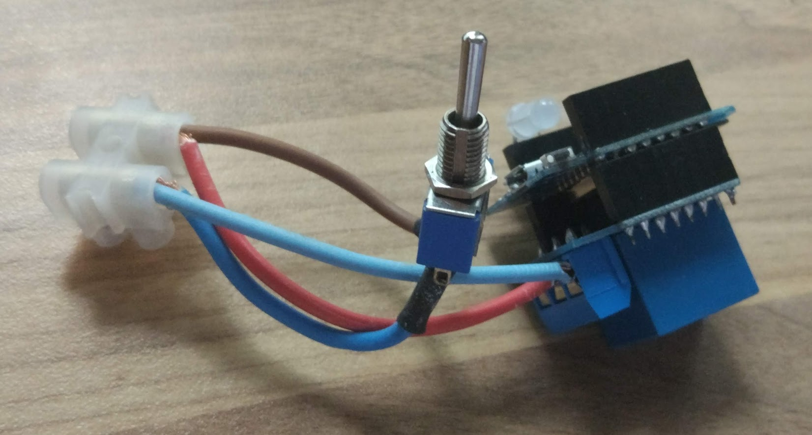

## Control remoto mediante MQTT

Vamos a hacer ahora un ejemplo muy sencillo de control remoto mediante MQTT, es el que tengo funcionando en la caldera de casa...

El hardware es un dispositivo Wemos ESP Mini, con un relé que es el que activa/desactiva la caldera, y un led NeoPixel que uso como indicador de funcionamiento.



También he puesto un interruptor para puentear la salida en caso de fallo del sistema y así tener un respaldo manual.

Sólo necesitamos que nuestro dispositivo esté conectado al wifi y que está suscrito a los mensajes con topic:


```python
import machine, neopixel

topic_subCaldera = b'/caldera'

rele = machine.Pin(Wemos.D1,machine.Pin.OUT)  # Rele shield en D1 (GPIO5)

np = neopixel.NeoPixel(machine.Pin(Wemos.D4),1) # Led RGB through the Hole en pin D4 (GPIO2)

blue = (0,0,10)
green = (10,0,0) 

def enciendeCaldera():
    rele.on()
    np[0] = red
    np.write()
    print('Caldera ON')

def apagaCaldera():
    rele.off()
    np[0] = blue
    np.write()
    print('Caldera OFF')


def sub_CheckTopics(topic, msg):
    if topic == topic_subCaldera:     # Check for caldera topic
        if msg == b'On':
            enciendeCaldera()
        else:
            apagaCaldera()

...
```
