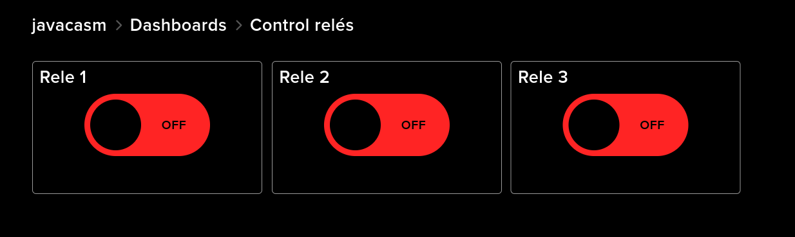
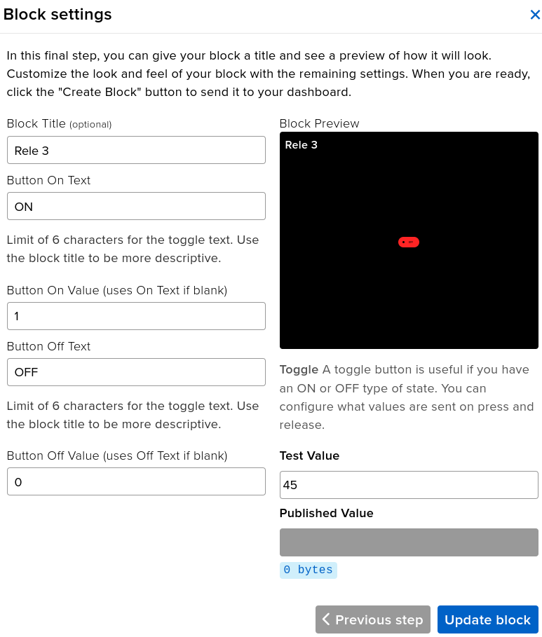
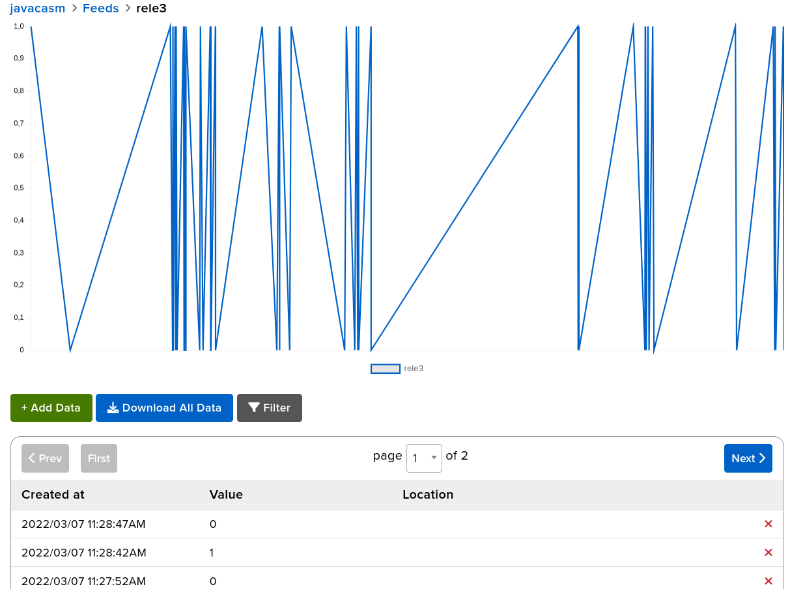

## Control remoto con Adafruit IO

Vamos a modificar el programa que utilizamos para publicar datos en Adafruit IO, para ahora poder controlar unos relés remotamente.

Hemos conectado además del DHT22, los 3 relés a los pines 25,26 y 27. Son relés de lógica negativa, es decir al activar su señal de control se apagan y se encienden al apagarla. Los alimentamos desde los 5V de la placa, aunque funcionan perfectamente con los 3.3V de la señal de salida de los pines del ESP32.

```python
reles = []
pinesReles = (25,26,27)
for pinRele in pinesReles:
    rele = machine.Pin(pinRele,machine.Pin.OUT)
    rele.off()
    time.sleep_ms(10)
    rele.on() # Estos reles usan logica invertida
    reles.append(rele) 
```

Vamos a suscribirnos a los topics de los relés

```python
        for i in range(len(reles)):
            topic = topic_subRele+str(i+1) # Los nombres de los reles empiezan en 1
            client.subscribe(topic)
            print(f'Suscrito a {topic}')
```

ahora comprobaremos los topics y sus valores para ver si son sobre nuestros relés:

```python
    if sTopic.startswith(topic_subRele):
        posicion = int(sTopic[-1])-1 # los topic empiezan en 1 y la lista de reles en 0
        if sMsg == '0':
            reles[posicion].on() # Usan logica invertida
        elif sMsg == '1':
            reles[posicion].off() # Usan logica invertida
        else:
            print(f'Mensaje desconocido {topic} > {msg} ')
```

Y sacamos la comprobación de mensajes **client.check_msg()**  fuera de la espera para publicar datos.

[Código test_control_io_adafruit.py](https://raw.githubusercontent.com/javacasm/CursoMicropython/master/codigo/mqtt_adafruit_io/test_control_io_adafruit.py)

```python
# MQTT control desde Adafruit IO

from umqttsimple import MQTTClient, MQTTException
import ubinascii
import machine
import time         # Para las esperas
import utime
import dht
import config

v = '0.7'

client_id = ubinascii.hexlify(machine.unique_id())

topic_user = b'javacasm'
topic_errors = topic_user + b'/errors'
topic_throttle = topic_user + b'/throttle'
topic_sub = topic_user + b'/feeds'
topic_subSensor = topic_sub + b'/DHT22_2_'
topic_subTemp = topic_subSensor + b'Temp'
topic_subHum = topic_subSensor + b'Hum'
topic_subRele = topic_sub + b'/rele'

reles = []
pinesReles = (25,26,27)
for pinRele in pinesReles:
    rele = machine.Pin(pinRele,machine.Pin.OUT)
    rele.off()
    time.sleep_ms(10)
    rele.on() # Estos reles usan logica invertida
    reles.append(rele) 

sensorDHT22 = dht.DHT22(machine.Pin(14))

def getData():
    sensorDHT22.measure()
    return (sensorDHT22.temperature(), sensorDHT22.humidity())

def getLocalTimeHumanFormat():
    strLocalTime = "{0}/{1:02}/{2:02} {3:02}:{4:02}:{5:02}".format(*utime.localtime(utime.time())[0:6])
    return strLocalTime

def sub_CheckTopics(topic, msg):
    print(f'Topic:{topic} msg:{msg}')
    sTopic = topic.decode('UTF-8') # convierte a cadena
    sMsg = msg.decode('UTF-8')
    if sTopic.startswith(topic_subRele):
        posicion = int(sTopic[-1])-1 # los topic empiezan en 1 y la lista de reles en 0
        if sMsg == '0':
            reles[posicion].on() # Usan logica invertida
        elif sMsg == '1':
            reles[posicion].off() # Usan logica invertida
        else:
            print(f'Mensaje desconocido {topic} > {msg} ')
        

def connect_and_subscribe():
    global client, client_id
    client = MQTTClient(client_id, config.mqtt_server, port = config.mqtt_port, user = config.mqtt_user, password = config.mqtt_password)
    client.set_callback(sub_CheckTopics)
    try:
        client.connect()
        client.subscribe(topic_errors)
        client.subscribe(topic_throttle)
        print(f'Suscrito a {topic_errors} & {topic_throttle}')

        for i in range(len(reles)):
            topic = topic_subRele+str(i+1) # Los nombres de los reles empiezan en 1
            client.subscribe(topic)
            print(f'Suscrito a {topic}')

        print(f'Connected to {config.mqtt_server} MQTT broker as {config.mqtt_user}' )
        return client
    except MQTTException as me: # https://www.vtscada.com/help/Content/D_Tags/D_MQTT_ErrMsg.htm
        value = f'{me}'
        if value == '5':
            print('Authorization error')
        elif value == '4':
            print('Login error')
        else:
            print(f'Connecting error: {me}')
        return None        
    except Exception as e:
        print(f'Connecting error: {e}')
        return None    

def restart_and_reconnect():
    print(f'Failed to connect to MQTT broker {config.mqtt_server}. Reconnecting...')
    time.sleep(10)
    machine.reset()

def mainMQTT(everySeconds = 30):
    client = connect_and_subscribe() # connect and get a client reference
    if client == None:
        restart_and_reconnect()
        
    last_Temp = 0 # utime.ticks_ms()
    while True :
        now = utime.ticks_ms()
        elapsedTime = utime.ticks_diff(now, last_Temp)
        msgTime = getLocalTimeHumanFormat()
        print(f'check4msgs... {msgTime}',end = '\r')
        client.check_msg() # Comprobamos si ha mensajes
        if last_Temp == 0 or elapsedTime > (everySeconds*1000):
            try:
                temp, hum = getData()
                print(f'{msgTime} Hum:{hum} Temp:{temp}')
                try:
                    if client != None:
                        client.publish(topic_subTemp, f'{temp}')
                        client.publish(topic_subHum, f'{hum}')
                        print(f'Published {topic_subTemp} & {topic_subHum}')
                    else:
                        print(f'Not published {topic_subTemp} & {topic_subHum}')
                    last_Temp = now
                except Exception as e:
                    print(f'{msgTime} Error publishing sensor data')
                    print(f'Error: {e} {type(e)}')
                    
            except Exception as e:
                print(f'{msgTime} Error getting sensor data')
                print(f'Error: {e} {type(e)}')
                time.sleep(0.5)
                
        time.sleep_ms(10)
      

```

En Adafruit IO hemos creado los correspondientes feeds rele1,rele2 y rele3 y los ponemos en un dashboard con controles de botón (toggle)



Configurando cada uno para que muestre su nombre, vinculado a su correspondiente feed y que tenga el valor 1 ó 0 cuando esté activo o apagado.



Cuando nosotros actuamos sobre el control se publica un mensaje con el topic del feed y el valor del control



[](https://drive.google.com/file/d/1hCaL6zCV4lzGifX2oWK3Lg5QZhaFugXC/view?usp=sharing)


[Vídeo: Controlando relés desde Adafruit IO vía MQTT y con micropython](https://drive.google.com/file/d/1hCaL6zCV4lzGifX2oWK3Lg5QZhaFugXC/view?usp=sharing)
