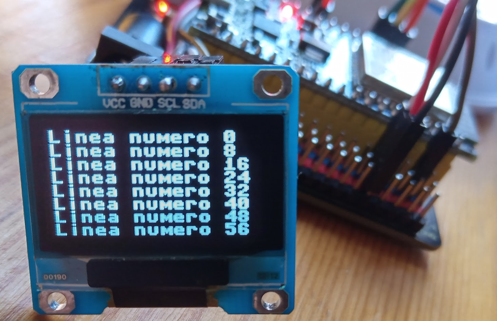
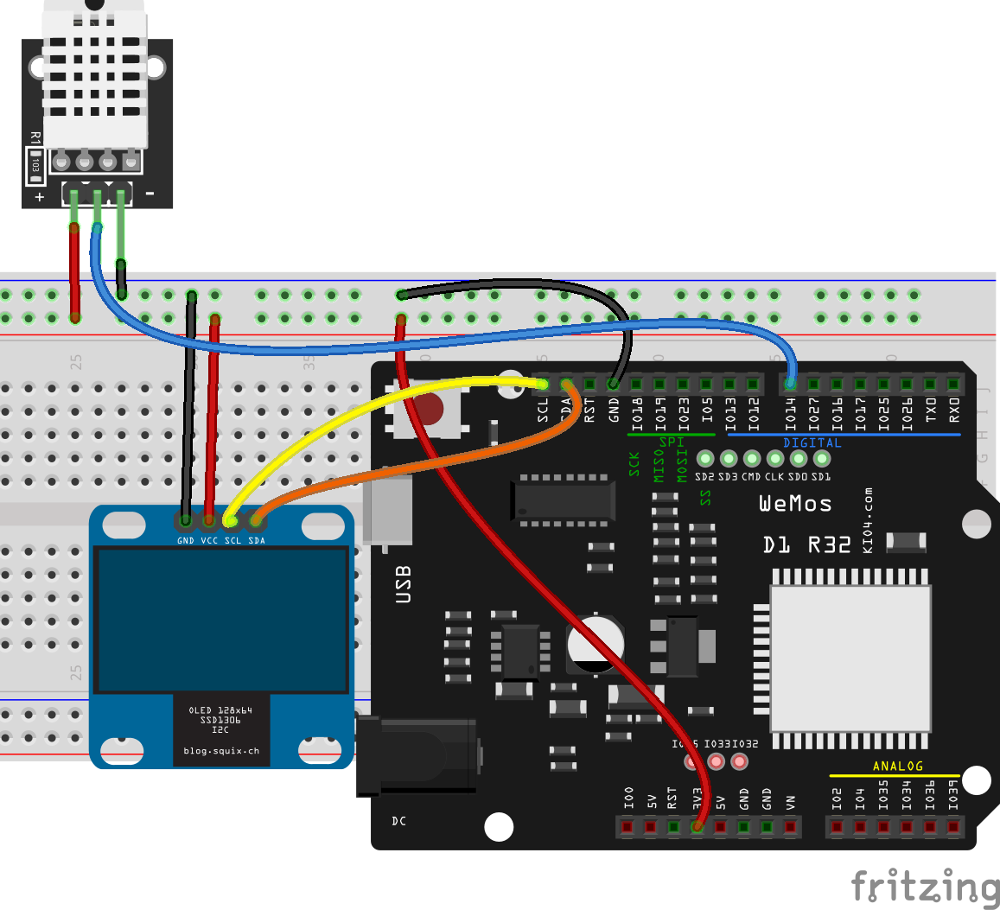
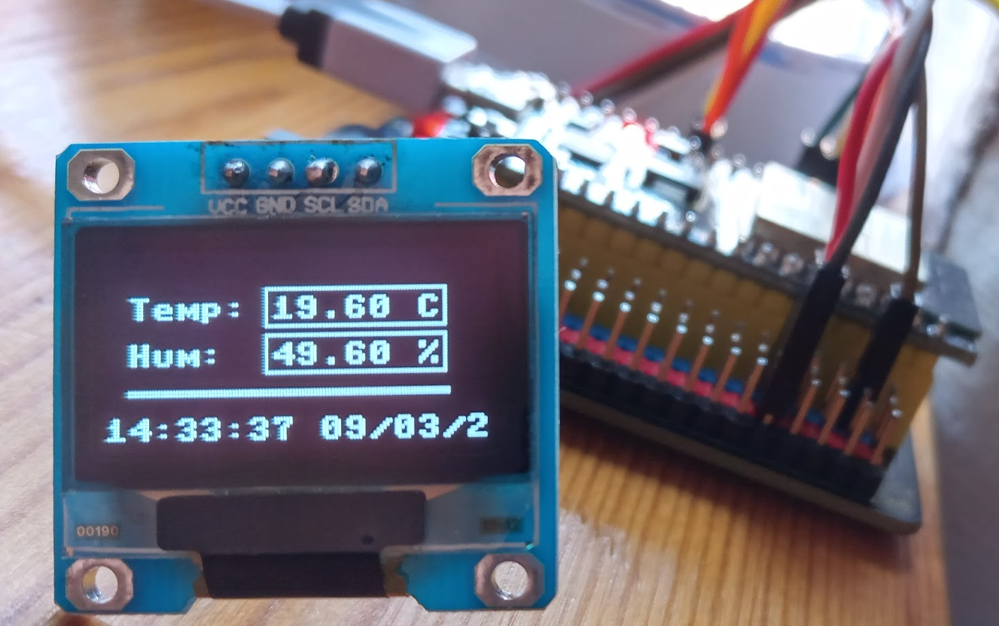

## Pantallas oled

Vamos a ver pantallas OLED, monocromas, formadas por leds individuales que podemos encender o apagar. Algunas tienen varias zonas con distintos colores para dar la impresión de que usan color, pero sólo podemos apagar o encender cada píxel, ni siquiera con diferentes niveles de brillo (sí que hay un brillo general de toda la pantalla).




Normalmente se conecta por protocolo I2C o SPI. Vamos a usar una basada en el chip **ssd1306** que se conecta con I2C, del que descargamos su [módulo/driver](https://raw.githubusercontent.com/javacasm/CursoMicropython/master/codigo/oled_ssd1306/ssd1306.py). Este sencillo módulo no nos permite cambiar el tamaño de la fuente ni mostrar imágenes, aunque sí que podremos hacer dibujos sencillos.

Creamos el objeto i2c con los pines 21 (SCL)  y 22 (SDA)

```python
i2c = machine.SoftI2C(scl = machine.Pin(21), sda = machine.Pin(22))

```

y lo usamos para crear el objeto oled 

```python
oled_width = 128 # ancho
oled_height = 64 # alto
oled = ssd1306.SSD1306_I2C(oled_width, oled_height, i2c, addr=0x3c) # Podria ser tambien 0x34

```

La dirección, dependiendo del fabricante también podría ser addr = 0x34.


Ahora ya podemos escribir texto con **oled.text(texto, x, y)** en la posición (x,y) y llamando después a **oled.show()** para que se muestren los cambios.

También podemos rellenar toda la pantalla usando **oled.fill(color)** con color siendo 0 ó 1 o desplazar el contenido con **oled.scroll(dx,dy)**, sin olvidar llamar después a **oled.show()**.

Podemos establecer un nivel de brillo general entre 0 y 255 para toda la pantalla con **oled.contrast(brillo)**, también apagarla o encenderla con **oled.poweroff()** y **oled.poweron()**.

Para dibujar podemos usar algunos métodos como pixel con **oled.pixel(x,y,color)** o **oled.line(x1,y1,x2,y1,color)** para dibujar una línea o rectángulos con **oled.rect(x,y,width,height,color)**

En este [Código test_oled.py](https://raw.githubusercontent.com/javacasm/CursoMicropython/master/codigo/oled_ssd1306/test_oled.py) podemos ver algunos ejemplos.


```python
import machine  
import ssd1306
import time 
import random

v= '0.5'

# Creamos el objeto i2c con los pines 21 (SCL)  y 22 (SDA)
i2c = machine.SoftI2C(scl = machine.Pin(21), sda = machine.Pin(22))


oled_width = 128 # ancho
oled_height = 64 # alto
oled = ssd1306.SSD1306_I2C(oled_width, oled_height, i2c, addr=0x3c) # Podria ser tambien 0x34

def show_text():
    for i in range(0, oled_height + 1 ,8):
        oled.text(f'Linea numero {i}', 0, i) # altura del texto 8 pixels
            
    oled.show() # Mostramos el contenido
    
def scroll_display(scroll_x = -4, scroll_y = -2):
    for i in range(0, oled_width + 1,4):
        oled.scroll(scroll_x, scroll_y)
        oled.show()

def slow_fill(finalShow = False,color = 1):
    for x in range(oled_width):
        for y in range(oled_height):
            oled.pixel(x,y,color)
            if not finalShow:
                oled.show()
    if finalShow:
        oled.show()

def randomLines(N=100,finalShow = False):
    for i in range(N):
        oled.line(random.randrange(oled_width),random.randrange(oled_height),
                  random.randrange(oled_width),random.randrange(oled_height),
                  1)
        if not finalShow:
            oled.show()
    if finalShow:
        oled.show()

def randomRects(N=100,finalShow = False):
    for i in range(N):
        oled.rect(random.randrange(oled_width),random.randrange(oled_height),
                  random.randrange(oled_width),random.randrange(oled_height),
                  1)
        if not finalShow:
            oled.show()
    if finalShow:
        oled.show()

```

### Mostrando temperatura y humedad en OLED




Donde hemos conectado los pines i2c de la pantalla y de nuestra placa y la alimentación.

Vamos a mezclar ahora nuestro programa que mide temperatura y humedad con la pantalla Oled. [Código oled_meteo.py](https://raw.githubusercontent.com/javacasm/CursoMicropython/master/codigo/oled_ssd1306/oled_meteo.py) 

```python
import machine  
import ssd1306
import utime
import dht
import config

v = 0.3

sensorDHT22=dht.DHT22(machine.Pin(config.DHT_PIN))

i2c = machine.SoftI2C(scl = machine.Pin(21), sda = machine.Pin(22))


oled_width = 128 # ancho
oled_height = 64 # alto
oled = ssd1306.SSD1306_I2C(oled_width, oled_height, i2c, addr=0x3c) # Podria ser tambien 0x34

def getSensorData():
    sensorDHT22.measure()
    return (sensorDHT22.temperature(), sensorDHT22.humidity())

def getLocalTimeHumanFormat():
    strLocalTime = "{3:02}:{4:02}:{5:02} {2:02}/{1:02}/{0}".format(*utime.localtime(utime.time())[0:6])
    return strLocalTime

tabulacion = 8

def meteo():
    while True:
        try:
            temp, hum = getSensorData()
            sFecha = getLocalTimeHumanFormat()
            oled.fill(0) # borramos
            msgTemp = f'Temp: {temp:2.2f} C'
            oled.text(sFecha,0,oled_height -10)
            print(sFecha, end = ' ')
            oled.text(msgTemp, tabulacion, 15)
            print(msgTemp, end=' ')
            msgHum = f'Hum:  {hum:2.2f} %'
            oled.text(msgHum, tabulacion, 30)
            print(msgHum)
            oled.line(tabulacion,45,oled_width - 2 *tabulacion+2,45,1)
            oled.line(tabulacion,46,oled_width - 2 *tabulacion+2,46,1)
            oled.rect(54,12,60,13,1)
            oled.rect(54,27,60,13,1)
            
            oled.show()
            utime.sleep(1)
        except Exception as e:
            print(f'Error: {e} ')
         
```

Donde sólo hemos añadido un poco de formato y unas líneas para mejorar el aspecto.



