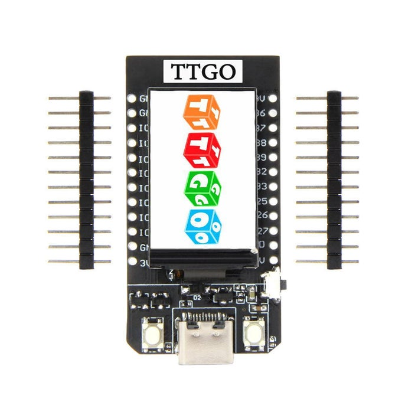
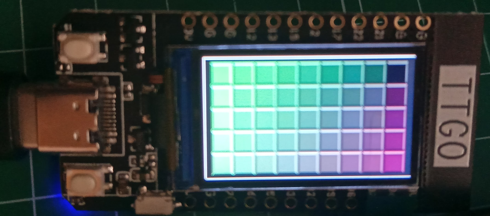
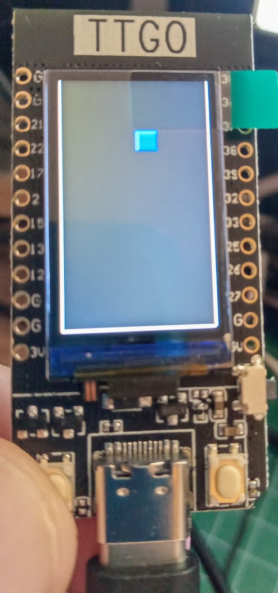
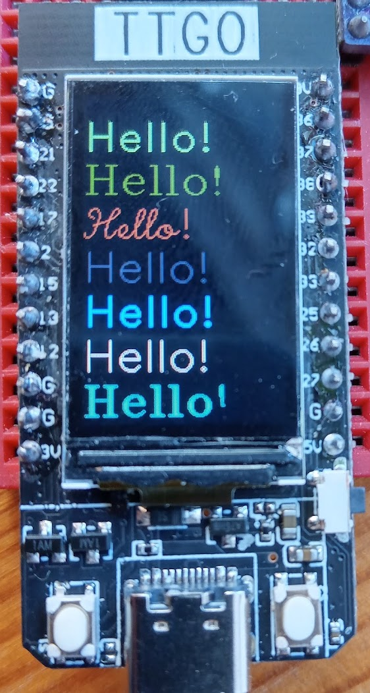

## TTGO - color

Vamos a trabajar ahora con una pantalla LCD color que usa el controlador ST7789 y que se conecta por SPI. Está incorporada en la placa LILYGO TTGO-color



Necesitamos descargar un [driver st7789py.py](https://raw.githubusercontent.com/javacasm/CursoMicropython/master/codigo/TTGO_TFT_up18/st7789py.py) que subiremos a placa.


```python
# test st7789

v = 0.1

import machine
import st7789py as st7789 # hacemos un alias del import por compatibilidad

'''
Pines SPI
GPIO 19  - Din / MOSI
GPIO 18  - Clk / SCLK

CS: 5
DC: 16
RST: 23
BL: 14
'''

BL_PIN = 4
SCK_PIN = 18
MOSI_PIN = 19
MISO_PIN = 13
RESET_PIN = 23
CS_PIN = 5
DC_PIN = 16

tft_width = 135
tft_height = 240

bl = machine.Pin(BL_PIN, machine.Pin.OUT)
bl.on()


spi = machine.SPI(
    1,
    baudrate=30000000,
    polarity=1,
    phase=1,
    sck=machine.Pin(SCK_PIN),
    mosi=machine.Pin(MOSI_PIN))


tft = st7789.ST7789(
    spi, tft_width, tft_height,
    reset=machine.Pin(RESET_PIN, machine.Pin.OUT),
    cs=machine.Pin(CS_PIN, machine.Pin.OUT),
    dc=machine.Pin(DC_PIN, machine.Pin.OUT),
    backlight=bl)

tft.init()

tft.fill(st7789.color565(100,10,10))

```

Si todo ha ido bien tendremos la pantalla de color rojo.

Donde ...

* Hemos configurado el SPI con los pines que utiliza la placa y que podemos ver en su pineado:


* Hemos hecho un alias del import por compatibilidad, más adelante veremos el motivo.
* Inicializamos la conexión SPI con los pines especificados
* Creamos el objeto tft = st7789 ... con el objeto spi creado, las dimensiones de la pantalla y el resto de pines
* Inicializamos con tft.init()
* Rellenamos la pantalla con un color rojizo, usando st7789.color565(r,g,b)


Vamos a hacer un pequeño ejemplo gráfico donde pintaremos un marco y un fondo estilo tetris:



Creamos un método **frame** que pinta el marco, usando los métodos vline y hline que dibujan líneas verticales y horizontales (más eficientemente que una línea cualquiera)

```python
def frame(frame_color = st7789.WHITE, back_color=st7789.color565(10,10,10)):
    tft.fill(back_color)
    tft.vline(0, 0, tft_height-1, frame_color )
    tft.vline(tft_width-1, 0, tft_height-1, frame_color)
    tft.hline(0, tft_height-1, tft_width-1, frame_color)
```

Ahora vamos a crear un método que dibuja una tesela, sombreando los bordes para dar sensación de volumen, usando colores similares al de cada tesela, pero más oscuros y más claros. Definimos los colores en función de color base de cada una:

```python
def tile(x,y,l,r,g,b,ancho = 3):
    tft.fill_rect(x, y ,l, l, st7789.color565(r,g,b))
    c50 = st7789.color565(r+50,g+50,b+50)
    c100 = st7789.color565(r+100,g+100,b+100)
    c3 = st7789.color565(r//3,g//3,b//3)
    c2 = st7789.color565(r//2,g//2,b//2)
    for i in range(1,ancho):
        tft.hline(x + i, y + i, l - 2 * i, c50)
        tft.vline(x + i, y + i, l - 2 * i, c100)
        tft.vline(x + l -i, y + i, l - 2 * i, c3)
        tft.hline(x + i, y + l - i , l - 2 * i, c2)
```

Ahora usamos el método anterior para rellenar toda la pantalla:

```python
def test_fill(l = 25 ):
    for x in range(0,tft_width//l):
        for y in range(0,tft_height//l):
            tile(x*l + tft_width%l//2, y*l + tft_height%l//2, l,  x*l,y*l,(x+y)*l//2)
```

Aprovechando que la pantalla tiene 2 botones, vamos a hacer una primera versión de un sencillo "tetris", en el que movemos una tesela con los botones:

```python
def fall(x=tft_width//2, y=0, l=20, r=0, g=0, b=150,back_color = st7789.color565(10,10,10)):
    frame()
    lButton=machine.Pin(0,machine.Pin.PULL_DOWN)
    rButton=machine.Pin(35,machine.Pin.PULL_DOWN)
    while y+l<tft_height-1:
        tft.fill_rect(x,y,l,l,back_color) # borramos el anterior cuadrado
        y+=1
        if lButton.value() == 0: # Tiene lógica invertida al usar pulldown
            x -= 5
            if x < 1 :
                x = 1
        if rButton.value() == 0: # Tiene lógica invertida al usar pulldown
            x += 5    
            if x  > tft_height - l - 2:
                x = tft_width - l - 2

        tile(x,y,l,r,g,b)
        time.sleep(0.1)
```



[Código completo](https://raw.githubusercontent.com/javacasm/CursoMicropython/master/codigo/TTGO_TFT_up18/mini_tetris.py)

¿ Echas algo en falta? Sí, con este driver no podemos escribir texto...

Pero podemos incorporar un módulo _[pytest.py](https://raw.githubusercontent.com/javacasm/CursoMicropython/master/codigo/TTGO_TFT_up18/pytext.py)_ que nos permite hacerlo y también necesitaremos las fuentes en la carpeta [/pyfonts](https://github.com/javacasm/CursoMicropython/tree/master/codigo/TTGO_TFT_up18/pyfonts). Si miras la carpeta verás que hay muchas fuentes y que son ficheros python. Si abres alguno de ellos verás que sólo contienen una serie de números que son los trazos de cada letra

```python
def glyphs():
	return 96

_font =\
b'\x00\x4a\x5a\x17\x4d\x58\x52\x46\x52\x54\x53\x54\x20\x52\x52'\
b'\x46\x53\x46\x53\x54\x20\x52\x52\x58\x51\x59\x51\x5a\x52\x5b'\
b'\x53\x5b\x54\x5a\x54\x59\x53\x58\x52\x58\x20\x52\x52\x59\x52'\
b'\x5a\x53\x5a\x53\x59\x52\x59\x15\x49\x5b\x4e\x46\x4d\x47\x4d'\
b'\x4d\x20\x52\x4e\x47\x4d\x4d\x20\x52\x4e\x46\x4f\x47\x4d\x4d'\
b'\x20\x52\x57\x46\x56\x47\x56\x4d\x20\x52\x57\x47\x56\x4d\x20'\
b'\x52\x57\x46\x58\x47\x56\x4d\x0b\x48\x5d\x53\x42\x4c\x62\x20'\
b'\x52\x59\x42\x52\x62\x20\x52\x4c\x4f\x5a\x4f\x20\x52\x4b\x55'\
b'\x59\x55\x32\x49\x5c\x52\x42\x52\x5f\x53\x5f\x20\x52\x52\x42'\
b'\x53\x42\x53\x5f\x20\x52\x57\x49\x59\x49\x57\x47\x54\x46\x51'\
b'\x46\x4e\x47\x4c\x49\x4c\x4b\x4d\x4d\x4e\x4e\x56\x52\x57\x53'\
b'\x58\x55\x58\x57\x57\x59\x54\x5a\x51\x5a\x4f\x59\x4e\x58\x20'\
b'\x52\x57\x49\x56\x48\x54\x47\x51\ ....
```

Vamos a ver cómo usarlos en el fichero _[pyhello.py](https://raw.githubusercontent.com/javacasm/CursoMicropython/master/codigo/TTGO_TFT_up18/pyhello.py)_ donde ...

* Importamos los ficheros de las fuentes que vamos a usar (no podemos importarlos todos por falta de memoria)
* Creamos un array con los fuentes para elegir uno aleatoriamente con la función _pick_item_
* Inicializamos el driver de la pantalla
* Desde la función _test_text()_ mostramos los distintos tipos en diferentes colores
    * Creamos un color
    * Elegimos una fuente con _pick_item_
    * Llamamos a la función _pytext.text_  pasándole tft,  la fuente, el texto, las coordenadas y el color

```python
import sys
import time
import machine
import st7789py as st7789
import uos
import random

v = '1.1'

sys.path.append('/pyfonts') # Indicamos al sistema que busque los ficheros a importar _tambien_ en /pyfonts
'''
import astrol
import cyrilc
import gotheng
import gothger
import gothita
import greeks
import italicc
import italiccs
import meteo
import music
'''
import romanc
import romancs
import romand
import romanp
import romans
import romant
import scriptc
import scripts

import pytext
'''
fonts = [astrol, cyrilc, gotheng, greeks, italicc, italiccs,
         italiccs, meteo, music, romanc,
         romancs, romand, romanp, romans,
         romant, scriptc, scripts]
'''

fonts = [ romanc, romancs, romand, romanp, romans,
         romant, scriptc, scripts]

def pick_item(sequence):
    div = 0x3fffffff // len(sequence)
    return sequence[random.getrandbits(30) // div]

BL_PIN = 4
SCK_PIN = 18
MOSI_PIN = 19
RESET_PIN = 23
CS_PIN = 5
DC_PIN = 16

tft_width = 135
tft_height = 240

bl = machine.Pin(BL_PIN, machine.Pin.OUT)
bl.on()


spi = machine.SPI(
    1,
    baudrate=30000000,
    polarity=1,
    phase=1,
    sck=machine.Pin(SCK_PIN),
    mosi=machine.Pin(MOSI_PIN))

tft = st7789.ST7789(
    spi, tft_width, tft_height,
    reset=machine.Pin(RESET_PIN, machine.Pin.OUT),
    cs=machine.Pin(CS_PIN, machine.Pin.OUT),
    dc=machine.Pin(DC_PIN, machine.Pin.OUT),
    backlight=bl)

tft.init()
tft.fill(st7789.BLACK)

def test_text():
    row = 0
    again = True
    while again:
        color = st7789.color565(
            random.getrandbits(8),
            random.getrandbits(8),
            random.getrandbits(8))

        row += 32

        pytext.text(tft, pick_item(fonts), "Hello!", row, 0, color)

        if row > 192:
            tft.fill(st7789.BLACK)
            row = 0

```



