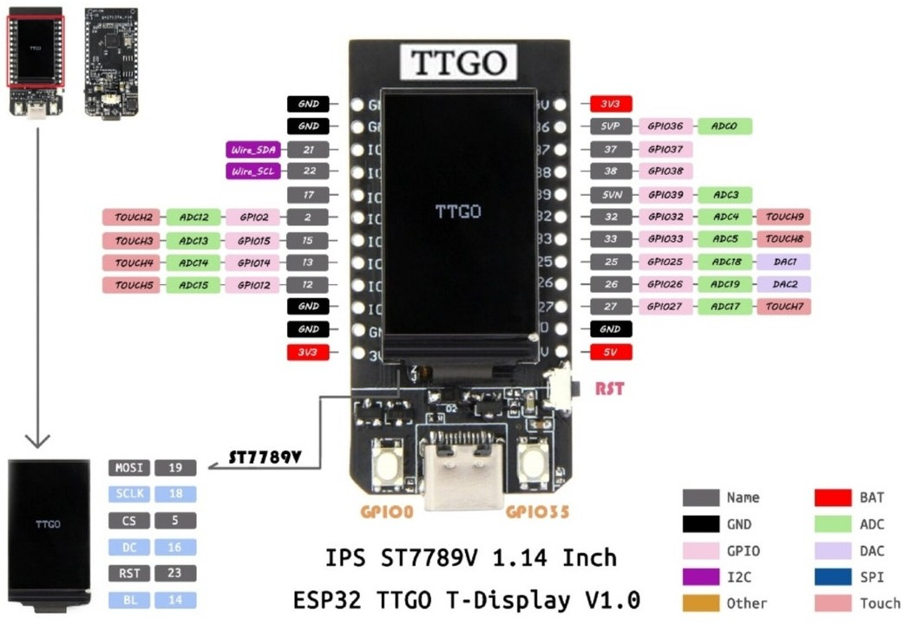

## TTGO - color

Vamos a trabajar ahora con una pantalla LCD color que usa el controlador ST7789 y que se conecta por SPI. Está incorporada en la placa LILYGO TTGO-color


Necesitamos descargar un [driver st7789py.py](https://raw.githubusercontent.com/javacasm/CursoMicropython/master/codigo/TTGO_TFT_up18/st7789py.py) que subiremos a placa.


```python
# test st7789

v = 0.1

import machine
import st7789py as st7789 # hacemos un alias del import por compatibilidad

'''
Pines SPI
GPIO 19  - Din / MOSI
GPIO 18  - Clk / SCLK

CS: 5
DC: 16
RST: 23
BL: 14
'''

BL_PIN = 4
SCK_PIN = 18
MOSI_PIN = 19
MISO_PIN = 13
RESET_PIN = 23
CS_PIN = 5
DC_PIN = 16

tft_width = 135
tft_height = 240

bl = machine.Pin(BL_PIN, machine.Pin.OUT)
bl.on()


spi = machine.SPI(
    1,
    baudrate=30000000,
    polarity=1,
    phase=1,
    sck=machine.Pin(SCK_PIN),
    mosi=machine.Pin(MOSI_PIN))


tft = st7789.ST7789(
    spi, tft_width, tft_height,
    reset=machine.Pin(RESET_PIN, machine.Pin.OUT),
    cs=machine.Pin(CS_PIN, machine.Pin.OUT),
    dc=machine.Pin(DC_PIN, machine.Pin.OUT),
    backlight=bl)

tft.init()

tft.fill(st7789.color565(100,10,10))

```

Si todo ha ido bien tendremos la pantalla de color rojo.

Donde ...

* Hemos configurado el SPI con los pines que utiliza la placa y que podemos ver en su pineado:



* Hemos hecho un alias del import por compatibilidad, más adelante veremos el motivo.
* Inicializamos la conexión SPI con los pines especificados
* Creamos el objeto tft = st7789 ... con el objeto spi creado, las dimensiones de la pantalla y el resto de pines
* Inicializamos con tft.init()
* Rellenamos la patalla con un color rojizo, usando st7789.color565(r,g,b)


Vamos a hacer un pequeño ejemplo gráfico donde pintaremos un marco y un fondo estilo tetris:


Creamos un método **frame** que pinta el marco, usando los métodos vline y hline que dibujan líneas verticales y horizontales (más eficientemente que una línea cualquiera)

```python
def frame(frame_color = st7789.WHITE, back_color=st7789.color565(10,10,10)):
    tft.fill(back_color)
    tft.vline(0, 0, tft_height-1, frame_color )
    tft.vline(tft_width-1, 0, tft_height-1, frame_color)
    tft.hline(0, tft_height-1, tft_width-1, frame_color)
```

Ahora vamos a crear un método que dibuja una tesela, sombreando los bordes para dar sensación de volumen, usando colores similares al de cada tesela, pero más oscuros y más claros. Definimos los colores en función de color base de cada una:

```python
def tile(x,y,l,r,g,b,ancho = 3):
    tft.fill_rect(x, y ,l, l, st7789.color565(r,g,b))
    c50 = st7789.color565(r+50,g+50,b+50)
    c100 = st7789.color565(r+100,g+100,b+100)
    c3 = st7789.color565(r//3,g//3,b//3)
    c2 = st7789.color565(r//2,g//2,b//2)
    for i in range(1,ancho):
        tft.hline(x + i, y + i, l - 2 * i, c50)
        tft.vline(x + i, y + i, l - 2 * i, c100)
        tft.vline(x + l -i, y + i, l - 2 * i, c3)
        tft.hline(x + i, y + l - i , l - 2 * i, c2)
```

Ahora usamos el método anterior para rellenar toda la pantalla:

```python
def test_fill(l = 25 ):
    for x in range(0,tft_width//l):
        for y in range(0,tft_height//l):
            tile(x*l + tft_width%l//2, y*l + tft_height%l//2, l,  x*l,y*l,(x+y)*l//2)
```

Aprovechando que la pantalla tiene 2 botones, vamos a hacer una primera versión de un sencillo "tetris", en el que movemos una tesela con los botones:

```python
def fall(x=tft_width//2, y=0, l=20, r=0, g=0, b=150,back_color = st7789.color565(10,10,10)):
    frame()
    lButton=machine.Pin(0,machine.Pin.PULL_DOWN)
    rButton=machine.Pin(35,machine.Pin.PULL_DOWN)
    while y+l<tft_height-1:
        tft.fill_rect(x,y,l,l,back_color) # borramos el anterior cuadrado
        y+=1
        if lButton.value() == 0: # Tiene lógica invertida al usar pulldown
            x -= 5
            if x < 1 :
                x = 1
        if rButton.value() == 0: # Tiene lógica invertida al usar pulldown
            x += 5    
            if x  > tft_height - l - 2:
                x = tft_width - l - 2

        tile(x,y,l,r,g,b)
        time.sleep(0.1)
```


[Código completo](https://raw.githubusercontent.com/javacasm/CursoMicropython/master/codigo/TTGO_TFT_up18/mini_tetris.py)

¿ Hechas algo en falta? Sí, con este driver no podemos escribir texto...

