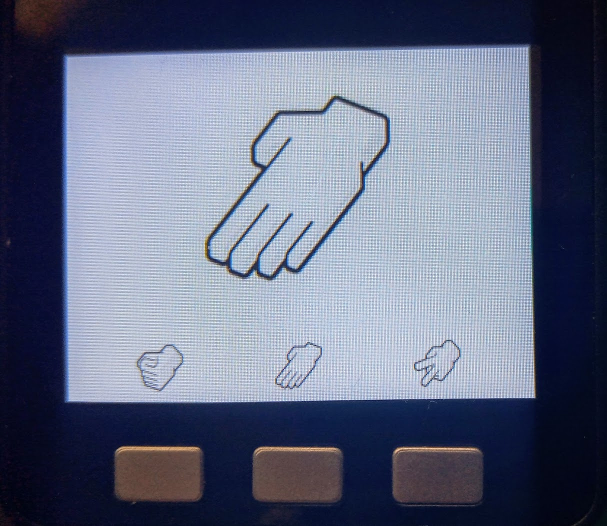

## m5Stack

Una de las características más interesantes de los equipos m5stack es que incorporan una pantalla grande y de buena calidad y botones que podemos usar.

En este caso vamos a usar el firmware oficial de m5Stack que nos facilita enormemente el uso del interface a costa de no poder usar la última versión de micropython. La versión que incluyen es la 1.12

Vamos a ver que el módulo **m5stack** nos facilita enormemente el trabajo, permitiéndonos mostrar imágenes o reproducir sonidos con facilidad. Veamos un ejemplo que viene incluído en el firmware de m5stack que es un juego de Piedra/Papel/Tijera

[Código](https://raw.githubusercontent.com/javacasm/CursoMicropython/master/codigo/m5stack-basic/ppt.py)




```python
# rock, paper, scissors
from m5stack import *
import utime as time
import random
ROCK = 0
PAPER = 1
SCISSORS = 2

rps_img = (
  'img/rock_128.jpg',
  'img/paper_128.jpg',
  'img/scissors_128.jpg'
)

lcd.clear(lcd.WHITE)

lcd.image(48, 200,  rps_img[0], 2)
lcd.image(143, 200, rps_img[1], 2)
lcd.image(238, 200, rps_img[2], 2)

win_music = (1046,1318,1568,2093)
lose_music = (2093,1568,1318,1046)


def play_music(notes):
  for note in notes:
    speaker.tone(note, 120, 1)

while True:
  rand = random.randint(0, 2)
  lcd.image(lcd.CENTER, 30, rps_img[rand])

  if btnA.isPressed():   # ROCK
    if rand == SCISSORS:
      play_music(win_music)
    elif rand == PAPER:
      play_music(lose_music)
    while not btnA.isReleased(): # Wait for button A release
      pass

  elif btnB.wasPressed(): # PAPER
    if rand == ROCK:
      play_music(win_music)
    elif rand == SCISSORS:
      play_music(lose_music)
    while not btnB.isReleased(): # Wait for button B release
      pass

  elif btnC.wasPressed(): # SCISSORS
    if rand == PAPER:
      play_music(win_music)
    elif rand == ROCK:
      play_music(lose_music)
    while not btnC.isReleased(): # Wait for button C release
      pass
  
  time.sleep(0.02)
```
Donde vemos que ya están definidos los botones **btnA**, **btnB** y **btnC**. También podemos trabajar con la pantalla usando el objeto **lcd** o reproducir sonidos con **speaker**.

Mostrar una imagen es tan sencillo como hacer **lcd.image(x, y, ficheroImagen)

